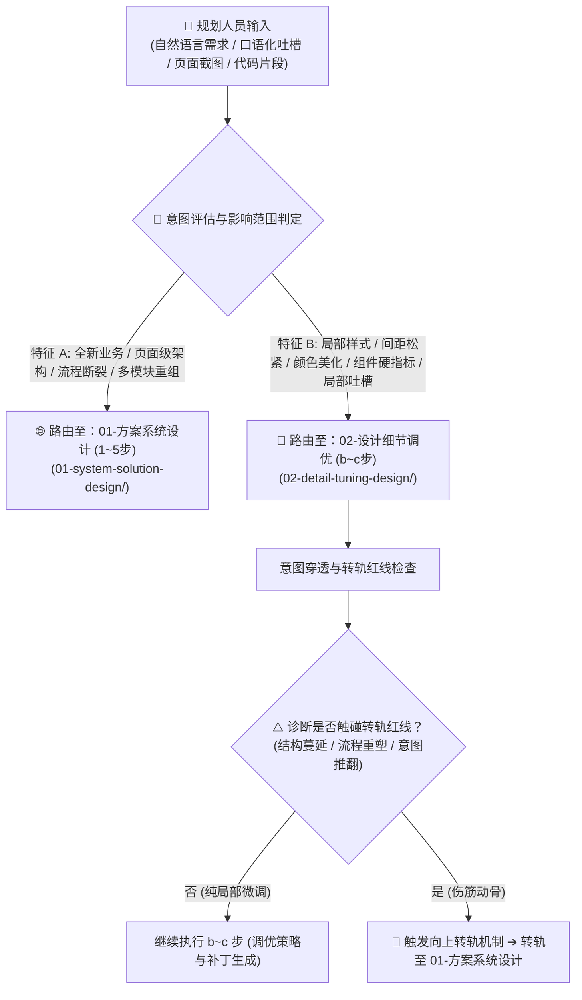

# 织雨设计智脑：意图分诊与转轨决策指南 (Triage & Escalation Rules)

> 💡 **中枢定位**：
> 本指南是织雨体验设计智脑接收到规划人员输入时的**“首道神经元”**。
> 它负责对用户的自然语言输入、PRD、吐槽或截图进行快速分诊，精准分流至 **【方案系统设计】** 或 **【设计细节调优】** 主线，并定义了细节调优过程中**“向上转轨至方案设计”**的判定红线。

---

## 1. 意图分诊核心决策树 (Triage Decision Tree)

---

## 2. 方案系统设计 vs 设计细节调优 判定基准

| 判定维度 | 🌐 方案系统设计 (System Solution) | 🔬 设计细节调优 (Detail Tuning) |
| :--- | :--- | :--- |
| **典型触发语** | “帮我设计一个云原生网络拓扑监控页面”、“想做一个策略配置向导”、“重构告警事件流大盘” | “这里太挤了”、“按钮颜色好土”、“表格操作列太乱”、“搜索框怎么这么笨重” |
| **影响空间范围** | **全页面级 (Page-level)** 或 **复合子系统级 (Sub-system)** | **局部组件级 (Component-level)** 或 **局部样式级 (Style-level)** |
| **涉及业务流程** | 涵盖多状态流转、从 0 到 1 任务闭环、多维联动下钻 | 仅在当前既定容器内的呈现优化，不改变底层业务状态机 |
| **代码动刀深度** | 重写/新建整个页面骨架、重构 DOM 树层级与响应式布局 | 仅修改局部 CSS 类名、微调间距 padding/gap、替换色值、微调局部 DOM 属性 |
| **对应落地路径** | `01-system-solution-design/` (完整 1~5 步流水线) | `02-detail-tuning-design/` (完整 b~c 步流水线) |

---

## 3. 🚨 调优过程中的“向上转轨红线” (Escalation Redlines)

在执行微观细节调优时，若资深设计师诊断发现满足以下 **任意一条红线**，禁止继续以局部补丁方式强行打补丁，**必须主动向规划人员提示风险，并转轨进入【方案系统设计】主线**：

1. 🛑 **结构蔓延红线 (Layout Contagion)**：
   * 规划人员吐槽“加个筛选按钮”，但诊断发现当前页面头部空间已被撑爆，若不重做 24 栅格与 Pro-Search 折叠联动框架，会导致整体页面横向滚动崩坏。
2. 🛑 **流程重塑红线 (Workflow Disruption)**：
   * 规划人员吐槽“把详情就地展开”，但该详情包含 3 个子任务表单与异步提交，抽屉与原地展开已无法承载，必须重新规划分步向导或独立旅程流程。
3. 🛑 **认知本质推翻 (Mental Model Invalidation)**：
   * 规划人员吐槽“折线图看不懂”，但深层病因在于当前业务根本不该用时序折线图表达，而是属于“多规则命中矩阵”或“拓扑因果关系”，必须重新定义业务场景范式。

---

## 4. 向上转轨时的织雨标准回复话术

当触发转轨时，织雨必须以专业设计师的同理心向规划人员说明：
> **“我仔细评估了你的优化建议，发现这不是单纯的样式或间距微调。深层原因在于【指明根因：如信息架构承载超限/任务流断裂】。如果仅在局部打补丁，会导致页面后续更加杂乱且容易破坏既有逻辑。我建议我们将此任务升级为【方案系统设计】，先带你梳理清晰本质任务旅程与业务框架套头，再输出完整的落地方案，你觉得如何？”**
