# 1.1 目标用户现状痛点剖析与当前任务旅程还原 (Persona, Pain Points & As-Is Journey)

> 💡 **中枢定位**：
> 本文档承接全景图中 **【方案系统设计主线】** 步骤 1 的前两项核心决策：
> * **1.1 目标用户及用户的当前现状痛点是什么？**
> * **1.2 本次需求有哪些主场景？各主场景下目标用户的当前任务旅程与痛点是什么（先拆场景，再分场景 As-Is 还原与插旗）？**
> 
> 🛑 **阶段铁律**：
> **需求分析是完全基于现状的（As-Is）。** 必须先拆出主场景，再按场景还原当前真实操作全貌并插旗；**严禁**揉成一条笼统旅程，也**严禁**出现任何“未来的优化后旅程图”。（未来旅程不再单独产出，优化动作直接落在后续页面设计中）。

---

## 一、需求理解与穿透方法论：从“伪需求”到“业务本质”

上游业务规划或产品经理递过来的原始需求，往往是**披着功能外衣的“伪方案”**（如：“在表格加个导出按钮”、“加个弹窗配 IP”）。资深设计师在动刀前，必须通过三层穿透法提纯出真实的业务本质。

### 1. 需求解构的三层真伪模型

```text
┌────────────────────────────────────────────────────────────────────────┐
│ 1. 表面功能层 (Feature Request) : 规划提的表象需求（如：“希望加个跨屏批量同步按钮”）│
│         ↓ 追问触发场景与前置上下文                                            │
│ 2. 业务目标层 (Business Goal)   : 业务真正要考核的产出（缩短现场交付工期，降低人力成本）│
│         ↓ 剥离 UI 形式，挖掘用户底层意图                                      │
│ 3. 用户本质意图 (User Real Job) : 交付工程师在弱网机房内不想人工给 50 台设备重复抄录参数│
└────────────────────────────────────────────────────────────────────────┘
```

### 2. 需求提纯的反向追问三部曲
在面对模糊需求时，织雨必须在脑内或向业务方发起三项关键追问：
1. **追问触发情境**：“用户在什么具体状态下会点击这个功能？前一秒他在干什么？后一秒他要拿着结果去向谁汇报？”
2. **追问现状阻塞点**：“现有系统为什么走不通？最折磨用户的具体是哪一个界面的哪一步？”
3. **追问风险代价**：“如果这个需求完全不做，最坏的结果是什么？会导致资金损失、违约罚款，还是引发高危宕机事故？”

---

## 二、四大真实高频角色心智与使用情境深剖 (Context of Use)

必须将角色置入**真实的物理环境与心理压力**中去剖析痛点，杜绝坐在空调房里空想：

| 排序与角色分类 | 代表岗位与细分角色 | 真实使用情境与心智压力 | 核心体验痛点根源 |
| :--- | :--- | :--- | :--- |
| **① 管理员群体 (Admins - 最高频)** | 运维管理员、安全管理员、审计管理员、租户管理员 | **心智：求稳、防背锅、怕脏写**<br>面对海量异构设备与海量策略规则，最怕修改一个参数引发次生故障；日常频繁在多个业务系统切换。 | 专业术语理解门槛高；多场景（如内网/分支/SaaS）配置割裂无法统一；缺乏实时防呆预校验；配置修改后无法预知波及面。 |
| **② 一线交付 / 技服工程师 (Field & Service Engineers)** | 客户现场交付人员、售后技术支持、网络实施工程师 | **心智：开局快、别卡壳、客户在旁盯着**<br>常处于客户机房、弱网甚至无网环境；设备无显示屏，需临时接串口线；时间紧迫，交付延期面临扣款。 | 设备初始化繁琐；缺乏开箱即用指引（如即插即用、贴纸扫码指引）；授权激活流程割裂；批量配置流程冗长且极其容易漏配关键参数。 |
| **③ 客户侧管理者 / 决策者 (Decision Makers / Executives)** | CIO、CTO、安全总监 (CISO)、IT 运营负责人 | **心智：一屏掌控、量化因果、防被蒙蔽**<br>不关心具体某条日志，需要向上汇报汇报投资回报率（ROI）、业务可用性、SLA 达标率与安全态势。 | 数据颗粒度过碎，报表全是离散表格，看不出宏观趋势；系统给出的结论缺乏量化证据支撑，难以用于管理决策与汇报。 |
| **④ 企业终端员工 / 业务使用人员 (End-User Employees)** | 办公内网员工、分支机构外勤、普通业务申请人员 | **心智：别烦我、别打扰、一键自愈**<br>使用客户端仅为完成本职工作，极度厌恶复杂权限拦截与安全打扰；电脑卡顿时急需自愈。 | 安全合规管控频繁中断办公工作流；弹窗过多干扰视线；客户端卡顿甚至断流；报错提示全为技术代码（如 0x800401），不知如何恢复。 |

---

## 三、现状痛点微观解剖工具：基于“认知与操作阻碍”四维模型

资深设计师诊断痛点不是背诵大词，而是精准定位用户在界面上的具体**生理与认知阻碍**：

```text
┌──────────────┐     ┌──────────────┐     ┌──────────────┐     ┌──────────────┐
│  1. 看 (信息) │ ➔   │  2. 想 (认知) │ ➔   │  3. 动 (操作) │ ➔   │  4. 等 (反馈) │
│  盲区 / 噪音 │     │ 术语 / 恐惧  │     │ 折返 / 机械  │     │ 盲等 / 报错  │
└──────────────┘     └──────────────┘     └──────────────┘     └──────────────┘
```

### 1. 看（信息获取卡点）
* **视野盲区**：核心指标分散在 3 个以上的页面，没有单一视图能纵览全局因果链；
* **视觉噪音**：全屏告警满堂红，关键离群尖刺指标被淹没在 95% 的无效低危事件中；
* **人工拼图**：在监控系统看到时延高，需手动复制 IP 打开拓扑系统比对，再打开日志系统搜时间切片。

### 2. 想（决策推理卡点）
* **术语黑盒**：全是底层底层协议专业缩写（如 MTU、BGP MED、Keepalive），没有自然语言说明；
* **隐性冲突**：A 配置与 B 配置互斥，但界面不给任何提示，全凭老专家经验“口口相传”；
* **决策恐惧**：点击“提交”按钮时，界面无法直观预览影响面（不知道会断开多少个连接、产生多大流量抖动）。

### 3. 动（交互执行卡点）
* **路径折返**：为了给设备绑定一个标签，必须跳出当前向导去标签中心新建，返回时原表单被全部清空；
* **机械重复**：给 100 个分支下发相同策略，必须手动重复配置 100 次，不支持同源聚合下发；
* **零容错手抖**：高危删除或下线操作仅弹出一个普通“确认”按钮，无二次敲击确认或回滚快照。

### 4. 等（状态反馈卡点）
* **异步盲等**：点击批量下发后界面只有无休止的 Loading 转圈，无分步进度、无完成倒计时；
* **报错无效**：失败时仅弹出一句通用的“系统异常 (500)”，不告诉用户究竟是哪一行数据填错了，逼迫用户推倒重来。

---

## 四、主场景拆分 → 分场景 As-Is 任务流程图与痛点插旗

> ⚠️ **强制顺序**：先拆**主场景**并标明痛点，再按场景绘制任务流程图、插旗定级。  
> 禁止把整模块揉成一条「大而全」旅程——不同触发情境下的 Job、角色压力与断点往往完全不同，混画会漏痛点、也导不出可落地的体验目标。

### 1. 先做主场景拆分 (Scenario Decomposition)

需求穿透（第一～三节）完成后，必须先回答：**本次需求覆盖哪些彼此独立、可单独成闭环的主场景？**  
在拆分主场景时，不仅要理清场景业务边界，**必须同步标记出该场景在现状（As-Is）下是否存在痛点、痛点具体是什么**。这能让产研团队在进入细节前，一眼锁定哪些场景需要重拳改造（🔴 存在痛点），哪些场景仅需常规承载（⚪ 流程顺畅）。

#### 拆分原则
* **按触发情境 / 生命周期节点拆**，不按页面或功能点拆（页面是手段，场景是用户真实要办成的事）；
* 每个主场景应能独立说清：**谁、在什么触发下、要完成什么 Job、若不做会怎样**；
* 同一模块下常见会拆出多条主场景（开/关/改/查/排障等），数量以「能独立闭环」为准，一般 **2～5 条**，避免碎到按钮级；
* 若某条链路只是另一主场景的子步骤，并入该主场景，不单列；
* **前置判明痛点**：拆出场景的同时，即刻标记该场景是否有阻碍，并提炼现状核心卡点。

#### 主场景清单模板（必填）

| 场景编号 | 主场景名称 | 触发情境 | 主要角色 | 用户要办成的 Job | 是否存在痛点 | 现状核心痛点概括 (As-Is 卡点) | 与本次需求的相关度 |
| :---: | :--- | :--- | :--- | :--- | :---: | :--- | :---: |
| **S1** | [如：入职账号开通] | [如：HR 入职通知到达] | [如：租户管理员] | [如：当日开通可用账号与基础权限] | 🔴 存在痛点 | [如：权限无模板需在多页面逐项勾选，耗时长且极易漏配] | 高 / 中 / 低 |
| **S2** | … | … | … | … | ⚪ 流程顺畅 | [无明显痛点 / 体验良好] | … |

#### 拆分示例：用户管理模块

| 场景编号 | 主场景名称 | 触发情境 | 主要角色 | 用户要办成的 Job | 是否存在痛点 | 现状核心痛点概括 (As-Is 卡点) |
| :---: | :--- | :--- | :--- | :--- | :---: | :--- |
| **S1** | 入职账号开通 | 新员工入职，需当日可用 | 租户 / IT 管理员 | 开通账号、绑定组织与基础权限并通知本人 | 🔴 存在痛点 | 权限无套餐模板，需人工在 5 个离散页面逐项勾选，平均耗时 25 分钟且极易漏配基础权限 |
| **S2** | 离职账号注销 | 员工离职日，需收口权限与资产 | 安全 / IT 管理员 | 停用账号、回收权限、审计留痕，防漏关 | 🔴 存在痛点 | 账号禁用与关联资产/令牌解绑割裂，缺乏一键收口，离职后有越权悬挂漏洞 |
| **S3** | 日常运维排障 | 用户反馈「登不上 / 无权限」 | 一线运维 / 管理员 | 快速定位是账号、权限还是客户端问题并恢复 | 🔴 存在痛点 | 报错全为技术代码无排查建议，排障需跨 3 个系统翻查离散日志，完全依赖二线专家 |
| **S4** | 权限变更 / 调岗 | 组织调整或岗位变动 | 租户管理员 | 改角色/组织且不误伤无关权限 | ⚪ 流程顺畅 | 当前支持基于部门继承策略并批量变更，操作链条清晰闭环，无明显体验阻碍 |

---

### 2. 分场景当前主要任务流程图 (As-Is Task Flow · HTML 原生规范)

在主场景拆分表格确定后，**紧随其后必须为高/中相关度的每个主场景绘制出当前实际发生的任务流程图**，直观呈现节点流转，并**精准高亮标记出存在痛点的具体节点**。

#### 💡 技术实现规范解答：HTML 原生直出 vs 独立脚本工具
* **明确结论**：**直接使用原生 HTML + 内嵌 SVG 编写即可，完全不需要单独的脚本工具！**
* **核心优势**：
  1. **零外部依赖，即拷即用**：现代 Markdown 阅读器（VS Code 内置预览、Typora、各大知识库平台）以及 HTML 交付物均原生支持直接内联 HTML+SVG，无需安装任何 Node.js、Python-Graphviz 或浏览器截图工具；
  2. **100% 像素级高保真还原**：完美呈现左侧外置角色图标、浅灰蓝低饱和任务卡片、纯矢量蓝色导向箭头、平滑分支弧线与文字标签，以及醒目的**亮橙红痛点高亮卡片**；
  3. **可维护性极强**：后续节点增删或文案微调直接修改代码文字即可，无需重新运行脚本重新渲染出图。

#### 🎨 流程图视觉与构造标准（紧凑精炼规范）
* **角色标识（左侧外置）**：深灰 SVG 人物剪影图标（`#4B5563`，26×26px）+ 角色名称（11px）垂直排列，紧凑省空间；
* **常规任务节点**：浅灰蓝圆角矩形（`background: #EEF2F6; color: #1F2329; border-radius: 4px; padding: 6px 12px; font-size: 12px;`），无沉重边框，文字精炼居中；
* **连线与分支箭头**：品牌蓝色（`stroke: #1677FF; stroke-width: 1.6`，紧凑间距 20px 宽度），直线与贝塞尔平滑弧线结合，末端带清晰箭头；分支高度紧凑收敛在 84px 以内；
* **痛点高亮节点（轻量柔和红 + 悬停 Tooltip 浮层）**：
  - **视觉弱化**：采用轻量柔和的珊瑚砖红（`background: #E26351; color: #FFFFFF; font-size: 12px; font-weight: 600; padding: 6px 12px;`），告别刺眼高饱和与重度阴影，精致透气；
  - **鼠标悬停浮层 (Tooltip)**：卡片本身保持极简步骤名（6~8字以内），鼠标悬停即刻弹出纯 CSS 黑色小浮层（`position: absolute; bottom: calc(100% + 8px)`），详细告知该节点的具体痛点成因与业务阻碍，保证图表整体小巧紧凑的同时信息深度不打折！

#### 📌 标准 HTML 代码模板与效果（以【场景1】管理员新增审批模板为例）

```html
<!-- 主场景当前主要任务流程图组件 (Task Flow) 紧凑精炼版 -->
<style>
  .flow-container { font-family: -apple-system, BlinkMacSystemFont, 'Segoe UI', Roboto, 'PingFang SC', sans-serif; background: #ffffff; padding: 16px 20px; border: 1px solid #f0f0f0; border-radius: 8px; margin: 16px 0; }
  .flow-title { font-size: 13px; font-weight: 700; color: #1f2329; margin-bottom: 3px; }
  .flow-desc { font-size: 11.5px; color: #8f959e; margin-bottom: 8px; }
  .flow-stream { display: flex; align-items: center; overflow-x: auto; padding-top: 68px; margin-top: -50px; padding-bottom: 8px; }
  .flow-actor { display: flex; flex-direction: column; align-items: center; justify-content: center; margin-right: 14px; flex-shrink: 0; min-width: 38px; }
  .flow-actor-name { font-size: 11px; color: #2d3436; font-weight: 500; margin-top: 2px; }
  .flow-box { position: relative; background: #eef2f6; color: #1f2329; font-size: 12px; font-weight: 500; padding: 6px 12px; border-radius: 4px; white-space: nowrap; flex-shrink: 0; cursor: default; transition: all .15s; }
  .flow-box:hover { background: #e2e8f0; z-index: 50; }
  /* 柔和珊瑚红痛点卡片，告别刺眼暗影与高饱和 */
  .flow-box-danger { position: relative; background: #E26351; color: #ffffff; font-size: 12px; font-weight: 600; padding: 6px 12px; border-radius: 4px; white-space: nowrap; flex-shrink: 0; cursor: pointer; transition: all .15s; }
  .flow-box-danger:hover { background: #D85441; z-index: 50; }
  /* 悬停浮层 Tooltip（带充足向上预留空间，彻底杜绝 overflow 遮挡） */
  .flow-tooltip { position: absolute; bottom: calc(100% + 8px); left: 50%; transform: translateX(-50%) translateY(4px); background: #1F2329; color: #ffffff; font-size: 11px; font-weight: 400; line-height: 1.45; padding: 6px 10px; border-radius: 4px; white-space: normal; width: max-content; max-width: 220px; box-shadow: 0 4px 12px rgba(0,0,0,0.18); opacity: 0; visibility: hidden; pointer-events: none; transition: all .18s cubic-bezier(.4,0,.2,1); z-index: 100; text-align: left; }
  .flow-tooltip::after { content: ""; position: absolute; top: 100%; left: 50%; transform: translateX(-50%); border-width: 4px 4px 0 4px; border-style: solid; border-color: #1F2329 transparent transparent transparent; }
  .flow-box:hover .flow-tooltip, .flow-box-danger:hover .flow-tooltip { opacity: 1; visibility: visible; transform: translateX(-50%) translateY(0); }
  .flow-arrow { padding: 0 4px; display: flex; align-items: center; flex-shrink: 0; }
</style>

<div class="flow-container">
  <!-- 场景标题与说明 -->
  <div class="flow-title">【场景1】管理员新增审批模板</div>
  <div class="flow-desc">首次使用此功能，管理员需要配置相关的审批模板作为后续的流程处理基线</div>

  <!-- 流程图主体流向 -->
  <div class="flow-stream">
    <!-- 左侧角色标识 -->
    <div class="flow-actor">
      <svg width="26" height="26" viewBox="0 0 36 36" fill="none">
        <circle cx="18" cy="11" r="7" fill="#4B5563" />
        <path d="M5 31C5 24.3726 10.3726 19 17 19H19C25.6274 19 31 24.3726 31 31V32H5V31Z" fill="#4B5563" />
      </svg>
      <span class="flow-actor-name">管理员</span>
    </div>

    <!-- 节点 1 -->
    <div class="flow-box">进入控制台审批模板页</div>

    <!-- 箭头 1 -->
    <div class="flow-arrow">
      <svg width="20" height="12" viewBox="0 0 20 12" fill="none">
        <path d="M0 6H15" stroke="#1677ff" stroke-width="1.6" />
        <path d="M12 2L16 6L12 10" stroke="#1677ff" stroke-width="1.6" stroke-linecap="round" stroke-linejoin="round" />
      </svg>
    </div>

    <!-- 节点 2 -->
    <div class="flow-box">点击新增</div>

    <!-- 箭头 2 -->
    <div class="flow-arrow">
      <svg width="20" height="12" viewBox="0 0 20 12" fill="none">
        <path d="M0 6H15" stroke="#1677ff" stroke-width="1.6" />
        <path d="M12 2L16 6L12 10" stroke="#1677ff" stroke-width="1.6" stroke-linecap="round" stroke-linejoin="round" />
      </svg>
    </div>

    <!-- 节点 3 -->
    <div class="flow-box">配置基础信息与限制</div>

    <!-- 箭头 3 -->
    <div class="flow-arrow">
      <svg width="20" height="12" viewBox="0 0 20 12" fill="none">
        <path d="M0 6H15" stroke="#1677ff" stroke-width="1.6" />
        <path d="M12 2L16 6L12 10" stroke="#1677ff" stroke-width="1.6" stroke-linecap="round" stroke-linejoin="round" />
      </svg>
    </div>

    <!-- 节点 4 -->
    <div class="flow-box">配置审批方式</div>

    <!-- 分支区域 (Fork) -->
    <div style="display: flex; align-items: center; flex-shrink: 0;">
      <!-- 分支 SVG 连接线 + 条件标签 -->
      <div style="position: relative; width: 54px; height: 84px; flex-shrink: 0;">
        <svg width="54" height="84" viewBox="0 0 54 84" fill="none">
          <path d="M0 42 H 20" stroke="#1677ff" stroke-width="1.6" />
          <path d="M20 42 C 30 42 32 16 42 16 H 48" stroke="#1677ff" stroke-width="1.6" fill="none" />
          <path d="M44 12 L 49 16 L 44 20" stroke="#1677ff" stroke-width="1.6" stroke-linecap="round" stroke-linejoin="round" />
          <path d="M20 42 C 30 42 32 68 42 68 H 48" stroke="#1677ff" stroke-width="1.6" fill="none" />
          <path d="M44 64 L 49 68 L 44 72" stroke="#1677ff" stroke-width="1.6" stroke-linecap="round" stroke-linejoin="round" />
        </svg>
        <span style="position: absolute; top: 0px; left: 6px; font-size: 10px; color: #646a73; white-space: nowrap;">自动通过</span>
        <span style="position: absolute; bottom: 0px; left: 6px; font-size: 10px; color: #646a73; white-space: nowrap;">人工审批</span>
      </div>

      <!-- 分支右侧卡片列 -->
      <div style="display: flex; flex-direction: column; justify-content: space-between; height: 80px; flex-shrink: 0;">
        <!-- 上分支: 顺畅完成 -->
        <div style="display: flex; align-items: center; height: 28px;">
          <div class="flow-box">保存</div>
        </div>
        <!-- 下分支: 遇到痛点 -->
        <div style="display: flex; align-items: center; height: 28px;">
          <!-- 痛点高亮卡片 (轻量珊瑚红 + 悬停 Tooltip) -->
          <div class="flow-box-danger">
            配置审批流程
            <div class="flow-tooltip">
              <b style="color: #FFA39E;">🚩 痛点：节点规则繁杂</b><br/>
              审批人与条件分支配置步骤复杂且缺乏实时校验，极易漏配关键审核节点。
            </div>
          </div>
          <!-- 箭头 -->
          <div class="flow-arrow">
            <svg width="20" height="12" viewBox="0 0 20 12" fill="none">
              <path d="M0 6H15" stroke="#1677ff" stroke-width="1.6" />
              <path d="M12 2L16 6L12 10" stroke="#1677ff" stroke-width="1.6" stroke-linecap="round" stroke-linejoin="round" />
            </svg>
          </div>
          <!-- 结束节点 -->
          <div class="flow-box">保存</div>
        </div>
      </div>
    </div>
  </div>
</div>
```

---

### 3. 再按主场景深度插旗与严重度分级 (As-Is Journey Deep Dive)

对清单中**本次相关度为高/中**的每一条主场景，分别绘制**当前实际发生的真实用户旅程**，并在断点上打上 **🚩 痛点旗帜**。  
各场景旅程互不合并；痛点编号建议带场景前缀（如 `S1-P1`），便于后续体验目标与设计说明书对齐。

#### 单场景旅程还原标杆（以「云网络跨地域故障排查」= 某一主场景为例）：

```mermaid
graph TD
    subgraph AsIsJourney ["当前用户真实排障旅程 (As-Is Journey) · 场景 Sx"]
        T1["节点 1: 告警群收通知<br>(微信/钉钉收到报警)"] --> T2["节点 2: 登录监控大盘<br>(查看全网时延曲线)"]
        
        T2 --> P1["🚩 痛点 1: 噪音淹没<br>多条链路同时报警，无法秒级获知受损源头"]
        P1 --> T3["节点 3: 跨系统开网页<br>(打开拓扑工具查找链路)"]
        
        T3 --> P2["🚩 痛点 2: 视线断流与拼图<br>拓扑与监控无联动，需人工肉眼搜索设备名"]
        P2 --> T4["节点 4: 登录跳板机查日志<br>(SSH 登录对应路由器)"]
        
        T4 --> P3["🚩 痛点 3: 专家经验依赖<br>新手不会敲CLI命令，排障被迫升级找二线专家"]
        P3 --> T5["节点 5: 策略下发与调度<br>(打开控制台手动修改策略)"]
        
        T5 --> P4["🚩 痛点 4: 无配额防呆<br>缺乏实时配额预校验，调度超限导致二次雪崩"]
        P4 --> T6["节点 6: 人工反复刷屏验证<br>(持续观察15分钟确认恢复)"]
    end
```



> 用户管理类需求时，应对 **S1 开通 / S2 注销 / S3 排障…** 各画一张同等粒度的 As-Is 图，勿只画「管理后台日常操作」一条笼统链路。

---

### 4. 分场景痛点严重度分级矩阵

每个主场景插旗后，各自出一张分级表（可汇总为一张总表，但**必须带场景编号**）：

| 场景 | 旗帜编号 | 发生节点 | 现状物理阻碍描述 | 痛点等级 | 改善诉求与衡量基线 A |
| :---: | :---: | :--- | :--- | :---: | :--- |
| **S1** | **🚩 S1-P1** | [节点] | … | **P0 / P1 / …** | … |
| **S3** | **🚩 S3-P1** | 节点 2: 监控大盘 | 监控大盘无法秒级定界受损业务线，噪音事件占比达 80% | **P0 (阻塞级)** | 现状平均发现时间 (MTTD) 需 20 分钟 |
| **S3** | **🚩 S3-P2** | 节点 3: 拓扑定位 | 监控与拓扑系统相互割裂，用户需跨 3 个网页复制粘贴 IP 比对 | **P1 (严重级)** | 每次排障平均跳页 6 次，视线严重断流 |
| **S3** | **🚩 S3-P3** | 节点 4: 日志下钻 | 缺少可视化的因果证据链，排障过程必须由资深专家登机敲命令 | **P0 (阻塞级)** | 依赖跨角色协助，平均排障时长 1.5 小时 |
| **S3** | **🚩 S3-P4** | 节点 5: 策略修改 | 策略配置缺乏配额试算与超限拦截，操作完全处于高危盲区 | **P0 (高危级)** | 历史发生过 2 次超配额引发的业务中断 |

---

## 五、交付标准物模板 (用于注入步骤 4《设计说明书》)

在完成本步骤分析后，织雨在《设计说明书》第一章节严格输出以下**纯现状还原内容**：

```markdown
### 一、目标角色定位与现状任务旅程还原

#### 1. 核心服务角色
- **主要角色**：[例如：运维管理员 / 一线交付工程师]
- **使用情境**：[例如：客户弱网机房现场交付 / 深夜突发网络中断应急]
- **核心心智**：[例如：开局要快，严防配置冲突与参数遗漏]

#### 2. 本次需求主场景清单与现状痛点
| 场景编号 | 主场景名称 | 触发情境 | 主要角色 | 用户 Job | 是否存在痛点 | 现状核心痛点概括 | 相关度 |
| :---: | :--- | :--- | :--- | :--- | :---: | :--- | :---: |
| S1 | … | … | … | … | 🔴 存在痛点 | [扼要描述现状摩擦卡点] | 高 |
| S2 | … | … | … | … | ⚪ 流程顺畅 | [无明显痛点 / 体验良好] | 高 |

#### 3. 分场景当前任务流程图
对每个高/中相关度主场景，直接输出标准自包含 HTML+SVG 流程图组件，红底高亮痛点节点（参考截图样式）：

<!-- 场景 S1 当前任务流程图组件 (HTML+SVG，红底高亮展示 S1 痛点节点) -->
<!-- 场景 S2 当前任务流程图组件 (HTML+SVG，若有痛点标红，无痛点全灰蓝) -->

#### 4. 分场景用户任务旅程与痛点插旗
对每个高/中相关度主场景各输出一张旅程图：

##### 场景 S1：[场景名]
```mermaid
graph TD
    [该场景当前实际操作链路，摩擦节点标注 🚩 S1-Px]
```

##### 场景 S2：[场景名]
```mermaid
graph TD
    [同上，旗帜编号 S2-Px]
```

#### 5. 分场景现状核心痛点清单 (基线 A)
- **🚩 S1-P1（[节点名称]）**：[物理阻碍 + 基线数据]
- **🚩 S2-P1（[节点名称]）**：[心智摩擦 / 高危防呆缺失等]

*(说明：本步骤仅定锚主场景、现状旅程与痛点；优化动作不在本步展开)*
```
