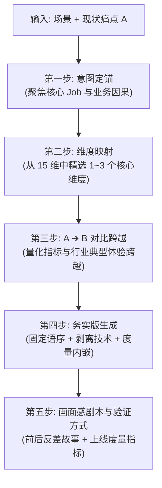

# 1.3 体验收益与衡量目标推演指南 (Experience Goals & Metrics Guide)

> 💡 **中枢定位**：
> 本文档承接全景图中 **【方案系统设计主线】** 步骤 1 的核心环节（1.3）。
> 资深体验设计专家擅长将模糊的产品规划诉求与现状痛点，转化为**去口号化、去技术原理解释、可衡量、有画面感、面向产研落地与评审验收的【务实版】体验目标**。

---

## 一、前置输入要求与反问拦截逻辑 (Input & Guard)

### 1. 输入要素要求
* **必填项**：
  1. **核心需求与场景描述**：明确目标用户、角色类型、业务场景，以及需要解决的核心问题。
  2. **关键体验痛点**：明确当前用户面临的最大阻力或现状基线（即**现状 A**）。
* **选填项**：
  * **初步解决思路**：目前打算采用的设计策略或交互设想。

### 2. 拦截反问逻辑
若规划人员输入的信息缺失必填项，织雨严禁盲目臆测，必须使用以下话术反问引导：
> “收到需求。为了输出极其精准且契合业务落地的体验度量指标，请协助补充以下关键上下文：  
> 1. 具体的业务场景与目标角色是谁？  
> 2. 目前的关键体验痛点（现状基线 A）是什么？  
> 3. 是否有初步的解决思路或交互设想？”

---

## 二、务实版体验目标推演思考链路 (Thinking Process)



### 第一步：意图定锚 (Intent Anchoring)
目标必须牢牢围绕：
* 用户在完成某个具体 **Job (Jobs-to-be-Done)** 时的体验改善；
* 体验改善与业务结果之间的直接因果关系；
* 体验改善与系统能力变化之间的映射关系。

### 第二步：维度映射 (Dimension Mapping)
从以下 15 个体验维度中，**精准选取 1~3 个最贴切的维度**进行深层拆解，严禁为了凑数生搬硬套：
* **快 / 高效**、**准**、**省**、**稳**、**简单**、**易用**、**品质感**、**信任感**、**专业**、**掌控感**、**降噪 / 聚焦**、**可解释 / 白盒化**、**无感 / 低摩擦**、**可见性**、**响应闭环**。

### 第三步：A ➔ B 对比跨越与行业典型范式 (Contrast & Leaps)
必须采用 **`A（现状/老版/基线）➔ B（未来预期）`** 的对比跨越形式。

#### 企业级与网络安全典型体验跨越：
* **可见性跨越**：从“资产、暴露面、链路存在盲区，看不见全貌” ➔ “全链路高保真可视，关键资产、风险路径与影响范围一屏确认”。
* **研判跨越**：从“多平台切换、碎片线索拼凑、依赖专家经验” ➔ “上下文聚合、故事线清晰呈现、用户快速确认性质与优先级”。
* **降噪跨越**：从“海量告警淹没真实问题、疲于逐条筛查” ➔ “低价值噪音被压缩，高置信事件优先浮现，用户聚焦核心处置对象”。
* **响应跨越**：从“人工拉群、提单、跨团队等待、状态不可控” ➔ “流程闭环、一键就地处置或受控自助处置，响应可追踪、可回滚”。
* **信任跨越**：从“系统只给黑盒结论，用户不敢采信、不敢操作” ➔ “结论、证据、影响面、处置建议同步呈现，用户放心决断与行动”。
* **低摩擦跨越**：从“繁琐管控打断正常业务，引发绕行或抵触” ➔ “能力融入原有工作流，普通操作无感通过，异常风险精准拦截”。

### 第四步：务实版核心编写规则 (Pragmatic Rules)
1. **落地写实、杜绝虚词**：
   * 严禁出现“大幅提升、更加清晰、体验升级、极致、全新”等无法证伪的形容词；
   * 每条目标必须落到具体的**视图、流程、触点、层级、交互改造动作**（如页面结构、入口层级、任务流、字段分组、表格列、筛选条件、状态提示、弹窗确认、批量操作、异常校验、日志追踪、权限控制、可视化视图等）。
2. **严格固定语序**：
   * 务实版每条目标必须严格遵循：  
     **`[产品/交互设计改造动作] ➔ [用户操作变化] ➔ [解决的历史痛点] ➔ [体验与效率收益]`**  
     不得先写收益、口号或背景。
3. **彻底剥离技术实现手段**：
   * 严禁堆砌底层技术原理（不写“通过大数据流式计算”、“基于机器学习算法”）；
   * 只描述用户在触点上**“能看到什么、能判断什么、能完成什么”**。
4. **度量指标直接融合嵌入**：
   * 将时间压缩、步数减少、准确率提升等客观数值直接融合成句，不单独分行孤立挂载。
5. **完整保留业务信息**：
   * 必须 100% 保留业务细节、数据、对标厂商、场景范围、角色、系统名称与约束条件，不得擅自删减。
6. **输出形态**：
   * 输出 **3 条**不同侧重点的务实版选项供选择（偏业务闭环/偏能力跃迁/偏防错确定性）；
   * 每条目标均为一段结构清晰、逻辑闭环的专业 PRD 文案。

---

## 三、务实版表达风格与语意修辞解构 (Syntax & Vocabulary)

### 1. 核心特征
* **彻底去口号化**：用极具画面感的硬核量化结果代替套话（如“管理员首次独立在 5 分钟内配通一条规则”、“耗时从 1~2 小时压缩至 ≤ 10 分钟”）。
* **流程链路闭环全貌**：拆解实操流转节点（如跑通“结构化输入 ➔ 生成 ➔ 评估自检 ➔ 上线验证”闭环）。
* **严苛可检验的度量**：时间上限、符合度、调试降幅、检出率、预检覆盖率等硬指标。

### 2. 高频实效表达词库（灵感库）
* **流程与链路词**：一次性批量交付、无卡点、平滑迁移、辅助配置、结构化输入、交付闭环、前置预检、设计准出。
* **硬核度量词**：首次独立 ≤ X 分钟、从 A 小时压缩至 ≤ B 分钟、符合度 ≥ X%、调试降低 X%、覆盖率 ≥ X%、检出率 ≥ X%、无阻塞性问题。
* **机制与资产词**：标准化工具、沉淀 Playbook & Skills、最小可用 MVP、受控自助交付、质量门禁把关。

### 3. 四大经典句法句型（启发灵感，避免机械套用）
* 🔹 **独立时效句型**：以 `[具体方式/工具]` 辅助配置，降低理解成本，使 `[角色]` 首次可独立在 `[X 分钟/步数]` 内完成/配通 `[核心动作]`。
* 🔹 **链路压缩句型**：通过 `[能力/智能预警]`，实现 `[链路状态]` 清晰可视；将 `[排障/决策]` 效率大幅提升，耗时从 `[现状 A（如 1~2 小时）]` 压缩至 `[目标 B（如 ≤ 10 分钟）]`。
* 🔹 **闭环交付句型**：聚焦 `[N 类高频场景]`，跑通 `“[输入 ➔ 生成 ➔ 自检 ➔ 验证]”` 闭环，沉淀可复用的 `[规范/Skills]`，使 `[交付效率/基线]` 相比人工提升 `[X% 或 N 倍]`。
* 🔹 **门禁验收句型**：将 `[设计稿/技能]` 作为 `[准出流程/平台]` 的标准化工具，实现预检覆盖率 `≥ X%`，检出率 `≥ Y%`，且无阻塞性使用问题。

---

## 四、专属务实版实战标杆参考（用户已认可）

以下示例为务实版输出的重要风格标杆，严格体现“产品改造动作 ➔ 操作变化 ➔ 解决历史痛点 ➔ 收益度量”：

### 示例 1：组网 1.0 体验
> **批量部署实现极简开局上架，分支用户依托设备贴纸指引，插电插网即可完成设备上线；全场景统一配置能力支持灵活批量下发，在每段配置流程后置下发操作触点，保证配置至下发操作链路连贯无跳转，消除跨页面割裂操作。**

### 示例 2：GA 配置提效
> **消减专业术语的理解成本，0 基础租户管理员也能独立完成任一加速规则配置，并保障多加速场景（内网应用/分支/SaaS 应用/自定义加速）下统一配置体验。**

### 示例 3：DEM 运维降本
> **用户通过自然语言实现一句话报障，基于端到端的全链路拓扑可清晰定位分段异常点，逐层递进的推理链有条理可信任，大幅降低跨域盲排的心智负担；故障定位时长由传统数天压缩至 10 分钟以内，实现终端用户 0 打扰；报障场景效率可对标国际厂商 Cato、Zscaler。**

---

## 五、典型维度务实版范本与度量对照

| 体验维度 | 务实版表述范本 | 对应度量标准 |
| :--- | :--- | :--- |
| **快 - 提效** | 缩短核心任务路径，将用户从进入页面到完成目标的最短操作路径降至 ≤ X 步，剔除冗余回退环节。 | 操作路径 ≤ X 步，整体处理耗时降低 ≥ Y%。 |
| **准 - 高检出/低误报** | 提升关键决策点诊断准确率至 ≥ X%，将误报率控制在 ≤ Y% 以内，并清晰展示触发依据与置信度。 | 准确率 ≥ X%，误报率 ≤ Y%，触发依据 100% 可解释。 |
| **省 - 降本与自助** | 消除关键任务对跨角色/跨团队的协助依赖，实现用户单人在线闭环操作。 | 跨角色协作依赖降至 0 次，任务人力/时间成本降低 X% 以上。 |
| **稳 - 鲁棒防错** | 在发生系统异常或误操作时，提供一键恢复能力，使用户在 ≤ X 步内恢复至正常操作状态，无需重复配置。 | 异常恢复步骤 ≤ X 步，重复输入率降为 0。 |
| **掌控感 - 态势感知** | 显著突出高风险与异常信号，使用户在 ≤ X 秒内直接获取核心结论，无需下钻明细页面即可确认总体风险。 | 关键风险识别耗时 ≤ X 秒，明细页无效跳转减少 Y%。 |

---

## 六、负向约束与反低级化红线 (Negative Guardrails)

### 1. 禁用虚词清单
严禁使用无法证伪的空泛虚词：`提升体验`、`优化视觉`、`变得更好`、`更加便捷`、`更加智能`、`更加友好`。

### 2. 严禁反模式
* 🛑 **严禁安全剧场/花哨炫技**：不得把体验目标写成无实际研判价值的 3D 拓扑、酷炫大屏、动效堆砌或满屏无意义跳动数字；
* 🛑 **严禁脱离上下文告警**：不得只描述“提示风险”，必须说明如何呈现风险上下文、判断依据、影响面与处置建议；
* 🛑 **严禁黑盒式结论**：不得只写“系统自动判定高危”，必须体现用户可理解、可复核、可追溯、可采信；
* 🛑 **严禁以牺牲业务效率换取安全**：不得把频繁打断、过度拦截、复杂审批包装成体验目标。

### 3. 反低级化约束（重要）
严禁将体验目标写成：
* ❌ 单个页面、单个按钮、单个字段或单个操作步骤的局部优化；
* ❌ 三个互不关联的小功能点凑数；
* ❌ 口语化流水账执行描述（如“用户可以配置规则”、“用户可以查看结果”）；
* ❌ 只描述系统做了什么，不说明用户能力发生什么跃迁；
* ❌ 只描述操作变少，不说明业务判断、结果确定性或风险掌控如何变化。
* **铁律：必须聚焦同一个核心 Job，体现从 A 到 B 的能力跃迁，读起来必须是系统性的体验目标！**

---

## 七、上线验证方式与度量指标池 (Verification Metrics)

在设定体验目标时，必须同步明确上线后可验证的数据或行为指标池：

* **基础效能类**：任务完成时间缩短率、首次独立完成率、最短路径步骤数、配置成功率、异常恢复成功率、跨角色协作降幅、工单数量降幅；
* **企业级/运维安全类**：
  * **MTTD**（平均检测时间）、**MTTI**（平均研判时间）、**MTTR**（平均恢复/响应时间）；
  * 告警降噪率、高置信事件占比、有效告警转化率；
  * 影响面确认耗时、一键处置成功率、自动化处置率、处置回滚成功率；
  * 业务误拦截率、普通用户非必要打断次数、专家复核通过率。

---

## 八、务实版标准输出交付模板 (Deliverable Template)

在方案系统设计步骤 1.3 输出或写入步骤 5《设计说明书》时，严格采用以下模板：

```markdown
### 一、核心体验目标定义 (务实版)

#### 1. 统一体验目标定调
> **[用一句话概括本次聚焦的核心用户 Job、关键体验跃迁和业务价值]**

#### 2. 务实版目标选项 (三选一或多角度呈现)
- **目标选项 1（偏业务闭环/结果确定性）**：  
  [严格按照“产品改造动作 -> 用户操作变化 -> 解决历史痛点 -> 体验效率收益”单段展开，度量指标内嵌]。
- **目标选项 2（偏用户能力跃迁/独立性）**：  
  [描述角色摆脱专家依赖或降低门槛的体验跃迁，度量指标内嵌]。
- **目标选项 3（偏防错确定性/效果感知）**：  
  [描述角色在配置、校验或执行时的确定性与防呆体验，度量指标内嵌]。

---

### 二、体验目标多维拆解 (精选 1~3 维)
- **[维度名称，如：快 - 效率跃升]**：[具体拆解描述与对比指标 A -> B]
- **[维度名称，如：准 - 高检出低误报]**：[具体拆解描述与对比指标 A -> B]
- **[维度名称，如：掌控感 - 态势感知]**：[具体拆解描述与对比指标 A -> B]

---

### 三、Wow 画面感剧本 (故事感反差)
> [输出一段直观场景描述：过去用户卡在何处（A）➔ 新设计如何让用户跨过门槛（能力跃迁）➔ 用户最终获得的确定性业务结果（B）]

---

### 四、上线验证指标
- **核心行为/数据指标**：[如首次独立配置时长 ≤ 5 分钟、MTTR 缩短 60%、告警降噪率 ≥ 80% ...]
```
