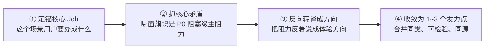
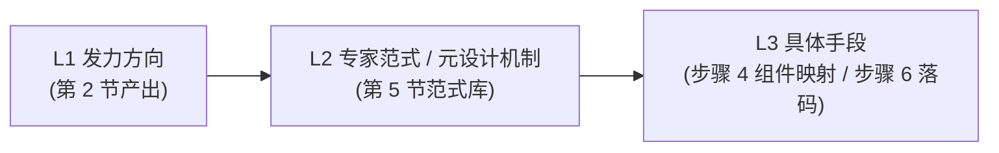

# 织雨设计智脑：设计发力点提炼与专家范式匹配规范 (Design Levers & Pattern Matching)

> 💡 **中枢定位**：
> 本文档是织雨在执行 **【方案系统设计主线】** 步骤 2 的标准作业程序。
>
> 🔗 **与步骤 1 的前后继承关系**：
> * **输入（承接步骤 1）**：主场景清单（S1~Sn）、各场景的痛点旗帜（🚩 Sx-Py）与痛点等级、以及由 [`experience-goals.md`](../①需求理解与分析/experience-goals.md) 推导出的**体验目标（A ➔ B 跨越）**。
> * **本步做什么**：先回答"这件事要**往哪个方向使劲**"，把它提炼成**设计发力点（方向级）**；再为这个方向寻找能承载它的**专家范式与元设计机制**；最后才谈具体手段。
> * **输出（交给步骤 3、4）**：设计发力点（方向）+ 业务定性 + 范式/机制选型。
>
> 🛑 **阶段铁律**：
> 1. **先定方向，再选机制，最后落手段**：严禁跳过"方向"直接匹配范式，更严禁把"标红 / 图标 / 弹窗"这类手段当成设计发力点；
> 2. **发力点必须可检验、够格**：每个发力点都必须能统领多个手段（而非一个动作），并能对应到 A ➔ B 的度量跨越；
> 3. **发力点须锚定场景与旗帜**：每个发力点都要写清它来自哪个主场景、翻转了哪面痛点旗帜（🚩 Sx-Py），不得凭空产生。

---

## 1. 先纠偏：发力点、机制、手段是三个层级 (Three Layers)

“一个标红报错”为什么会显得鸡肋？因为它属于**第三层（手段）**，而不是第一层（发力点）。三者层级如下：

| 层级 | 名称 | 回答的问题 | 合格示例 | 反面示例 |
| :---: | :--- | :--- | :--- | :--- |
| **L1** | **设计发力方向（发力点）** | 用户要**到达**什么体验状态？ | “让故障点与影响范围被**一眼清晰看见**”<br>“让用户**敢信**系统结论” | “加一个标红” |
| **L2** | **设计机制 / 专家范式** | 用什么**系统级机制**到达？ | P-01 端到端拓扑链路 + P-05 三级联动排障 | “把按钮放大” |
| **L3** | **具体手段 / 单元设计** | 到达时**踩的每一步**怎么做？ | 标红高亮、脉冲圆点、连线加粗、虚线胶囊 | —— |

> 🛑 **红线**：**单一颜色、单一图标、单一按钮、单条文案、单个动效 = 手段（L3），禁止写进“设计发力点”。**
> 判断口诀：**“这能动统几个手段？”** 若只能对应一个动作，它就不是发力点。

---

## 2. 从步骤 1 承接：设计发力点提炼四步法 (How to Analyze)

这是全篇的核心。**发力点不是拍脑袋想的，是从步骤 1 的场景与痛点“反推”出来的。**

### 输入对齐
逐条主场景 Sx 取出三样东西：**① 该场景的 Job → ② 该场景的痛点旗帜与等级 → ③ 该场景的体验目标（A ➔ B）**。

### 四步推演



1. **① 定锚核心 Job**：一句话说清这个场景用户真正要办成的事（不是页面功能）。
2. **② 抓核心矛盾**：**不要对所有痛点平均用力**。挑出阻塞该 Job 的 P0/高危旗帜，它就是这条场景的“主阻力”。
3. **③ 反向转译成方向（关键一步）**：把“阻力现象”**反着说**成“要达成的体验方向”，并用体验维度命名。见下方转译表。
4. **④ 收敛为 1~3 个发力点**：把同类方向合并，聚焦同一个核心 Job；整体保持 1~3 个，宁少勿滥。

### 第 ③ 步的核心工具：痛点现象 ➔ 发力方向 反向转译表

| 步骤 1 痛点旗帜的典型现象 | 反向转译出的「发力方向」（发力点） | 体验维度 |
| :--- | :--- | :--- |
| 看不见全貌、盲区、数据分散在多屏 | 让用户**一屏看清全链路与影响范围**，不再靠人工拼图 | 可见性 / 掌控感 |
| 海量告警淹没，真问题找不到 | 让**高置信问题优先浮现**，低价值噪音被压缩 | 降噪 / 聚焦 |
| 黑盒结论、不敢采信 | 让**结论、依据、影响面同步可见可复核**，用户放心决断 | 可解释 / 信任感 |
| 依赖专家、跨角色等待、卡脖子 | 让**一线可独立闭环**，不依赖专家协助 | 能力跃迁 / 独立性（省） |
| 怕改错、易漏配、乱操作 | 让**变更前可预知影响**，超限被拦截 | 防呆确定性 / 稳 |
| 反复跳页、路径长、视线断流 | 让用户在**就地最短路径**内闭环 | 最简闭环 / 低摩擦（快） |
| 异步盲等、报错无用、不知恢复 | 让**状态与失败原因即时可见、可修复** | 可见性 / 响应闭环 |

> 📌 发力方向的命名词库，直接复用 [`experience-goals.md`](../①需求理解与分析/experience-goals.md) 的 15 个体验维度：快/高效、准、省、稳、简单、易用、品质感、信任感、专业、掌控感、降噪/聚焦、可解释/白盒化、无感/低摩擦、可见性、响应闭环。

### 发力点合格性四检（每条都要过）

| 检查项 | 通过标准 |
| :--- | :--- |
| **方向性** | 描述的是“用户要到**达**的体验状态”，不是页面元素或动作 |
| **足够格** | 能**统领多个手段**（若只能对应一个动作 → 降级为手段） |
| **可检验** | 能对应到 A ➔ B 的度量跨越（如“识别耗时 1.5 小时 ➔ ≤ 10 分钟”） |
| **同源** | 服务于**同一个核心 Job**，不是三个互不相关的小点凑数 |

---

## 3. 方向 ➔ 机制 ➔ 手段 的挂靠 (Direction to Mechanism)

拿到发力方向后，**去范式库找能承载它的机制**，再往下才是手段（手段留到步骤 4/6 细化）：



| L1 发力方向 | L2 承载机制（范式/高元设计） | L3 典型手段（**只是手段**） |
| :--- | :--- | :--- |
| 故障点与影响范围一眼清晰可见 | P-01 端到端拓扑链路 + P-05 三级联动下钻 | 标红、脉冲圆点、连线加粗、图内虚线胶囊展开 |
| 高置信问题优先浮现、噪音被压缩 | P-04 同源聚合降噪 / 时序阈值分区间 | 浅底深字状态标签、Top N 高亮、离群点放大 |
| 结论可复核、敢采信 | P-08 攻击链阶段时间轴 / 证据链回显 | 证据卡片、影响面清单、触发依据 Popover |
| 变更前可预知影响、超限被拦 | P-05 实时配额试算状态机 | 双轴对比滑动条、超限红色拦截条、禁用按钮 + Tooltip |

> 🛑 反模式：**从“手段”倒推“发力点”**（例如因为想加标红，就说发力点是“让报错更醒目”）。正确顺序永远是 **方向 → 机制 → 手段**。

---

## 4. 业务属性与严肃度定性（定“度”，不定“向”）

定性**不改变发力方向**，只决定发力时“克制到什么程度、用什么色彩基调、容错要多严”。

| 业务大类 | 严肃程度 | 典型场景 | 推荐审美风格与色彩基调 | 关键交互原则 |
| :--- | :--- | :--- | :--- | :--- |
| **可视化运维类** | 极高 (Mission-Critical) | 拓扑监控、故障自愈、流量调度、节点巡检 | **深沉克制 / 石墨冷灰**<br>底色通透、去框线化，色彩仅留给红/黄/绿告警脉冲 | In-situ 图内原地展开、视线锚定、三级联动排障流 |
| **策略与业务配置类** | 高 (High-Reliability) | WAF 规则集、BGP 路由划拨、安全拦截策略 | **严谨理性 / 逻辑清晰**<br>蓝灰主调、明确步骤条、高对比度参数表单 | 强配额预校验、严密防呆、变更前后对比 (Diff) |
| **对象与资源管理类** | 中 (Standard Enterprise) | 资产清单、主机列表、证书管理、用户鉴权 | **现代扁平 / 高效规整**<br>白底卡片、32px 高度紧凑搜索、40px 行高表格 | 冻结关键列、多维批量操作、高频快捷抽屉编辑 |
| **复杂报表与运营分析** | 中偏低 (Analytics) | 计费账单、流量大盘、访问趋势、SLA 达标报表 | **通透开阔 / 丰富可视化**<br>双色阶图表、KPI 四联胶囊、高亮离群值 | 多维时间切片对比、Top N 数据过滤、图表/表格一键切换 |

---

## 5. 专家范式库（已迁至设计资产库 `03-design-assets/patterns/`）

> ⚠️ 使用前提：**必须先在第 2 节定出发力方向，再进范式库找机制**；严禁跳过方向直接套范式。

范式库属于**设计资产**，统一存放于设计资产库，本规范**只做引用，不内嵌明细**：

* 📁 范式库目录：[`03-design-assets/patterns/`](../../03-design-assets/patterns/)
* 🔎 速查表（先看这个）：[`patterns-cheatsheet.md`](../../03-design-assets/patterns/patterns-cheatsheet.md)
* 📄 各范式详情：`pattern-p01-*.md` ~ `pattern-p08-*.md`（P-01 端到端拓扑链路、P-02 KPI 四联驾驶舱、P-03 时间切片趋势、P-04 复杂策略分步向导、P-05 多维下钻联动排障、P-06 同源条目聚合、P-07 全生命周期巡检、P-08 安全事件调查研判）

**使用方式**：发力方向（第 2 节产出）➔ 在速查表按业务本质反查 ➔ 展开对应 `pattern-pXX-*.md` 取「核心机制 + 结构骨架 + 交互闭环」➔ 交给步骤 3/4 落地。

> 🛑 **资产归口铁律**：所有设计资产（范式 / 组件 / 套头 / Tokens）统一归口 `03-design-assets/`；本文档只保留“**怎么找发力方向**”的思考方法，不再内嵌资产明细。

---

## 6. 步骤 2 交付标准物模板 (注入《设计说明书》第二章)

```markdown
### 二、业务定性、设计发力点与范式选型 (Step 2 产物)

- **业务属性与严肃程度**：[可视化运维 / 极高严肃度]
- **色彩与审美基调**：[石墨冷灰、去框线化、仅留告警脉冲色]

#### 1. 设计发力点（方向级，源自步骤 1 的场景痛点与体验目标）
| 发力点（方向） | 来源场景 / 旗帜 | 体验维度 | 要达成的 A ➔ B | 统领的范式 |
| :--- | :--- | :--- | :--- | :--- |
| 让故障点与影响范围一眼清晰可见 | S1 / 🚩 S1-P1、S1-P2 | 可见性 / 掌控感 | 定位耗时 1.5h ➔ ≤ 10min | P-01 + P-05 |
| 让变更前可预知影响、超限被拦 | S1 / 🚩 S1-P4、S2-P2 | 防呆确定性 / 稳 | 超限事故 2 起 ➔ 0 起 | P-04/P-05 配额试算 |

#### 2. 选定的专家范式与元设计机制
- **专家范式**：P-01 端到端拓扑链路 + P-05 多维下钻联动排障
- **元设计机制**：[如：图内虚线胶囊就地展开单元 / 实时配额试算状态机]

#### 3. 方向 ➔ 机制 ➔ 手段 挂靠（手段留待步骤 4/6 细化）
- 发力点「让故障点清晰可见」➔ 机制「拓扑链路 + 联动高亮」➔ 手段：[标红、脉冲点、连线加粗 …]
```

> 📌 若某条发力点找不到 Sx-Py 归属，说明它不是从场景反推来的，应剔除或回炉到步骤 1 重新澄清。
