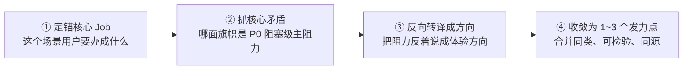

# 织雨设计智脑：设计发力点提炼与专家范式匹配规范 (Design Levers & Pattern Matching)

> 💡 **中枢定位**：
> 本文档是织雨在执行 **【方案系统设计主线】** 步骤 2 的标准作业程序。
>
> 🔗 **与步骤 1 的前后继承关系**：
> * **输入（承接步骤 1）**：主场景清单（S1~Sn）、各场景用户痛点与心理摩擦、以及核心体验改进目标。
> * **本步核心逻辑与执行顺序（四步闭环推导链条）**：
>   1. **判定需求类型与业务严肃度定性**：对照 [`2.2-标杆案例库.md`](2.2-标杆案例库.md) 门户完成需求类型定性（Type-01~07），并明确业务严肃度与色彩基调；
>   2. **业务场景 ➔ 标杆 Job 匹配映射**：从第一章拆分的业务场景（S1~Sn）出发，去标杆案例库对应分册查看该类型沉淀的标准 Job 节点（如 Job 1、Job 2、Job 3），将拆分的业务场景与标准 Job 进行精准对齐匹配；
>   3. **结合场景与 Job 诉求提炼核心设计发力点**：围绕场景痛点与所承接 Job 的本质诉求，思考体验核心矛盾，提炼 1~3 个方向级设计发力点；
>   4. **顺着匹配的 Job 靶向采纳标杆设计经验 (EP-xx)**：场景对应哪个 Job，就顺理成章地将标杆案例库中该 Job 下成熟的实战经验（EP-xx）采纳过来，确定落地机制与组件选型。
> * **输出（交付《设计说明书》第二章，并交给步骤 3、4）**：需求定性与严肃度 + 业务场景与标杆 Job 匹配表 + 核心设计发力点 + 标杆案例经验采纳矩阵（EP-xx）。
>
> 🛑 **阶段铁律**：
> 1. **严禁凭空套经验**：必须先判定需求类型，并将拆分的业务场景与标杆 Job 对齐，才能精准吸收经验；
> 2. **发力点源自业务矛盾与 Job 诉求**：每个发力点都要有对应的业务场景与 Job 支撑，严禁把“加个图标/标红”等单一手段当成设计发力点；
> 3. **用专业通俗的语言表达**：表达要专业但接地气，说人话，严禁堆砌晦涩难懂的虚词套话。

---

## 1. 先纠偏：发力点、机制、手段是三个层级 (Three Layers)

“一个标红报错”为什么会显得鸡肋？因为它属于**第三层（手段）**，而不是第一层（发力点）。三者层级如下：

| 层级 | 名称 | 回答的问题 | 合格示例 | 反面示例 |
| :---: | :--- | :--- | :--- | :--- |
| **L1** | **设计发力方向（发力点）** | 用户要**到达**什么体验状态？ | “让故障点与影响范围被**一眼清晰看见**”<br>“让用户**敢信**系统结论” | “加一个标红” |
| **L2** | **设计机制 / 专家范式** | 用什么**系统级机制**到达？ | P-01 端到端拓扑链路 + P-05 三级联动排障 | “把按钮放大” |
| **L3** | **具体手段 / 单元设计** | 到达时**踩的每一步**怎么做？ | 标红高亮、脉冲圆点、连线加粗、虚线胶囊 | —— |

> 🛑 **红线**：**单一颜色、单一图标、单一按钮、单条文案、单个动效 = 手段（L3），禁止写进“设计发力点”。**
> 判断口诀：**“这能动统几个手段？”** 若只能对应一个动作，它就不是发力点。

---

## 2. 从步骤 1 承接：设计发力点提炼四步法 (How to Analyze)

这是全篇的核心。**发力点不是拍脑袋想的，是从步骤 1 的场景与痛点“反推”出来的。**

### 输入对齐
逐条主场景 Sx 取出三样东西：**① 该场景的 Job → ② 该场景的痛点旗帜与等级 → ③ 该场景的体验目标（A ➔ B）**。

### 四步推演



1. **① 定锚核心 Job**：一句话说清这个场景用户真正要办成的事（不是页面功能）。
2. **② 抓核心矛盾**：**不要对所有痛点平均用力**。挑出阻塞该 Job 的 P0/高危旗帜，它就是这条场景的“主阻力”。
3. **③ 反向转译成方向（关键一步）**：把“阻力现象”**反着说**成“要达成的体验方向”，并用体验维度命名。见下方转译表。
4. **④ 收敛为 1~3 个发力点**：把同类方向合并，聚焦同一个核心 Job；整体保持 1~3 个，宁少勿滥。

### 第 ③ 步的核心工具：痛点现象 ➔ 发力方向 反向转译表

| 步骤 1 痛点旗帜的典型现象 | 反向转译出的「发力方向」（发力点） | 体验维度 |
| :--- | :--- | :--- |
| 看不见全貌、盲区、数据分散在多屏 | 让用户**一屏看清全链路与影响范围**，不再靠人工拼图 | 可见性 / 掌控感 |
| 海量告警淹没，真问题找不到 | 让**高置信问题优先浮现**，低价值噪音被压缩 | 降噪 / 聚焦 |
| 黑盒结论、不敢采信 | 让**结论、依据、影响面同步可见可复核**，用户放心决断 | 可解释 / 信任感 |
| 依赖专家、跨角色等待、卡脖子 | 让**一线可独立闭环**，不依赖专家协助 | 能力跃迁 / 独立性（省） |
| 怕改错、易漏配、乱操作 | 让**变更前可预知影响**，超限被拦截 | 防呆确定性 / 稳 |
| 反复跳页、路径长、视线断流 | 让用户在**就地最短路径**内闭环 | 最简闭环 / 低摩擦（快） |
| 异步盲等、报错无用、不知恢复 | 让**状态与失败原因即时可见、可修复** | 可见性 / 响应闭环 |

> 📌 发力方向的命名词库，直接复用 [`1.2-体验目标.md`](../①需求理解与分析/1.2-体验目标.md) 的 15 个体验维度：快/高效、准、省、稳、简单、易用、品质感、信任感、专业、掌控感、降噪/聚焦、可解释/白盒化、无感/低摩擦、可见性、响应闭环。

### 发力点合格性四检（每条都要过）

| 检查项 | 通过标准 |
| :--- | :--- |
| **方向性** | 描述的是“用户要到**达**的体验状态”，不是页面元素或动作 |
| **足够格** | 能**统领多个手段**（若只能对应一个动作 → 降级为手段） |
| **可检验** | 能对应到 A ➔ B 的度量跨越（如“识别耗时 1.5 小时 ➔ ≤ 10 分钟”） |
| **同源** | 服务于**同一个核心 Job**，不是三个互不相关的小点凑数 |

---

## 3. 方向 ➔ 机制 ➔ 手段 的挂靠 (Direction to Mechanism)

拿到发力方向后，**去范式库找能承载它的机制**，再往下才是手段（手段留到步骤 4/6 细化）：


| L1 发力方向 | L2 承载机制（范式/高元设计） | L3 典型手段（**只是手段**） |
| :--- | :--- | :--- |
| 故障点与影响范围一眼清晰可见 | P-01 端到端拓扑链路 + P-05 三级联动下钻 | 标红、脉冲圆点、连线加粗、图内虚线胶囊展开 |
| 高置信问题优先浮现、噪音被压缩 | P-04 同源聚合降噪 / 时序阈值分区间 | 浅底深字状态标签、Top N 高亮、离群点放大 |
| 结论可复核、敢采信 | P-08 攻击链阶段时间轴 / 证据链回显 | 证据卡片、影响面清单、触发依据 Popover |
| 变更前可预知影响、超限被拦 | P-05 实时配额试算状态机 | 双轴对比滑动条、超限红色拦截条、禁用按钮 + Tooltip |

> 🛑 反模式：**从“手段”倒推“发力点”**（例如因为想加标红，就说发力点是“让报错更醒目”）。正确顺序永远是 **方向 → 机制 → 手段**。

---

## 4. 业务属性与严肃度定性（定“度”，不定“向”）

定性**不改变发力方向**，只决定发力时“克制到什么程度、用什么色彩基调、容错要多严”。

| 业务大类 | 严肃程度 | 典型场景 | 推荐审美风格与色彩基调 | 关键交互原则 |
| :--- | :--- | :--- | :--- | :--- |
| **可视化运维类** | 极高 (Mission-Critical) | 拓扑监控、故障自愈、流量调度、节点巡检 | **深沉克制 / 石墨冷灰**<br>底色通透、去框线化，色彩仅留给红/黄/绿告警脉冲 | In-situ 图内原地展开、视线锚定、三级联动排障流 |
| **策略与业务配置类** | 高 (High-Reliability) | WAF 规则集、BGP 路由划拨、安全拦截策略 | **严谨理性 / 逻辑清晰**<br>蓝灰主调、明确步骤条、高对比度参数表单 | 强配额预校验、严密防呆、变更前后对比 (Diff) |
| **对象与资源管理类** | 中 (Standard Enterprise) | 资产清单、主机列表、证书管理、用户鉴权 | **现代扁平 / 高效规整**<br>白底卡片、32px 高度紧凑搜索、40px 行高表格 | 冻结关键列、多维批量操作、高频快捷抽屉编辑 |
| **复杂报表与运营分析** | 中偏低 (Analytics) | 计费账单、流量大盘、访问趋势、SLA 达标报表 | **通透开阔 / 丰富可视化**<br>双色阶图表、KPI 四联胶囊、高亮离群值 | 多维时间切片对比、Top N 数据过滤、图表/表格一键切换 |

---

## 5. 专家范式库（已迁至设计资产库 `03-design-assets/patterns/`）

> ⚠️ 使用前提：**必须先在第 2 节定出发力方向，再进范式库找机制**；严禁跳过方向直接套范式。

范式库属于**设计资产**，统一存放于设计资产库，本规范**只做引用，不内嵌明细**：

* 📁 范式库目录：[`03-design-assets/patterns/`](../../03-design-assets/patterns/)
* 🔎 速查表（先看这个）：[`patterns-cheatsheet.md`](../../03-design-assets/patterns/patterns-cheatsheet.md)
* 📄 各范式详情：`pattern-p01-*.md` ~ `pattern-p08-*.md`（P-01 端到端拓扑链路、P-02 KPI 四联驾驶舱、P-03 时间切片趋势、P-04 复杂策略分步向导、P-05 多维下钻联动排障、P-06 同源条目聚合、P-07 全生命周期巡检、P-08 安全事件调查研判）

**使用方式**：发力方向（第 2 节产出）➔ 在速查表按业务本质反查 ➔ 展开对应 `pattern-pXX-*.md` 取「核心机制 + 结构骨架 + 交互闭环」➔ 交给步骤 3/4 落地。

> 🛑 **资产归口铁律**：所有设计资产（范式 / 组件 / 套头 / Tokens）统一归口 `03-design-assets/`；本文档只保留“**怎么找发力方向**”的思考方法，不再内嵌资产明细。

---

## 6. 步骤 2 交付标准物模板 (注入《设计说明书》第二章)

```markdown
### 二、设计思考、标杆 Job 匹配与经验采纳 (Step 2 产物)

#### 1. 需求类型判定与严肃度定性 (定“度”，不定“向”)
- **需求类型判定**：[对照 2.2 门户定性，如：Type-07 检测任务与批量巡检类]
- **业务属性与严肃度**：[如：企业合规管控 / 极高严肃度 (Mission-Critical)]
- **色彩与审美基调**：[如：深沉克制 / 石墨冷灰底色、去框线化、异常指标单点染色]
- **页面核心架构原则**：[如：首页只管「检测任务」调度与监控；详情页才看「受检终端」排障与处置]

#### 2. 业务场景 ➔ 标杆 Job 匹配映射表
> 💡 从第一章拆分的业务场景（S1~Sn）出发，去标杆案例库对应分册匹配其标准 Job（Job 1、Job 2、Job 3）。场景对应哪个 Job，后续就针对性提炼发力点，并顺理成章将该 Job 下成熟的标杆实战经验（EP-xx）采纳过来。

| 业务场景 | 场景名称与核心痛点 | 匹配标杆标准 Job 节点 | Job 核心命题与关注维度 | 经验采纳重点 (EP 靶向承接) |
| :--- | :--- | :--- | :--- | :--- |
| **S1** | 合规检测任务制定与下发<br>*(痛点：配置繁琐易错、范围未知)* | **【Job 1：创建并运行任务】**<br>*(配置与圈选环节)* | 降低配置心智负荷与前置防呆 | 采纳 EP-03 (800px抽屉)、EP-04 (即时测算)、EP-05 (单一确定主按钮) |
| **S2** | 巡检任务执行与状态监控<br>*(痛点：长耗时盲等、离线挂死)* | **【Job 1：创建并运行任务】**<br>*(执行与监控环节)* | 非终态持续反馈与状态机防冲突 | 采纳 EP-01 (卡片流承载大数)、EP-02 (指标点染)、EP-06 (卡底细进度条与加锁) |
| **S3** | 查看任务结果与排查终端<br>*(痛点：结果混杂、跳页断流)* | **【Job 2：查看结果与排查问题】**<br>*(结果定性与排障环节)* | 宏观定性、多轮历史回溯与就地下钻 | 采纳 EP-07 (头部大结论)、EP-08 (父任务聚合历史下拉)、EP-09 (抽屉就地排查) |
| **S4** | 违规终端批量处置与闭环<br>*(痛点：处置脱节、缺乏分级闭环)* | **【Job 2：查看结果与排查问题】**<br>*(处置与闭环环节)* | 处置动作防呆与高效闭环通道 | 采纳 EP-09 (批量按钮未勾选置灰防呆)、EP-10 (零信任动态隔离防呆确认) |
| **日常管护** | 任务启停、手动重测与删除<br>*(诉求：轻操作顺手、高危防呆)* | **【Job 3：日常管理与模板维护】**<br>*(日常轻维护环节)* | 高频轻操作原地化与破坏性操作防呆 | 采纳 EP-01 (行内轻操作)、EP-10 (删除气泡回显任务名防呆) |

#### 3. 核心设计发力点提炼 (结合场景痛点与标杆 Job 诉求)
> 💡 发力点紧密连接业务场景与所匹配的标准 Job，明确面对管理者的体验卡点如何从交互机制与心智层面破局。

| 核心设计发力点 | 承接场景与 Job | 用户痛点与心理摩擦 | 系统设计解法 (Design Rationale) | 承载的标杆经验 |
| :--- | :--- | :--- | :--- | :--- |
| **发力点 1：预置规则轻量配置与受检范围即时测算** | 场景 S1 (Job 1) | 怕拼错与怕误伤，手工填参容易漏报，不知道覆盖多少台 | 常用软件与黑名单预置库多选 + 选部门即时测算终端总量 | EP-01, EP-03, EP-04, EP-05 |
| **发力点 2：长耗时任务进度连续反馈与离线自动容错** | 场景 S2 (Job 1) | 长时间黑盒盲等，离线终端卡死不知进度 | 卡片底部细进度条实时呈现 + 10分钟离线超时熔断标记 + 运行期写操作加锁 | EP-06, 超时熔断 |
| **发力点 3：违规终端就地深度排查与轻重分级闭环处置** | 场景 S3, S4 (Job 2) | 排查需跳到底层全量日志，处置脱节需人工线下催办 | 抽屉原地核对缺失项与违规路径 + 客户端自愈提醒与零信任动态隔离双通道 | EP-07, EP-08, EP-09, EP-10 |

#### 4. 采用的核心交互机制
- **单列任务卡片流**：每行一张独立卡片，指标与动作互不挤压。
- **同一任务聚合历史检测记录**：详情页通过时间下拉快速翻看历史轮次，列表不刷屏。
- **右侧抽屉就地双轴排障**：点击终端在右侧滑出抽屉，左核对软件状态、右排查违规细节，不中断主视线。
- **联动零信任网络动态隔离**：严重违规终端提供二次防呆弹窗，原地阻断权限并引导自愈。

#### 5. 标杆案例经验按 Job 靶向采纳矩阵 (从 Type-xx 精准提取)
> 💡 顺着各场景匹配的标杆 Job 节点，将标杆分册中成熟的工程实战经验（EP-xx）靶向采纳并落地：

| 经验编号 | 归属标杆 Job | 经验名称与机制 | 对齐产线 | 推荐程度 | 在本方案中的实际落地 |
| :---: | :--- | :--- | :--- | :--- | :--- |
| **EP-01** | Job 1 / Job 3 | 单列任务卡片流 (Card) | XDR / SASE | 【首选基线】 | 任务列表首选单列卡片，首页只放任务不放单机；卡片行内提供轻操作。 |
| **EP-02** | Job 1 | 未执行占位与异常指标点染 | SASE / aES | 【体验推荐】 | 未执行显示「-」而非「0」；违规数字单点染红，界面无色彩噪音。 |
| **EP-03** | Job 1 | 右侧抽屉轻量新建 (Drawer) | SASE | 【首选基线】 | 新建任务用 800px 右侧抽屉（对齐 SASE 现行规范），填完即走，保留列表上下文。 |
| **EP-04** | Job 1 | 圈选对象与前置防呆测算 | XDR / SASE | 【防呆首选】 | 勾选部门后即时测算出覆盖电脑总量，让影响面心中有数。 |
| **EP-05** | Job 1 | 单一主按钮 + 立即执行勾选框 | XDR | 【首选基线】 | 页脚只放一个主按钮「确定」，搭配立即执行勾选框，杜绝双主按钮。 |
| **EP-06** | Job 1 | 卡底细进度条与操作置灰加锁 | SASE / XDR | 【体验推荐】 | 执行中卡片底部显示细进度条；禁用重跑/删除并提示原因，防止并发脏写。 |
| **EP-07** | Job 2 | 头部一句话大结论定性 | SASE | 【体验推荐】 | 详情页顶部一句话给出诊断结论，快速定局。 |
| **EP-08** | Job 2 | 留档式父任务历史时光机 | XDR | 【强烈推荐】 | 复测不增列表条目；详情页时间下拉回切历次检测历史。 |
| **EP-09** | Job 2 | 抽屉就地排查与批量置灰 | SASE / aES | 【首选基线】 | 点击终端右侧滑出抽屉排查，不跳页；未勾选时批量按钮置灰防呆。 |
| **EP-10** | Job 2 / Job 3 | 任务名原样回显防呆与分级处置 | SASE / XDR | 【首选基线】 | 删除气泡回显任务名防误删；提供轻提醒与零信任动态隔离双通道。 |
```

> 📌 核心逻辑闭环：**判定需求类型 ➔ 场景与标杆 Job 匹配 ➔ 提炼核心设计发力点 ➔ 顺着 Job 采纳对应的标杆经验 (EP-xx)**。每一个环节都有据可依，环环相扣。
