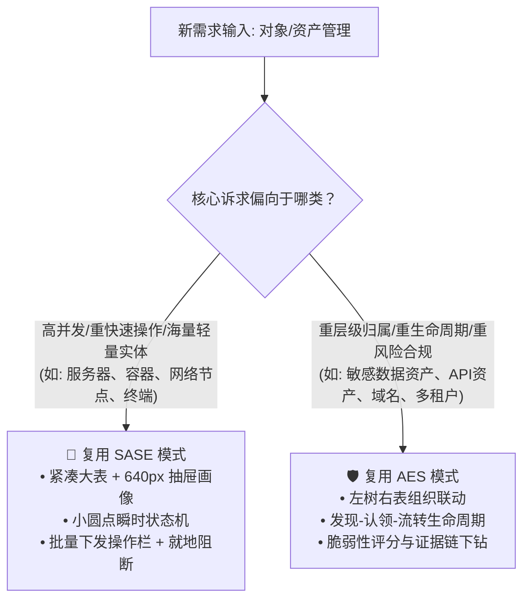

# 织雨设计智脑：B 端需求类型全景图与标杆案例库 (Benchmark Cases & Design Archetypes)

> 💡 **中枢定位**：
> 本文档是织雨在执行 **【方案系统设计主线】** 步骤 2（设计点思考）时的**核心经验底座与推演参照系**。
>
> 🔗 **与步骤 1、步骤 2 的上下游咬合逻辑**：
> 1. **步骤 1 完成时（需求理解与分析）**：在输出痛点与体验目标的同时，**对照本文档前置全景图，完成【需求类型定性】**；
> 2. **步骤 2 启动时（设计点思考）**：**必须强制查阅本文档对应需求类型**：
>    - 先对照【板块一：通用设计场景清单】，检查本次业务是否遗漏关键子场景（如连通性校验、影子资产认领、批量防呆）；
>    - 再对照【板块二：标杆案例深度蒸馏】，学习业内成熟标杆（如 SASE、AES 等）的落地手法与“为什么这样设计（Why）”；
>    - 比对本次业务与标杆案例的异同，完成经验复用，输出本次的《设计发力点与拟解决方案》；
> 3. **步骤 4 落地时（布局与结构）**：根据选定的方案架构，无缝映射到 `03-design-assets/` 组件库进行装配。

---

## 🗺️ 一、前置：B 端常见需求类型全景图与定性自检

当规划人员输入原始需求并完成步骤 1 的本质理解后，通过下表快速完成**需求类型定性**：

| 需求类型编号 | 需求类型名称 | 业务本质（解决什么核心问题） | 常见的真实业务需求场景举例 | 对应标杆案例 |
| :---: | :--- | :--- | :--- | :--- |
| **Type-01** | **对象与资产管理类** | 掌握海量物理、虚拟或数字实体的全貌台账、实时运行状态、权属责任与拓扑归属，实现高效管控、批量维护与应急排障 | • **终端安全管控**（如 SASE 办公 PC、移动终端准入合规体检与阻断）<br>• **主机与算力资产**（如数据中心服务器、云主机 ECS、虚拟机台账）<br>• **云原生容器管理**（如 Kubernetes 集群、节点 Node、Pod 实例清单）<br>• **账号与身份权限**（如企业员工目录、IAM 用户、角色与特权账号 PAM）<br>• **数据与数字资产**（如对外 API 接口清单、数据库敏感字段分类分级台账、域名与 SSL 证书生命周期）<br>• **网络与基础设施**（如交换机、路由器、防火墙网关设备及端口台账） | SASE 终端管理<br>AES 资产管理 |
| **Type-02** | **配置对接与数据同步类** | 跨异构系统、跨网络隔离区或跨平台打通控制流与数据流，确保凭据安全互通、字段精确映射对齐与数据无损增量同步 | • **异构数据库同步**（如 MySQL/Oracle 到 ClickHouse/ES 的全量与实时增量 CDC 管道）<br>• **第三方平台集成**（如企业微信/钉钉通讯录同步、飞书多维表格接入、OAuth2/SAML 单点登录认证对接）<br>• **网络对等互联打通**（如混合云跨 VPC 对等连接 Peering、专线 Direct Connect、云企业网 CEN 实例绑定）<br>• **外部通道与日志推送**（如 Syslog 日志外发、Kafka 消息流转接入、Webhook 告警回调通道配置）<br>• **开放平台应用接入**（如开发者 API 凭证管理、服务回调地址与签名机制配置） | 数据集成管道向导<br>网络对等接入向导 |
| **Type-03** | **监控度量与驾驶舱类** | 汇聚海量微观时序数据与指标状态，提供宏观秒级业务感知、异常尖刺预警与多维趋势研判，辅助全局运营与架构决策 | • **核心业务 SLA 态势大盘**（核心接口调用成功率、P99 响应耗时、系统吞吐 TPS 实时监控仪表盘）<br>• **基础设施资源与成本看板**（各业务线 CPU/内存资源水位、云存储配额消耗、按月账单走势驾驶舱）<br>• **网络质量全景监测**（全国/全球网络链路时延热力图、丢包率曲线、专线峰值带宽与拥塞监控）<br>• **企业安全综合态势**（全网安全威胁等级、拦截恶意攻击总量、高危未修复资产分布大屏） | 业务性能驾驶舱<br>全局态势大盘 |
| **Type-04** | **链路排障与拓扑分析类** | 在复杂的网状交织与层层调用的系统架构中，穿透黑盒依赖，顺藤摸瓜秒级定位性能瓶颈与级联故障因果源头 | • **分布式微服务调用链排障**（从用户请求 ➔ API 网关 ➔ 业务服务 ➔ Redis/MySQL 的调用全景拓扑与慢查询定界）<br>• **物理/虚拟网络拓扑可观测**（跨地域 VPC、VPN 网关、Transit Gateway 之间的网络路由拓扑图）<br>• **业务上下游依赖与影响面分析**（核心服务受损时，秒级推演上下游受波及的 20+ 个业务模块与受损半径）<br>• **数据血缘与流转关系图谱**（追踪某张核心数据报表从原始日志经数仓多层清洗流转的全生命周期路径） | 端到端全景排障工作台 |
| **Type-05** | **事件研判与调查处置类** | 聚合分散且海量的离散告警与异常信号，按时序串联因果证据链，消除告警风暴，驱动跨角色协同处置与闭环自愈 | • **XDR 安全事件调查研判**（还原黑客钓鱼入侵 ➔ 横向渗透 ➔ 提权 ➔ 数据渗漏全过程证据链）<br>• **智能告警中心与事故协同**（将 10,000+ 条网络抖动告警聚类为 1 起关键事故，指派应急小组并联动自愈脚本）<br>• **高危合规审批与流转工单**（涉密数据外发审批、特权操作申请、关键资产下线阻断审核工单）<br>• **故障复盘与事故复原**（事发时段指标与操作行为时序回放、责任归因与改进项跟踪） | XDR 安全事件协同研判<br>智能告警协同工作台 |
| **Type-06** | **策略规则与编排类** | 承载高复杂度、多分支条件判定与严格配额防呆的业务控制逻辑，确保规则不冲突、执行不越界、发布可预期 | • **Web 应用防火墙 (WAF) 策略编排**（按 URI 路径配置 IP 黑白名单、CC 频次防御、SQL/XSS 拦截规则）<br>• **API 网关流量治理策略**（灰度金丝雀权重切流规则、熔断降级阈值、CORS 跨域与访问黑名单）<br>• **零信任访问控制 (ZTNA) 策略**（根据角色身份、所在物理位置、终端安全基线动态判定访问权限）<br>• **数据安全脱敏与合规策略**（身份证/手机号/银行卡等敏感字段的掩码脱敏与导出限制规则编排） | 复杂策略分步向导 |

---

## 🏛️ 二、Type-01：对象与资产管理类需求兵法与标杆蒸馏

### 【板块一：对象管理类必须关注的 6 大通用设计场景】
无论管理的是服务器、终端、API 还是数据资产，设计方案时必须全面覆盖以下 6 大场景，严禁只画一个普通表格：

```text
┌─────────────────────────────────────────────────────────────────────────────────┐
│ ① 呈现架构 ── [大平铺单表 / 左右树表联动 / 资产卡片看板]                          │
│ ② 接入/新增 ── [单条录入向导 / Excel-API批量导入 / 探针主动发现与认领]            │
│ ③ 查/筛/看 ── [32px Pro-Search复合搜索 / 离散标签切片 / 自定义列配置 / 模糊vs精准]  │
│ ④ 变更/管理 ── [行内快捷就地编辑 / 抽屉深度属性配置 / 批量打标与下发 / 分组迁移]    │
│ ⑤ 状态与异常 ── [在线-离线瞬时状态机 / 风险脆弱性评分 / 异常就地阻断与隔离]         │
│ ⑥ 退出与下线 ── [带影响清单的红色阻断Modal / 资产退役归档 / 安全口令防误删]         │
└─────────────────────────────────────────────────────────────────────────────────┘
```

---

### 【板块二：标杆案例深度蒸馏与因果推演】

#### ⭐ 标杆案例 1：SASE 终端管理 (深水区：高并发、重运维控制、海量弱网终端)

##### 1. 对应板块一的 6 大场景落地做法
* **① 呈现架构**：
  - 顶部指标汇总条（在线率/合规率/失联数）；
  - 主体采用**高密度表格**（表头 32px，行高 40px，横向滚动冻结操作列）；
  - 单击行不跳页，右侧滑出 **800px 深度画像抽屉 (Drawer)**，承载硬件资产、网络状态、下发策略与风险体检 4 大 Tab。
  ```text
  ┌────────────────────────────────────────────────────────────────────────────────────────┐
  │ 页面标题栏（40px，面包屑 + "终端列表" + 统计徽标 + 右侧刷新按钮组）                         │
  ├────────────────────────────────────────────────────────────────────────────────────────┤
  │ ↓ 间距 8px                                                                             │
  │ ┌─ 4 联指标概览条 (高度 64px, bg-[#F7F9FC], p-3) ────────────────────────────────────┐ │
  │ │  在线终端 12,450   │   离线终端 1,203   │   异常终端 18 (高危红)   │   合规率 98.6%   │ │
  │ └────────────────────────────────────────────────────────────────────────────────────┘ │
  │ ↓ 间距 8px                                                                             │
  │ ┌─ 主体数据区 (白底纯净无大外框, 12px 边距) ──────────────────────────┬─ 右滑深度抽屉 ─┐ │
  │ │  [ 🔍 32px Pro-Search 复合搜索器 ]   [ 离散状态 Tag 切片 ]  [ 操作组 ] │ (宽度 800px,  │ │
  │ │ ───────────────────────────────────────────────────────────────────│  z-50 遮罩)   │ │
  │ │  紧凑数据表格 (表头 32px bg-[#EDF1F7], 内容行高 40px, 数字右对齐)    │ ┌─ 4大 Tab ─┐ │ │
  │ │  ┌────┬──────────┬─────────────┬───────────┬─────────┬───────────┐ │ │ 硬件/网络/  │ │ │
  │ │  │勾选│ 终端名   │ IP / MAC    │ 状态(圆点)│ 合规体检│ 操作(就地)│ │ │ 策略/风险  │ │ │
  │ │  ├────┼──────────┼─────────────┼───────────┼─────────┼───────────┤ │ └───────────┘ │ │
  │ │  │ [ ]│ PC-00821 │ 10.12.4.102 │ ● 在线    │  96 分  │ [阻断][体检]│ │ 深度画像详情区│ │
  │ │  └────┴──────────┴─────────────┴───────────┴─────────┴───────────┘ │ │ 状态机控制  │ │
  │ │  底部分页器 (32px, flex justify-end)                                │ [关闭]        │ │
  │ └────────────────────────────────────────────────────────────────────┴───────────────┘ │
  └────────────────────────────────────────────────────────────────────────────────────────┘
  ```
* **② 接入/新增**：
  - 提供“客户端静默安装包生成向导”（带租户 Token），支持 Windows/macOS/Linux 一键分发脚本；
  - 首次联网上报自动录入并打上“待确认”标记。
* **③ 查/筛/看**：
  - 顶部标配 `32px` Pro-Search 复合搜索器，占位符明确穷举：`请输入终端名/IP/MAC/所属员工`；
  - 常用维度（系统类型、合规状态）提取为紧凑离散 Tag，点击即切片。
* **④ 变更/管理**：
  - 表格左侧支持勾选，底部浮现 **批量操作浮动栏 (Batch Action Bar)**，支持批量下发安全策略、批量更新版本、批量划拨部门；
  - 行内仅提供常用操作（体检/隔离），不常用的收入“更多 (`···`)”。
* **⑤ 状态与异常**：
  - 状态采用**高对比度小圆点 + 纯文本**（在线：`#10B981` 绿点；离线：`#94A3B8` 灰点；异常：`#EF4444` 红点）；
  - 异常节点支持操作列“**一键就地阻断接入**”，毫秒级切断网络。
* **⑥ 退出与下线**：
  - 点击“解除绑定/注销”时，弹出红色阻断 Modal，列出受影响的安装授权与数据证书清除提示，必须键入当前操作员口令才可执行。

##### 2. 💡 项目个性化与因果推演（Why - 为什么这样设计？）
* **为什么用“表格 + 半屏抽屉”而坚决不跳独立详情页？**
  - **业务因果**：运维人员排查员工网络故障时，往往需要**对照多台终端反复比对**。如果每次点开都跳整页，视线焦点与滚动位置彻底丢失，比对效率腰斩；半屏抽屉既能看清详情，又能随时点击上一行/下一行快速切换。
* **为什么状态坚决用“小圆点”，严禁用“彩色胶囊大标签”？**
  - **体验因果**：终端数量通常在数千到数万台，如果每一行都给一个红/绿背景的大胶囊，整个屏幕花花绿绿、信噪比极低，运维人员扫视两分钟就会产生视觉眩晕与疲劳。中性纯文本配合小圆点，让界面极其通透清爽。
* **为什么突出“一键就地阻断”？**
  - **安全心智**：在零信任安全体系中，“防扩散”是第一铁律。一旦发现某终端中毒，管理员必须在当前列表 1 秒内完成切断，严禁让管理员去找详情页或三级菜单。

---

#### ⭐ 标杆案例 2：AES 资产管理 (深水区：重资产权属、重风险漏洞、重影子资产发现)

##### 1. 对应板块一的 6 大场景落地做法
* **① 呈现架构**：
  - 采用 **“左侧业务组织/网络分组树 + 右侧资产综合列表”** 双栏联动架构；
  - 顶部设立常驻看板：`已认领资产 (8,420)` 与 `未认领影子资产 (132)` 专项切换 Tab。
  ```text
  ┌────────────────────────────────────────────────────────────────────────────────────────┐
  │ 顶部导航与状态栏 (48px)                                                                 │
  ├────────────────────────────────────────────────────────────────────────────────────────┤
  │ ┌─ 专项资产切换 Tab ─────────────────────────────────────────────────────────────────┐ │
  │ │  [ ★ 已认领业务资产 (8,420) ]       [ ⚠️ 待认领影子资产 (132) 需重点处置 ]          │ │
  │ └────────────────────────────────────────────────────────────────────────────────────┘ │
  │ ↓ 间距 8px                                                                             │
  │ ┌─ 左侧组织/网络分组树 ─┬─ 右侧资产综合管理区 ────────────────────────────────────────┐ │
  │ │  (固定宽度 240px)     │  ┌─ 顶部过滤栏 (32px 高度, 漏洞级别 + 暴露面筛选 + 导出) ──┐ │ │
  │ │  ┌ 搜索组织部门/网段┐ │  └─────────────────────────────────────────────────────────┘ │ │
  │ │  ├ 核心生产集群 (4) │ │  ↓ 间距 8px                                                 │ │
  │ │  ├ 办公研发网段 (8) │ │  ┌ 资产明细列表 (表头 32px, 行高 40px) ───────────────────┐ │ │
  │ │  │  └ 终端设备 (400)│ │  │ 资产名称 │ IP/端口 │ 负责人 │ CVE脆弱性评分 │ 关联漏洞数 │ │ │
  │ │  └ 外部暴露面资产   │ │  ├──────────┼─────────┼────────┼───────────────┼────────────┤ │ │
  │ │                       │  │ CRM-Web01│ 80/443  │ 张三   │ [ 78分 较高危]│  3 个高危  │ │ │
  │ │                       │  └─────────────────────────────────────────────────────────┘ │ │
  │ └───────────────────────┴──────────────────────────────────────────────────────────────┘ │
  └────────────────────────────────────────────────────────────────────────────────────────┘
  ```
* **② 接入/新增**：
  - 探针主动被动网络扫描；
  - 针对外部新发现资产，提供“影子资产认领向导”，引导管理员明确归属部门与安全责任人。
* **③ 查/筛/看**：
  - 支持按“漏洞严重度 (CVE等级)”、“暴露面 (公网/内网)”、“业务系统”多维交集筛选；
  - 表格列宽紧凑，CVE 数量列采用数字右对齐。
* **④ 变更/管理**：
  - 资产信息变更核心是“责任人与业务标签”；支持在右侧抽屉内进行属性修改，并自动同步关联工单系统。
* **⑤ 状态与异常**：
  - 独创“资产脆弱性综合健康分”；
  - 异常不是简单的在线/离线，而是“存在待修复高危漏洞”；点击漏洞数直接下钻该资产关联的漏洞清单与修复建议。
* **⑥ 退出与下线**：
  - 资产退役需走流转审批，下线前强制校验是否仍有活跃流量连接。

##### 2. 💡 项目个性化与因果推演（Why - 为什么这样设计？）
* **为什么采用“左树右表”而不是单表？**
  - **业务因果**：大型企业资产有极严格的“权属划分（谁开发、谁负责、谁背锅）”。按部门/网络区域分层聚合是资产负责人的第一心智模型，左侧树让跨部门资产的层级关系一览无余。
* **为什么把“未认领影子资产”做成顶部独立 Tab？**
  - **业务因果**：黑客攻击最容易攻破的就是“无人认领、无人维护的边缘资产”。把影子资产提升为第一优先级待办，驱动管理员消灭盲区。

---

### ⚖️ 本次业务与标杆案例的复用决策树 (Matching Tree)
在做新的对象管理类需求时，按如下逻辑决定复用哪种解法：


---

## 🔌 三、Type-02：配置对接与数据同步类需求兵法与标杆蒸馏

### 【板块一：配置对接与同步类必须关注的 6 大通用设计场景】
无论对接的是 API、数据库、第三方平台还是网络 VPC，必须全面考量以下 6 大场景：

```text
┌─────────────────────────────────────────────────────────────────────────────────┐
│ ① 凭据鉴权与前置连通性 ── [账号密钥录入 / In-situ原地连通性测试 / 未测通阻断]      │
│ ② 数据源与同步对象选择 ── [库表多级树选 / 白名单过滤 / 数据量与配额预估]           │
│ ③ 字段映射与清洗转换 ── [双列成对对齐 / 同名自动映射 / 转换公式与默认值填补]       │
│ ④ 冲突消解与异常策略 ── [同名冲突:覆盖-跳过-报错 / 脏数据隔离区 / 熔断阈值]        │
│ ⑤ 执行周期与速率控制 ── [全量vs增量 / 定时Cron周期 / 限流限速与并发峰值保护]       │
│ ⑥ 试运行与变更下发 ──── [Dry-run空跑试算 / 差异Diff对比视窗 / 正式发布下发]        │
└─────────────────────────────────────────────────────────────────────────────────┘
```

---

### 【板块二：标杆案例深度蒸馏与因果推演】

#### ⭐ 标杆案例：数据集成管道与多源对接向导 (深水区：异构数据源、配置极易出错、数据不可逆)

##### 1. 对应板块一的 6 大场景落地做法
* **① 凭据鉴权与前置连通性**：
  - 采用 **4 步向导式卡片 (Wizard)**；
  - 第一步输入 Host、Port、Secret 后，必须提供 **“测试连通性 (Test Connection)”** 按钮；
  - 采用 **In-situ 原地检测状态机**：点击后按钮转 Loading，成功变浅绿勾，失败原地展开浅红提示卡片（报出具体网络不可达或密码错误原因），**未测通严禁点击“下一步”**。
* **② 数据源与同步对象选择**：
  - 采用左右穿梭树结构（左侧待选库表，右侧已选同步对象）；
  - 实时显示已选数量与预估行数。
* **③ 字段映射与清洗转换**：
  - 采用 **“双列并排对齐表格”**（左侧来源字段，右侧目标字段）；
  - 顶部标配 **“自动同名连线”** 与 **“同类型自动匹配”** 按钮；
  - 未匹配的字段用橙色虚线高亮提醒；支持行内为目标字段配置默认补全值。
* **④ 冲突消解与异常策略**：
  - 必须提供“主键冲突处理策略”单选卡片组：
    - `覆盖写入`（以最新为准）
    - `跳过忽略`（保留既有数据）
    - `阻断报错`（立即暂停同步并告警）
  - 设立“异常脏数据容忍度”输入框（如允许 0.1% 错误行，超限即熔断）。
* **⑤ 执行周期与速率控制**：
  - 单选支持：`单次全量同步` / `实时增量监听 (CDC)` / `定时周期同步 (Cron)`；
  - 配备流控滑块（Max TPS / 最大带宽占用），防止打爆业务生产数据库。
* **⑥ 试运行与变更下发**：
  - 在最终确认页提供 **“试运行 10 条 (Dry-run)”** 按钮；
  - 在轻量抽屉中预览实际转换后的 JSON/表格结果，用户核对无误后点击“启动同步任务”。

##### 2. 💡 项目个性化与因果推演（Why - 为什么这样设计？）
* **为什么强制“In-situ 原地测试连通性”，且不通过不让走下一步？**
  - **因果痛点**：传统配置表单最痛的就是：花 10 分钟辛辛苦苦填完了 4 个页面的参数，最后点击保存时后端抛出 `Network Timeout: Connection Refused`，前面的心血全部白费。**原地前置阻断把排障成本降到最低**。
* **为什么字段映射必须有“自动同名匹配”？**
  - **体验因果**：工业级数据表往往有几十甚至上百个字段，如果全靠人工一行行下拉选择，不仅极易看花眼导致映射错乱，更会引发巨大的抵触情绪。“一键同名对齐”能瞬间解决 80% 的工作量。
* **为什么引入“Dry-run 试运行预览”？**
  - **心理因果**：数据同步属于“不可逆破坏性高危操作”。如果配置写错，可能把目标库的数据洗坏。提供 10 条真实试跑预览，是给规划与运维人员最大的**信任定心丸**。

---

## 📈 四、其他四大类型设计要点与通用清单 (Type 03~06 速查)

### Type-03: 监控度量与驾驶舱类 (Observability)
* **通用设计场景考量**：
  - ① 核心 KPI 一眼感知（4 联卡片，大字号 `24px Outfit`，环比趋势微图）；
  - ② 状态色温降噪（正常去标签，仅严重异常保留高危三元组）；
  - ③ 时间轴快速切片（15分钟/1小时/24小时/自定义跨度平滑切换）；
  - ④ 跨组件同源联动（点击折线图异常点，下方明细表格自动过滤对应时间段）。

### Type-04: 链路排障与拓扑分析类 (Topology & Tracing)
* **通用设计场景考量**：
  - ① 网状复杂度收拢（按层级虚拟聚合，严禁千条蜘蛛网连线）；
  - ② 四级连线语法（绿实线 1.8px ➔ 橙实线 1.8px ➔ 红虚线流动 2.0px ➔ 核心故障 3.0px）；
  - ③ 图内就地闭环（点击节点弹出半透气泡 Popover 查看状态，不跳转）；
  - ④ 故障扩散半径感知（高亮受影响的下游依赖节点，其余节点半透明置灰）。

### Type-05: 事件研判与调查处置类 (Incident & Investigation)
* **通用设计场景考量**：
  - ① 告警聚合降噪（同源告警合并为单一高危事件，杜绝告警风暴）；
  - ② 因果证据链还原（按时序串联攻击/故障阶段时间轴）；
  - ③ 处置防呆与工单闭环（一键阻断、下发临时规则、派发飞书/钉钉工单）。

### Type-06: 策略规则与编排类 (Rule & Policy)
* **通用设计场景考量**：
  - ① 条件分支可视化（树状 IF-ELSE 条件组，支持拖拽排序与优先级调整）；
  - ② 实时配额与资源试算（下发规则前预估 CPU/带宽开销，超限阻断）；
  - ③ 冲突检测机制（新增规则如果被前置既有规则完全覆盖，给出显式警告）。

---

## 🎯 五、设计点输出规范模板 (Output Contract for Step 2)

在完成步骤 2 的标杆学习后，织雨必须按照以下结构化格式向规划人员输出《设计点思考与拟解决方案》：

```markdown
### 💡 步骤 2：设计点思考与标杆借鉴推演

1. **本次需求类型判定**：【属于 Type-0X: xxx 类需求】
2. **标杆案例映射与启发**：
   - 参照标杆：[如 SASE 终端管理 / 数据对接向导]
   - 借鉴点：[如复用其“表格+640px画像抽屉”架构与“原地连通性测试”机制]
   - 本次个性化差异：[说明本次业务与标杆不同的地方，如本次数据量较小但对审计日志要求更高]
3. **关键业务共性场景覆盖清单**：
   - [x] 场景 1（接入与连通性）：设计了 In-situ 原地检测机制；
   - [x] 场景 2（呈现与查筛）：采用 32px Pro-Search + 高密度表格；
   - [x] 场景 3（高危防呆）：退出删除设计了影响资产清单与口令验证。
4. **核心设计发力点 (L1 方向 ➔ L2 机制)**：
   - **发力点 1**：[方向] ➔ [对应机制/范式]
   - **发力点 2**：[方向] ➔ [对应机制/范式]
```
