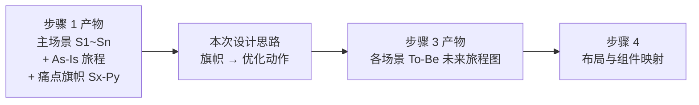
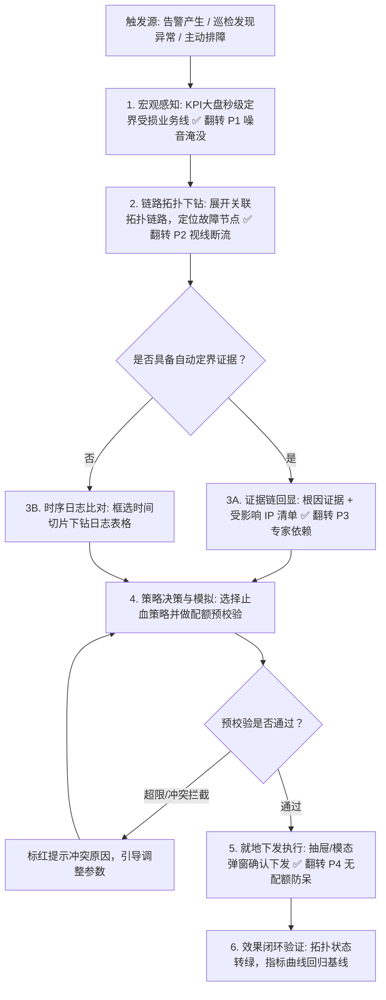

# 织雨设计智脑：本质任务旅程构建与流程建模规范 (Journey & Flow Modeling)

> 💡 **中枢定位**：
> 本文档是织雨在执行 **【方案系统设计主线】** 步骤 3 的标准作业程序。
>
> 🔗 **与步骤 1 的前后继承关系**：
> * **输入（承接步骤 1）**：主场景清单（S1~Sn）、各场景的 As-Is 现状旅程、已插旗的痛点（Sx-Py）。
> * **本步做什么**：在现状与痛点的基础上，**按本次设计思路，逐个场景描绘「优化调整后的未来旅程（To-Be）」**——即用户今后怎么更顺地把这件事办成。
> * **输出（交给步骤 4）**：每个主场景一张 To-Be 未来旅程图 + 一张痛点翻转对照表。
>
> 🛑 **阶段铁律**：
> 1. **场景一一对应**：未来旅程的场景编号必须与步骤 1 的 S1~Sn 严格对应，不新增、不合并、不遗漏；
> 2. **旗帜必须回应**：步骤 1 插下的每一面痛点旗帜（Sx-Py），都要在对应场景的未来旅程里被明确回应（解决 / 规避 / 本期不处理并说明原因）；
> 3. **只画未来**：本步骤只绘制“优化后”的旅程，现状 As-Is 不再重画（已在步骤 1 完成）。

---

## 1. 承接与推演链路 (From As-Is to To-Be)



**推演三步**：
1. **对齐场景**：从步骤 1 的场景清单中取出本次相关度为**高/中**的场景，逐条对应（S1→S1、S2→S2……）；
2. **翻转痛点**：把每个场景的痛点旗帜，翻译成本次的**优化动作**（如：噪音淹没 → 顶部 KPI 秒级定界）；
3. **重画旅程**：把优化动作落成未来旅程的节点与分支，形成该场景的新闭环。

---

## 2. 未来旅程推演三原则

1. **黄金路径最简原则 (Golden Path First)**：优先保证 80% 最常见场景的一键直达与最短操作链路；
2. **图内原地闭环原则 (In-situ Loop)**：非必要不跳页，操作对象与结果在同一视线锚定区闭环；
3. **异常与分支兜底原则 (Failsafe)**：每个节点都要考虑超时、鉴权不足、参数冲突、并发修改等异常分支与回滚方案。

---

## 3. 痛点旗帜 → 优化动作 翻转对照 (核心机制)

按场景，把步骤 1 的每一面旗帜翻转成未来旅程里的落点：

| 场景 | 痛点旗帜 | 现状阻碍（来自步骤 1） | 本次优化动作（设计策略） | 未来旅程落点（节点） |
| :---: | :---: | :--- | :--- | :--- |
| **S1** | 🚩 S1-P1 | … | … | … |
| **S1** | 🚩 S1-P2 | … | … | … |
| **S3** | 🚩 S3-P1 | 监控大盘无法秒级定界受损业务线 | 顶部 KPI 四联大盘秒级定界 | 节点 1「宏观感知」 |

> 说明：每面旗帜都必须有归属；本期确实不处理的，须写明“本期不处理 + 原因”，禁止悄悄消失。若未来旅程里新增了节点，须说明它服务于哪条场景的闭环。

---

## 4. 标准未来旅程图 (Mermaid) 建模规程

* **按场景逐个绘制**，图题标注场景编号，如：`场景 S1：入职账号开通 · To-Be 未来旅程`；
* 节点用 `Tn` 顺序编号，判断与异常用 `Decision` 节点；
* 承载优化的节点用 `✅` 标注它翻转了哪面旗帜，便于与步骤 1 对齐。

### 标杆示例（承接步骤 1 的「跨地域故障排查」场景）



> 其他高/中相关度场景同理各画一张；切勿把所有场景揉成一张「大而全」的图。

---

## 5. 典型高级流转策略库 (Advanced Flow Strategies)

### 策略 A：In-situ 图内原地展开与就地闭环
* **适用痛点**：用户在图里发现异常，传统做法是“点击跳转到详情页”，导致失去上游上下文。
* **织雨策略**：
  * 点击节点后，**直接在拓扑节点内部展开一层虚线胶囊或内嵌表格**；
  * 处理完毕一键折叠，用户视线全程停留在全局架构上。

### 策略 B：三级联动穿透排障流
* **适用痛点**：指标多、数据碎，找不到因果关系。
* **织雨策略**：
  * **第一级（头部时间轴/大盘）**：框选异常时间范围；
  * **第二级（中部拓扑图）**：受该时间范围波及的节点自动高亮呼吸动效；
  * **第三级（底部数据表）**：点击高亮节点，底部明细表立刻下沉过滤为该节点对应的近端日志与调用链明细。

### 策略 C：同源数据聚合与防呆状态机流
* **适用痛点**：跨地域/同源站海量条目散落，配置时容易漏项或超配额。
* **织雨策略**：
  * 按源站/地域聚合为父卡片，子节点支持一键全选或差异化配置；
  * 状态机严格约束：正在同步中的条目，操作按钮置灰并挂载 Tooltip，杜绝数据脏写。

---

## 6. 步骤 3 交付标准物模板 (注入《设计说明书》第三章)

在推进到步骤 4 前，织雨按**场景**固化以下结构：

```markdown
### 三、优化后各场景本质任务旅程 (To-Be Journey)

#### 1. 场景与旗帜对应总览
| 场景编号 | 主场景名称 | 相关度 | 涉及旗帜 | 本次优化主线 |
| :---: | :--- | :---: | :--- | :--- |
| S1 | … | 高 | 🚩 S1-P1 / S1-P2 | … |
| S2 | … | 高 | 🚩 S2-P1 | … |

#### 2. 痛点翻转对照
| 场景 | 痛点旗帜 | 本次优化动作 | 未来旅程落点 |
| :---: | :---: | :--- | :--- |
| S1 | 🚩 S1-P1 | … | 节点 1「…」 |

#### 3. 各场景未来旅程流程图 (Mermaid)
##### 场景 S1：[场景名]
```mermaid
graph TD
    [该场景优化后的任务流转，承载优化的节点用 ✅ 翻转 S1-Px]
```
##### 场景 S2：[场景名]
```mermaid
graph TD
    [同上，翻转 S2-Px]
```

#### 4. 关键交互策略选择
- [如：In-situ 图内原地展开 / 三级联动排障 / 配额防呆状态机]

*(说明：本步骤只输出“优化后”的未来旅程；其现状 As-Is 与痛点基线见《设计说明书》第一章)*
```
