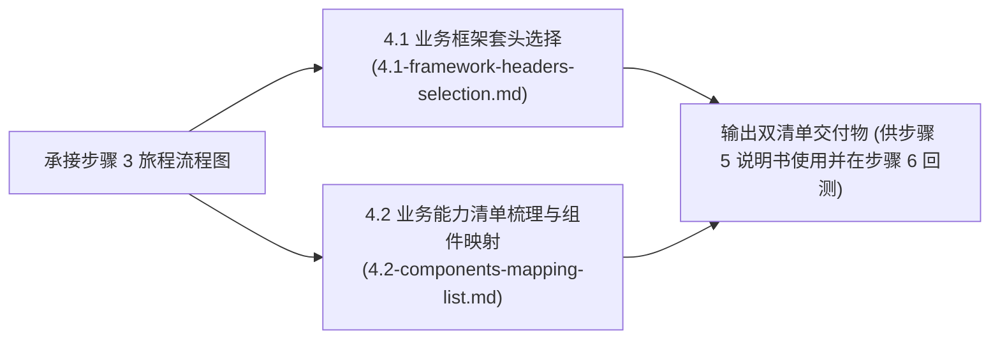

# 步骤 4：框架布局与组件结构推演总览 (Overview & Delivery)

> 💡 **定位**：方案系统设计主线步骤 4 的主控与交付标准说明。

---

## 1. 推演流程全景



---

## 2. 交付物标准模板 (用于注入步骤 5 设计说明书)

```markdown
### 四、框架套头选型与能力组件清单
#### 1. 业务框架套头
- **选定模板**：[TPL-01 监控大盘标准套头 / TPL-02 对象管理标准套头 ...]
- **套头骨架组成**：[如：面包屑 + 紧凑 Pro-Search + 固定操作组]

#### 2. 能力与组件对应清单
| 业务能力项 | 承载组件 | 规范引用 | 关键设计硬约束 |
| :--- | :--- | :--- | :--- |
| 1. [能力A: 如高频维度过滤] | [Pro-Search] | `comp-pro-search.md` | [32px 高度, 支持折叠] |
| 2. [能力B: 如多维时序呈现] | [切片趋势图] | `comp-chart.md` | [双轴时序, Top5 刷子降噪] |
| 3. [能力C: 如异常明细排障] | [紧凑表格] | `comp-table.md` | [40px 行高, 表头32px, 右对齐] |
```
