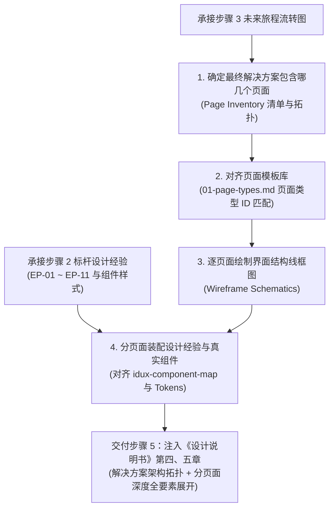

# 4.1 业务解决方案架构、页面清单与框架选型指引 (Solution Architecture & Page Inventory)

> 💡 **中枢定位**：
> 本文档是方案系统设计主线步骤 4 的主控与框架选型指引。
> 承接步骤 3 的未来黄金旅程，将业务流程落地为**端到端最终解决方案蓝图**：
> 1. **明确解决方案包含哪几个页面/视图**（主页面、抽屉、弹窗的关系拓扑与页面清单）；
> 2. **对齐页面模板库**（严格从 [`03-design-assets/page-templates/01-page-types.md`](../../03-design-assets/page-templates/01-page-types.md) 中选择标准页面类型 ID）；
> 3. **为每个页面产出界面布局线框图**（Wireframe Schematics）；
> 4. **将步骤 2 学习到的标杆设计经验（EP-xx）与真实 idux 组件进行分页面深度装配**，彻底避免信息孤岛。

---

## 一、步骤 4 最终解决方案推导工作流

---

## 二、页面模板选型参考 (对齐 `01-page-types.md`)

| 页面类型 ID | 模板名称 | 骨架特征 | 适用场景 |
| :--- | :--- | :--- | :--- |
| `page-table-basic` | **基础表格页** | 标题栏 + 表格工具栏 + 主数据表格 + 分页栏 | 基础对象查看、简单列表维护 |
| `page-table-overview` | **概览表格页** | 页面标题栏 + 顶部 KPI / 汇总卡片区 + 工具栏 + 数据表格 | 态势大盘、带宏观指标的资产或任务列表 |
| `page-table-tree` | **左树表格页** | 标题栏 + 左侧组织树/标签树 (240px) + 右侧数据表格 | 强组织架构层级归属的对象管理 |
| `page-form-drawer` | **抽屉表单页** | 右侧滑出抽屉 (480~640px) + 纵向表单 + 底部固定操作栏 | 轻量对象新建、就地快速配置 (EP-01) |
| `page-detail-drawer` | **抽屉详情页** | 右侧滑出抽屉 (640~800px) + 详情卡片/双栏排障 + 证据链 | In-situ 就地排障与体检下钻 (EP-07) |
| `page-form-modal` | **弹窗表单页** | 居中模态弹窗 (480~600px) + 紧凑表单 + 底部确认/取消 | 简短参数修改、标签编辑、加白申请 |
| `page-form-step-drilldown`| **步骤条配置页** | 顶部步骤条 (Steps) + 中部动态表单 + 底部引导操作底栏 | 极复杂向导、多阶段策略编排 |

---

## 三、步骤 4 标准交付契约（分页面装配，直供步骤 5 汇流）

完成步骤 4 推导后，必须输出以下两大结构化内容，作为注入步骤 5 设计说明书的硬性输入：

### 1. 最终解决方案架构与页面清单总览 (用于设计说明书第四章)
* **页面清单表**：列明每个页面编号（`Page-01`, `Page-02`...）、页面名称、交互形态（主页/抽屉/弹窗）、模板类型 ID、承担的用户 Job。
* **页面间关系拓扑图**：Mermaid 状态图或流转图，清晰标明从哪一个操作唤起哪一个抽屉/弹窗，以及完成后的就地回落机制。

### 2. 分页面全要素深度展开清单 (用于设计说明书第五章)
针对解决方案中的**每一个**页面/视图，依次结构化输出：
1. **页面定位与用户 Job**：该页面承担什么核心任务，翻转了哪几个现状痛点（插旗 `🚩Sx-Py`）；
2. **界面结构线框示意图 (Wireframe Schematic)**：清晰的布局线框，标注头部套头、筛选栏、卡片区、主表格/拓扑区、操作底栏等；
3. **承载的设计经验与 Why 因果**：明确本页面落地了哪几条标杆设计经验（如 `EP-01`, `EP-02`, `EP-04`, `EP-07`），说明为何在此采用此解法；
4. **页面模板与真实 idux 组件清单**：列明选用的模板 ID、所用真实组件（`IxTable`, `IxDrawer`, `IxProgress`, `IxPopconfirm` 等）、尺寸与 Token 硬指标（`h32`, `h28`, `rounded-[2px]`, `#1C6EFF` 等）；
5. **关键交互与状态流转机制**：原地闭环逻辑、实时计算或心跳防死信规则。
