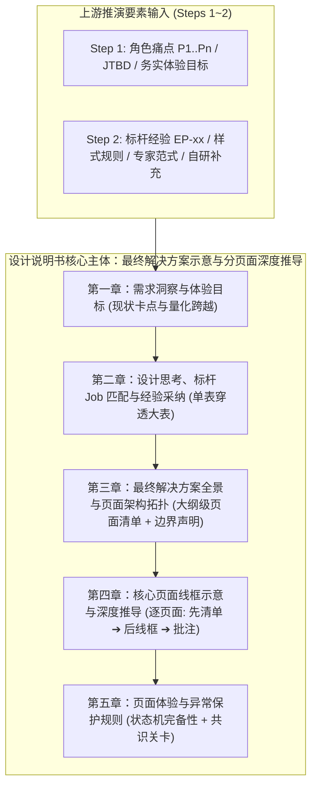

# 织雨设计智脑：标准设计说明书模板 (Design Specification Template)

> 💡 **中枢定位**：
> 本文档是织雨在执行 **【方案系统设计主线】** 步骤 4 的核心交付物模板。
> 它是资深设计师在动工写代码前，向业务规划人员呈递的**“端到端最终解决方案全景共识协议”**。
>
> 🛑 **系统化整合铁律（拒绝碎片化与机械堆叠）**：
> 设计说明书绝不是把 1~3 步推演产物机械、孤零零地各放一块内容！
> 它必须是将每一步的信息（业务痛点、标杆经验、场景旅程、组件选型）**全面汇流、整理并结构化映射到最终的解决方案中**：
> 明确回答本次需求**最终包含哪几个页面、各页面的界面结构线框图如何、每个页面融合承载了哪些标杆设计经验、以及具体采用了哪些页面模板和 idux 真实组件与 Token 样式**。
>
> 📐 **排版顺序与表达核心铁律（防退化硬规则）**：
> 1. **结构五章齐备**：全篇固定为五大章节，评审共识关卡统一作为第五章底部的 `<div class="checkpoint">` 浮层，不设独立第六章。
> 2. **第二章单表穿透**：业务场景映射与发力点**必须合并为唯一大表**（7 列表头），强制保留「自行设计补充（业务自研）」列，彻底杜绝双表套娃与重复。
> 3. **第四章严格“先清单、后线框”**：每个分页面小节必须遵循 `① 页面定位 ➔ ②【置顶】设计经验与组件映射清单 ➔ ③【居中】结构线框图 ➔ ④【底部】设计批注 (wf-annotation)` 的专业逻辑。
> 4. **双轨制归因标注**：映射清单中，标杆复用必须使用 `<span class="tag-exp">EP-xx</span>`（绿底实线），标杆未覆盖的自研推导必须使用 `<span class="deriv">业务独立推导</span>`（灰底虚线），血统泾渭分明。
> 5. **EP 经验与真实 UI 文本彻底解耦**：线框图中的按钮、标签、表头文字必须是 **100% 干净真实的业务语言**，**严禁**在 UI 文案中写入 `(EP-xx)`（如禁止写 `立即执行 (EP-05)`），EP 编号只允许出现在代码注释、映射表与底部批注中。
> 6. **文风去 AI 套话与黑话**：拒绝“极速赋能”、“零心智负担”、“立体感知”等无物虚词，拒绝虚拟人设吹嘘；采用简约、清晰、克制的设计师直白表达与量化对比（如“30 分钟 ➔ 30 秒”、“首页管任务、详情管终端”）。
> 7. **模板借用规范**：若 [`01-page-types.md`](../../03-design-assets/page-templates/01-page-types.md) 暂无专属模板，严禁杜撰不存在的 template ID，必须借用相近模板并显式注明参考案例（如：`套头借用 page-table-overview + 自定义主从分栏，参考 XDR 模板管理案例`）。
> 8. **表单书写必须严格参考设计资产规范输出（左右结构铁律）**：所有线框图中的表单书写**必须严格参考设计资产规范 [`03-design-assets/components/design-form.md`](../../03-design-assets/components/design-form.md) 输出**。所有表单片段必须遵循**左右结构**（左文本标题 Label、右组件内容 Control），**严禁出现 Ant Design 默认的上标题下组件（Vertical）布局**（严禁在 Label 文本后使用 `<br/>` 断行堆叠表单项）。非必填项左侧必须留星号占位空间确保文字像素级垂直对齐。
>
> 🛡️ **交付前自检铁律（强制 · 未过不得汇报）**：
> 出稿后**必须**运行 `bash tools/design-spec-selfcheck.sh design-spec-<业务名>.html` 并取得 **9/9 全绿**，方可进入「🚦 人机共识确认闸门」。

---

## 一、章节内容结构（系统化整合骨架，五章固定）



---

## 二、HTML 骨架模板（包含 Wireframe 视觉组件与全要素结构）

将下方骨架中的 `[方括号占位]` 替换为真实内容，产出单个 `.html` 文件即可在浏览器中获得兼具专业推演、视觉线框与工程组件映射的方案说明书。

```html
<!DOCTYPE html>
<html lang="zh-CN">
<head>
  <meta charset="UTF-8" />
  <meta name="viewport" content="width=device-width, initial-scale=1.0" />
  <title>织雨体验设计方案说明书：[方案名称]</title>
  <script src="https://cdn.jsdelivr.net/npm/mermaid@10/dist/mermaid.min.js"></script>
  <style>
    :root {
      --bg: #F7F9FC; --card: #FFFFFF; --border: #E1E5EB;
      --text: #2F3540; --text-sub: #6F7785; --text-mute: #A1A7B3;
      --blue: #1C6EFF; --blue-l: #E8F4FF; --blue-border: #BAE6FD;
      --warn-t: #FA8C16; --warn-b: #FFFBE6; --warn-bd: #FFE58F;
      --green-t: #12A679; --green-b: #F6FFED; --green-bd: #B7EB8F;
      --danger-t: #D9363E; --danger-b: #FFF1F0; --danger-bd: #FFA39E;
    }
    * { box-sizing: border-box; }
    body {
      margin: 0; background: var(--bg); color: var(--text);
      font-family: "Inter", "PingFang SC", "Helvetica Neue", Arial, sans-serif;
      font-size: 13px; line-height: 1.7;
    }
    .wrap { max-width: 1040px; margin: 0 auto; padding: 24px; }
    .doc { background: var(--card); border: 1px solid var(--border); border-radius: 6px; padding: 36px; box-shadow: 0 1px 3px rgba(15,23,42,0.04); }
    h1 { font-size: 22px; line-height: 30px; font-weight: 700; margin: 0 0 16px; color: #1E293B; }
    h2 { font-size: 16px; line-height: 24px; font-weight: 600; margin: 36px 0 14px; padding-bottom: 8px; border-bottom: 1px solid var(--border); color: #1E293B; }
    h3 { font-size: 14px; font-weight: 600; margin: 24px 0 10px; color: #2F3540; }
    h4 { font-size: 13px; font-weight: 600; margin: 16px 0 6px; color: var(--text-sub); }
    
    .meta { color: var(--text-sub); font-size: 12px; margin-bottom: 24px; line-height: 2; background: #F8FAFC; padding: 12px 16px; border-radius: 4px; border: 1px solid var(--border); }
    .meta b { color: var(--text); }
    .status { display: inline-block; padding: 2px 8px; border-radius: 2px; background: var(--warn-b); color: var(--warn-t); border: 1px solid var(--warn-bd); font-size: 11px; font-weight: 500; }
    
    table { width: 100%; border-collapse: collapse; margin: 12px 0; font-size: 12px; }
    th { background: #EDF1F7; color: #454C59; font-weight: 500; text-align: left; height: 32px; padding: 0 12px; border-bottom: 1px solid var(--border); white-space: nowrap; }
    td { height: 38px; padding: 6px 12px; border-bottom: 1px solid var(--border); vertical-align: top; }
    .num { text-align: right; font-variant-numeric: tabular-nums; }
    
    /* 标签双轨制：标杆复用实线绿 vs 业务独立推导虚线灰 */
    .tag { display: inline-block; padding: 1px 8px; border-radius: 2px; font-size: 11px; background: var(--blue-l); color: var(--blue); border: 1px solid var(--blue-border); }
    .tag-exp { display: inline-block; padding: 1px 8px; border-radius: 2px; font-size: 11px; background: var(--green-b); color: var(--green-t); border: 1px solid var(--green-bd); font-weight: 600; }
    .deriv { display: inline-block; padding: 1px 8px; border-radius: 2px; font-size: 11px; background: #F1F5F9; color: #454C59; border: 1px dashed #94A3B8; }
    .flag { display: inline-block; padding: 1px 6px; border-radius: 2px; font-size: 11px; background: var(--danger-b); color: var(--danger-t); border: 1px solid var(--danger-bd); }
    
    .mermaid { background: #F8FAFC; border: 1px solid var(--border); border-radius: 4px; padding: 16px; margin: 14px 0; text-align: center; overflow-x: auto; }
    ul { margin: 8px 0; padding-left: 20px; }
    li { margin: 4px 0; }
    .note { background: #F8FAFC; border-left: 3px solid var(--blue); padding: 8px 14px; margin: 10px 0; font-size: 12px; color: #454C59; }

    /* ========== 通用线框图视觉基础原语 (Universal Wireframe Primitives) ========== */
    .wf-container { background: #F8FAFC; border: 1px dashed #CBD5E1; border-radius: 6px; padding: 16px; margin: 16px 0; }
    .wf-label { display: inline-block; font-size: 11px; font-weight: 700; color: #454C59; margin-bottom: 6px; }
    .wf-shell { background: #FFFFFF; border: 1px solid #E2E8F0; border-radius: 4px; box-shadow: 0 1px 3px rgba(15,23,42,0.05); overflow: hidden; }
    .wf-header { background: #F1F5F9; border-bottom: 1px solid #E2E8F0; padding: 8px 12px; display: flex; justify-content: space-between; align-items: center; font-size: 11px; font-weight: 600; color: #454C59; }
    .wf-body { padding: 12px; }
    .wf-row { display: flex; gap: 10px; margin-bottom: 10px; align-items: stretch; }
    .wf-col { flex: 1; }
    .wf-card { background: #F8FAFC; border: 1px solid #E1E5EB; border-radius: 2px; padding: 8px 10px; font-size: 11px; }
    .wf-table { width: 100%; border-collapse: collapse; font-size: 11px; margin-top: 6px; }
    .wf-table th { background: #EDF1F7; padding: 6px 8px; border-bottom: 1px solid #E2E8F0; text-align: left; height: auto; }
    .wf-table td { padding: 6px 8px; border-bottom: 1px dashed #E2E8F0; color: #64748B; height: auto; }
    .wf-btn { display: inline-block; padding: 2px 10px; border-radius: 2px; font-size: 11px; background: #FFFFFF; color: #2F3540; border: 1px solid #D3D7DE; }
    .wf-btn-primary { display: inline-block; padding: 2px 10px; border-radius: 2px; font-size: 11px; background: var(--blue); color: #FFFFFF; border: 1px solid var(--blue); }
    .wf-btn-disabled { display: inline-block; padding: 2px 10px; border-radius: 2px; font-size: 11px; background: #EDF1F7; color: #BEC3CC; border: 1px solid #E2E8F0; }
    .wf-drawer-overlay { display: flex; background: rgba(15, 23, 42, 0.15); border: 1px dashed #94A3B8; border-radius: 4px; min-height: 280px; position: relative; }
    .wf-drawer-body { width: 440px; background: #FFFFFF; border-left: 2px solid var(--blue); padding: 16px; margin-left: auto; box-shadow: -4px 0 16px rgba(15,23,42,0.12); display: flex; flex-direction: column; }
    .wf-modal-overlay { display: flex; justify-content: center; align-items: center; background: rgba(15, 23, 42, 0.25); border: 1px dashed #94A3B8; border-radius: 4px; min-height: 240px; padding: 20px; }
    .wf-modal-body { width: 480px; background: #FFFFFF; border: 1px solid #CBD5E1; border-radius: 4px; padding: 16px; box-shadow: 0 4px 16px rgba(15,23,42,0.14); }
    .wf-annotation { font-size: 11px; color: #1C6EFF; background: #E8F4FF; padding: 6px 10px; border-radius: 2px; border-left: 3px solid var(--blue); margin-top: 10px; line-height: 1.6; }

    /* 表单专用线框原语（严格左右结构：左 Label 固定宽 + 间距 16px + 右 Control） */
    .wf-form-item { display: flex; align-items: flex-start; margin-bottom: 12px; }
    .wf-form-label { width: 110px; flex-shrink: 0; color: #6F7785; font-size: 11px; padding-top: 4px; text-align: left; }
    .wf-form-control { flex: 1; min-width: 0; }

    /* 底部评审共识关卡浮层 */
    .checkpoint { background: var(--blue-l); border: 1px solid #BAE6FD; border-radius: 4px; padding: 16px 20px; margin-top: 36px; font-size: 12px; color: #1C6EFF; line-height: 1.8; }
    .checkpoint b { display: block; margin-bottom: 6px; font-size: 13px; color: #1C6EFF; }
  </style>
</head>
<body>
<div class="wrap">
  <div class="doc">
    <h1>🎨 织雨体验设计方案说明书：[方案名称]</h1>
    <div class="meta">
      <b>方案制定者</b>：设计师织雨 (Virtual Designer Zhiyu)<br/>
      <b>产品线归属</b>：[如：{产品线名称} ➔ {一级模块} ➔ {二级模块} ➔ {功能页面}]<br/>
      <b>需求类型定性</b>：[如：Type-07 检测任务与批量巡检类]<br/>
      <b>输入需求依据</b>：<a href="[PRD相对路径]">[PRD文件名]</a><br/>
      <b>面向对象</b>：业务规划人员 / 前端工程团队<br/>
      <b>当前协同状态</b>：<span class="status">⏳ 步骤 4 交付完成 · 待规划人员评审确认 (Pending Human Review)</span>
    </div>

    <!-- ==================== 一、需求洞察与体验目标 ==================== -->
    <h2>一、需求洞察与体验目标</h2>

    <h3>1. 目标用户与核心任务 (JTBD)</h3>
    <ul>
      <li><b>[核心角色 1，如：企业安全运维管理员 (SecOps)]</b>
        <ul>
          <li><b>使用情境</b>：[描述用户核心心理状态、压力与痛点情境]</li>
          <li><b>核心任务</b>：“[用大白话第一人称描述用户要达成的本质任务，拒绝技术黑话]”</li>
        </ul>
      </li>
      <li><b>[核心角色 2，如：安全合规负责人 (CISO / 审计员)]</b>
        <ul>
          <li><b>使用情境</b>：[描述全局监管、汇报或审计要求]</li>
          <li><b>核心任务</b>：“[用大白话第一人称描述宏观掌控与凭据交付诉求]”</li>
        </ul>
      </li>
    </ul>

    <h3>2. 主场景清单与现状痛点</h3>
    <table>
      <thead>
        <tr><th style="width:8%;">场景</th><th style="width:20%;">主场景名称</th><th style="width:18%;">触发情境</th><th style="width:14%;">主要角色</th><th style="width:40%;">现状卡点 (Pain Points)</th></tr>
      </thead>
      <tbody>
        <tr><td>1</td><td>[场景名]</td><td>[触发情境]</td><td>[角色]</td><td><b>[痛点名称]</b>：[痛点描述]</td></tr>
        <tr><td>2</td><td>[场景名]</td><td>[触发情境]</td><td>[角色]</td><td><b>[痛点名称]</b>：[痛点描述]</td></tr>
      </tbody>
    </table>


    <h3>3. 核心体验改进目标</h3>
    <ul>
      <li>1. [一句话写出解决后的效果与业务收益，直接落到价值，如：告别手工维护底层参数，规则复用率提升 80%，运维投入从天级降至分钟级]</li>
      <li>2. [一句话，同上格式]</li>
      <li>3. [一句话，同上格式]</li>
    </ul>

    <!-- ==================== 二、设计思考、标杆 Job 匹配与经验采纳 ==================== -->
    <h2>二、设计思考、标杆 Job 匹配与经验采纳</h2>

    <h3>1. 需求类型分析 (四子弹定局)</h3>
    <ul>
      <li><b>需求类型定性</b>：[对照 2.2 标杆库门户定性，如：Type-07 检测任务与批量巡检类]。</li>
      <li><b>业务属性与严肃度</b>：[说明业务严肃级别，为什么高危、为何要克制稳重、严防误操作]。</li>
      <li><b>色彩基调</b>：[说明基底底色 #F7F9FC、去框线化原则、语义点染原则，严禁红色按钮]。</li>
      <li><b>页面职责分工</b>：[最核心的白话分工定性，如：首页只管「任务」大盘调度、详情页才看「终端」单机排查处置]。</li>
    </ul>

    <h3>2. 业务场景 ➔ 标杆 Job 匹配与设计发力点 (单表穿透)</h3>
    <div class="note">
      💡 <b>推导逻辑</b>：从第一章拆出的业务场景出发，逐格比对标杆 Job 节点。<b>标杆已有成熟经验的 → 直接借鉴（EP-xx）；标杆未覆盖的 → 转为业务独立推导（以现有资产规范自行设计）</b>。
    </div>
    <table>
      <thead>
        <tr>
          <th style="width:10%;">业务场景</th>
          <th style="width:15%;">匹配标杆 Job</th>
          <th style="width:16%;">核心设计发力点</th>
          <th style="width:18%;">用户痛点</th>
          <th style="width:19%;">系统设计解法</th>
          <th style="width:11%;">借鉴标杆经验</th>
          <th style="width:11%;">自行设计补充</th>
        </tr>
      </thead>
      <tbody>
        <tr>
          <td>场景 1<br/><span style="color:var(--text-sub);font-size:11px;">[场景名]</span></td>
          <td><b>【Job 1】</b>[Job名]<br/><span style="color:var(--text-sub);font-size:11px;">[Job细分流程]</span></td>
          <td><b>[发力点名称]</b></td>
          <td>[用户实际卡点]</td>
          <td>[系统如何破局]</td>
          <td><span class="tag-exp">EP-xx</span> <span class="tag-exp">EP-xx</span></td>
          <td>[标杆未覆盖的自研补充说明]</td>
        </tr>
        <tr>
          <td>场景 2<br/><span style="color:var(--text-sub);font-size:11px;">[场景名]</span></td>
          <td><b>【Job 1】</b>[Job名]<br/><span style="color:var(--text-sub);font-size:11px;">[Job细分流程]</span></td>
          <td><b>[发力点名称]</b></td>
          <td>[用户实际卡点]</td>
          <td>[系统如何破局]</td>
          <td><span class="tag-exp">EP-xx</span> <span class="tag-exp">EP-xx</span></td>
          <td>[标杆未覆盖的自研补充说明]</td>
        </tr>
      </tbody>
    </table>

    <h3>4. 标杆经验说明 (纯定义名词释义)</h3>
    <div class="note">本表仅对本方案采纳的经验（EP-xx）作统一定义释义，具体业务落地见第四章各页面。</div>
    <table>
      <thead>
        <tr><th style="width:10%;">经验编号</th><th style="width:18%;">归属标杆 Job</th><th style="width:44%;">经验名称与机制释义</th><th style="width:14%;">对齐产线</th><th style="width:14%;">推荐程度</th></tr>
      </thead>
      <tbody>
        <tr>
          <td><span class="tag-exp">EP-01</span></td>
          <td><b>Job 1</b></td>
          <td><b>单列任务卡片流 (Card)</b>：以卡片独立承载长名称与复合指标，避免宽表挤压。</td>
          <td>[产品线 / 来源模块]</td>
          <td><b>【首选基线】</b></td>
        </tr>
      </tbody>
    </table>

    <!-- ==================== 三、最终解决方案全景与页面架构拓扑 ==================== -->
    <h2>三、最终解决方案全景与页面架构拓扑</h2>

    <h3>解决方案页面清单与职责划分</h3>
    <table>
      <thead>
        <tr><th style="width:10%;">页面编号</th><th style="width:24%;">页面 / 视图名称</th><th style="width:12%;">交互形态</th><th style="width:16%;">页面模板</th><th style="width:38%;">核心职责</th></tr>
      </thead>
      <tbody>
        <tr>
          <td><b>Page-01</b></td>
          <td>[主页面名称]</td>
          <td>主页面</td>
          <td><code>page-table-overview</code></td>
          <td>[一句话说清本页职责]</td>
        </tr>
        <tr>
          <td><b>Page-02</b></td>
          <td>[抽屉/弹窗名称]</td>
          <td>右侧抽屉</td>
          <td><code>page-form-drawer</code></td>
          <td>[一句话说清本页职责]</td>
        </tr>
      </tbody>
    </table>

    <div class="note">
      🧾 <b>页面集合推导依据</b>：由「业务对象 × 动作」覆盖度自检反推得出。<br/>
      🚫 <b>本期不做边界声明</b>：[显式声明本期暂不做或剥离独立立项的动作与功能]。<br/>
      💡 <b>模板选用声明</b>：若 <code>01-page-types.md</code> 暂无专属模板，借用相近模板并显式注明参考案例（如：<code>套头借用 page-table-overview + 自定义主从分栏，参考 XDR 模板管理案例</code>）。
    </div>

    <!-- ==================== 四、核心页面线框示意与深度推导 ==================== -->
    <h2>四、核心页面线框示意与深度推导</h2>
    <p style="color:var(--text-sub);font-size:12px;">
      本章逐页汇流前置推导（痛点、标杆经验、idux 组件与 Token 规范）。每个页面小节严格遵循<b>“① 页面定位 ➔ ②【置顶】设计经验与组件映射清单 ➔ ③【居中】结构线框图 ➔ ④【底部】设计批注”</b>的专业排版顺序。
    </p>

    <!-- 4.1 Page-01 主页面小节示范 -->
    <h3>4.1 Page-01：[主页面名称] ([交互形态] · [管辖对象维度])</h3>
    <ul>
      <li><b>页面定位与核心任务</b>：[描述页面定位、承接哪几个 Job 流程]。</li>
      <li><b>选用页面模板</b>：<code>page-table-overview</code></li>
    </ul>

    <!-- 步骤 1：先置顶映射清单 (TABLE FIRST) -->
    <h4>Page-01 设计经验与组件选型映射清单</h4>
    <table>
      <thead>
        <tr>
          <th style="width:20%;">界面区域 / 业务能力项</th>
          <th style="width:16%;">组件 (idux / 蒸馏名)</th>
          <th style="width:18%;">规范引用</th>
          <th style="width:22%;">关键尺寸与 Token 硬指标</th>
          <th style="width:14%;">设计经验</th>
          <th style="width:10%;">来源</th>
        </tr>
      </thead>
      <tbody>
        <tr>
          <td>页面框架与面包屑</td>
          <td><code>IxHeader</code></td>
          <td>01-page-types.md</td>
          <td>底色 <code>#F7F9FC</code>、容器边框 <code>#E1E5EB</code>、标题 <code>16px/600 #2F3540</code></td>
          <td>产线标准框架</td>
          <td>模板还原</td>
        </tr>
        <tr>
          <td>宏观态势概览区</td>
          <td><code>IxCard</code> + <code>IxText</code></td>
          <td>tokens-cheatsheet.md</td>
          <td>卡片圆角 <code>2px</code>、边框 <code>#E1E5EB</code>、主数字 <code>20px</code> 等宽字体</td>
          <td><span class="deriv">业务独立推导</span> (管理审计视角)</td>
          <td>业务独立推导</td>
        </tr>
        <tr>
          <td>任务卡片流主容器</td>
          <td><code>IxCard</code></td>
          <td>04-interaction-patterns.md</td>
          <td>整卡宽 <code>100% × 126px</code>、内边距 <code>12px 16px</code>、圆角 <code>2px</code>、边框 <code>#E1E5EB</code></td>
          <td><span class="tag-exp">EP-01</span> 单列任务卡片流</td>
          <td>标杆复用</td>
        </tr>
      </tbody>
    </table>

    <!-- 步骤 2：居中线框图 (WIREFRAME SECOND) -->
    <!-- ⚠️ 铁律：线框图内的 UI 控件文本必须是纯真实业务语言，严禁写入 (EP-xx)！ -->
    <div class="wf-container">
      <div class="wf-label">📐 界面结构线框示意图 (Wireframe Layout)</div>
      <div class="wf-shell">
        <div class="wf-header">
          <span>[一级模块] / [二级模块] / [功能页面]</span>
          <div><span class="tag">产线规范</span></div>
        </div>
        <div class="wf-body">
          <div class="wf-row">
            <div class="wf-card wf-col">
              <span class="wf-label">指标名称</span>
              <div style="font-size:18px;font-weight:700;color:var(--blue);">94.2%</div>
              <span style="font-size:10px;color:var(--text-sub);">辅助指标说明</span>
            </div>
          </div>
          <!-- 主操作栏与内容线框 -->
          <div class="wf-row" style="background:#F1F5F9;padding:6px 10px;border-radius:2px;align-items:center;">
            <span class="wf-btn-primary">+ 新建任务</span>
            <span class="wf-btn" style="margin-left:8px;">次级操作</span>
          </div>
        </div>
      </div>
      <!-- 步骤 3：底部设计批注 (ANNOTATION THIRD) -->
      <div class="wf-annotation">
        💡 <b>架构定位与 Why 依据</b>：[解释为什么选择此种布局，解决什么根本矛盾]。<br/>
        🧭 <b>业务动作落点 (CRUD 闭环)</b>：<b>增</b>＝[操作落点]；<b>查</b>＝[操作落点]；<b>改</b>＝[操作落点]；<b>删</b>＝[操作落点与二次确认]。<br/>
        🛡️ <b>状态机与异常规则</b>：[说明运行中互斥加锁、置灰等保护机制]。
      </div>
    </div>

    <!-- 4.2 Page-02 抽屉页面小节示范 (DRAWER ARCHETYPE) -->
    <h3>4.2 Page-02：[抽屉页面名称] (右侧抽屉 · [管辖对象维度])</h3>
    <ul>
      <li><b>页面定位与核心任务</b>：[如：配置新建/编辑，或单对象深度下钻排障，就地闭环不跳页]。</li>
      <li><b>选用页面模板</b>：<code>page-form-drawer</code></li>
    </ul>

    <h4>Page-02 设计经验与组件选型映射清单</h4>
    <table>
      <thead>
        <tr>
          <th style="width:20%;">界面区域 / 业务能力项</th>
          <th style="width:16%;">组件 (idux / 蒸馏名)</th>
          <th style="width:18%;">规范引用</th>
          <th style="width:22%;">关键尺寸与 Token 硬指标</th>
          <th style="width:14%;">设计经验</th>
          <th style="width:10%;">来源</th>
        </tr>
      </thead>
      <tbody>
        <tr>
          <td>抽屉容器与遮罩</td>
          <td><code>IxDrawer</code></td>
          <td>01-page-types.md</td>
          <td>宽度 <code>440px</code> / <code>640px</code>、右侧滑出、<code>z-index: 1000</code></td>
          <td>产线标准抽屉</td>
          <td>模板还原</td>
        </tr>
        <tr>
          <td>表单主体或信息分栏</td>
          <td><code>IxForm</code></td>
          <td>design-form.md</td>
          <td>表单项间距 <code>12px</code>、左对齐标签固定宽 <code>110px</code>、间距 <code>16px</code>、水平左右结构</td>
          <td><span class="deriv">业务独立推导</span></td>
          <td>模板还原</td>
        </tr>
        <tr>
          <td>抽屉底部操作条</td>
          <td><code>IxButton</code></td>
          <td>comp-button.md</td>
          <td>高度 <code>32px</code>、唯一主按钮 + 描边取消按钮</td>
          <td>标准双按钮操作条</td>
          <td>模板还原</td>
        </tr>
      </tbody>
    </table>

    <div class="wf-container">
      <div class="wf-label">📐 抽屉界面结构线框示意图 (Drawer Layout)</div>
      <div class="wf-drawer-overlay">
        <div class="wf-drawer-body">
          <div class="wf-header" style="background:#FFFFFF;padding:0 0 10px 0;margin-bottom:12px;border-bottom:1px solid #E2E8F0;">
            <span style="font-size:13px;font-weight:600;color:#1E293B;">[抽屉标题]</span>
            <span style="cursor:pointer;color:#94A3B8;">✕</span>
          </div>
          <div style="flex:1;overflow-y:auto;font-size:11px;color:#454C59;">
            <div class="wf-card" style="margin-bottom:10px;">
              <span class="wf-label" style="margin-bottom:10px;display:block;">分组信息 / 核心配置</span>
              <!-- 标准表单项示范：严格遵循 design-form.md 左右结构 (左 Label 110px + 16px 间距 + 右 Control) -->
              <div class="wf-form-item">
                <div class="wf-form-label"><span style="color:#F52727;margin-right:4px;">*</span>配置名称：</div>
                <div class="wf-form-control">
                  <input type="text" value="标准输入项示例" style="width:100%;max-width:320px;height:28px;border:1px solid #D3D7DE;border-radius:2px;padding:0 8px;font-size:11px;" readonly />
                </div>
              </div>
              <div class="wf-form-item">
                <div class="wf-form-label"><span style="visibility:hidden;margin-right:4px;">*</span>生效状态：</div>
                <div class="wf-form-control">
                  <label><input type="checkbox" checked disabled /> 启用此策略</label>
                </div>
              </div>
            </div>
            <div class="wf-card">
              <span class="wf-label">明细清单 / 规则项</span>
              <div style="margin-top:6px;color:#64748B;">[明细内容排版]</div>
            </div>
          </div>
          <div style="padding-top:12px;border-top:1px solid #E2E8F0;display:flex;justify-content:flex-end;gap:8px;">
            <span class="wf-btn">取消</span>
            <span class="wf-btn-primary">确定</span>
          </div>
        </div>
      </div>
      <div class="wf-annotation">
        💡 <b>架构定位与 Why 依据</b>：[解释抽屉设计的就地闭环优势]。<br/>
        🧭 <b>业务动作落点</b>：<b>保存/提交</b>＝[点击底部确定]；<b>取消</b>＝[点击取消或蒙层退出]。<br/>
        🛡️ <b>状态机与异常规则</b>：[表单脏检查提示、异步提交 Loading 加锁]。
      </div>
    </div>

    <!-- 4.3 Page-03 模态弹窗小节示范 (MODAL ARCHETYPE) -->
    <h3>4.3 Page-03：[模态弹窗名称] (模态弹窗 · [高危阻断或确认])</h3>
    <ul>
      <li><b>页面定位与核心任务</b>：[高危破坏性动作二次防呆阻断，或轻量阻断式交互]。</li>
      <li><b>选用页面模板</b>：<code>page-form-modal</code></li>
    </ul>

    <h4>Page-03 设计经验与组件选型映射清单</h4>
    <table>
      <thead>
        <tr>
          <th style="width:20%;">界面区域 / 业务能力项</th>
          <th style="width:16%;">组件 (idux / 蒸馏名)</th>
          <th style="width:18%;">规范引用</th>
          <th style="width:22%;">关键尺寸与 Token 硬指标</th>
          <th style="width:14%;">设计经验</th>
          <th style="width:10%;">来源</th>
        </tr>
      </thead>
      <tbody>
        <tr>
          <td>模态对话框容器</td>
          <td><code>IxModal</code></td>
          <td>01-page-types.md</td>
          <td>宽度 <code>480px</code>、居中悬浮、高斯暗黑蒙层</td>
          <td>防呆二次阻断</td>
          <td>模板还原</td>
        </tr>
        <tr>
          <td>风险警示与影响范围</td>
          <td><code>IxAlert</code></td>
          <td>tokens-cheatsheet.md</td>
          <td>高危柔和红底 <code>#FFF1F0</code>、文字 <code>#D9363E</code></td>
          <td>破坏性操作防呆</td>
          <td>模板还原</td>
        </tr>
      </tbody>
    </table>

    <div class="wf-container">
      <div class="wf-label">📐 模态弹窗结构线框示意图 (Modal Layout)</div>
      <div class="wf-modal-overlay">
        <div class="wf-modal-body">
          <div class="wf-header" style="background:#FFFFFF;padding:0 0 10px 0;margin-bottom:10px;border-bottom:1px solid #E2E8F0;">
            <span style="font-size:13px;font-weight:600;color:#1E293B;">⚠️ [高危动作/确认标题]</span>
          </div>
          <div style="font-size:11px;color:#454C59;line-height:1.6;margin-bottom:14px;">
            <div style="background:#FFF1F0;border:1px solid #FFA39E;padding:8px 10px;border-radius:2px;color:#D9363E;margin-bottom:10px;">
              <b>影响警示</b>：[明确说明操作的影响范围与不可逆代价，杜绝技术黑话]。
            </div>
            <div>[二次确认文案或轻量输入项]</div>
          </div>
          <div style="display:flex;justify-content:flex-end;gap:8px;">
            <span class="wf-btn">取消</span>
            <span class="wf-btn-primary">确认执行</span>
          </div>
        </div>
      </div>
      <div class="wf-annotation">
        💡 <b>架构定位与 Why 依据</b>：[说明为何必须采用强阻断模态弹窗而非静默执行]。<br/>
        🛡️ <b>防呆拦截铁律</b>：禁止红色实心按钮，统一使用品牌蓝主按钮；需回显对象全名防止误操作。
      </div>
    </div>

    <!-- ==================== 五、页面体验与异常保护规则 ==================== -->
    <h2>五、页面体验与异常保护规则</h2>
    <ul>
      <li>🛑 <b>状态覆盖完备性</b>：[明确终态、非终态、错误态、超时态的流转规则]。</li>
      <li>🛑 <b>加载态与空状态</b>：列表加载使用 <code>IxSkeleton</code>，局部操作使用 <code>IxSpin</code>；空数据必须保留工具栏并展示 <code>IxEmpty</code>。</li>
      <li>🛑 <b>高危破坏性操作防呆</b>：删除操作必须使用 <code>IxPopconfirm</code> 原样回显对象全名；覆盖性操作必须显式警告数据丢失代价。</li>
      <li>🎨 <b>按钮用色铁律（核心安全带）</b>：全系统只有品牌蓝主按钮（<code>#1C6EFF</code>）与描边普通按钮，<b>绝对禁止红色实心按钮</b>；危险操作收纳进更多下拉菜单，通过二次确认承载。</li>
      <li>🛑 <b>客户端文案人性化</b>：向终端员工弹出的提示文案必须是大白话，严禁出现底层报错代码。</li>
      <li>🛑 <b>批量动作安全带</b>：未勾选行时批量按钮必须置灰禁用（<code>#EDF1F7 / #BEC3CC</code>），勾选后激活并回显“已选 N 项”。</li>
    </ul>

    <!-- 底部评审确认关卡 (固定于第五章末尾) -->
    <div class="checkpoint">
      <b>🚦 人机协作共识确认关卡 (Human-in-the-loop Checkpoint)</b>
      规划老师好，以上为您梳理的【最终解决方案全景与分页面深度推导】设计说明书。请重点把关：<br/>
      1. <b>页面清单与架构拓扑</b>：本方案划分的页面与视图层级是否完整覆盖业务闭环？<br/>
      2. <b>标杆复用与自研推导边界</b>：第二章与第四章标注的标杆复用（EP-xx）与业务自研推导（.deriv）是否符合预期？<br/>
      3. <b>线框图与真实组件</b>：各页面的线框结构、idux 组件选型与尺寸 Token 是否严谨？<br/>
      <br/>
      <b>若您认可，请回复【确认】；若需调整，请指出具体细节。共识达成前，织雨绝不提前生成前端代码！</b>
    </div>

  </div>
</div>

<script>
  mermaid.initialize({ startOnLoad: true, theme: "neutral", securityLevel: "loose" });
</script>
</body>
</html>
```

---

## 三、生成与交付前自检铁律 (Self-Check Gateways)

为确保产出的设计说明书达到**资深设计师基准水平**，全流程必须严格遵守以下工程纪律与机器自检闸门：

### 1. 单文件自包含与资产合规
* **纯自包含**：CSS 必须内嵌在 HTML 的 `<style>` 中，严禁外链本地 CSS 文件；除 Mermaid CDN 脚本外不依赖任何第三方运行时，离线双击即可完整浏览。
* **零随机值与色值合规**：全篇所有色值必须取自 [`tokens-cheatsheet.md`](../../03-design-assets/tokens-cheatsheet.md) 白名单，严禁 AI 自由发挥发明新色值（如 `#15803D`, `#1E40AF` 均属违规，必须使用规范中的 `#12A679`, `#1C6EFF`）。
* **按钮用色绝对安全带**：全系统仅允许品牌蓝主按钮（<code>#1C6EFF</code>）与普通描边按钮，**绝对禁止红色实心按钮**。

### 2. 交付前机器自检闸门 (7/7 必过)
出稿后、向业务规划人员汇报前，**必须在终端执行自检脚本**：
```bash
bash tools/design-spec-selfcheck.sh design-spec-<业务名>.html
# 退出码 0 = 7/7 全绿（方可进入共识确认）；退出码 1 = FAIL（严禁带病交付）
```

| # | 检查项 | 判定标准 | 拦截的历史退化 |
| :---: | :--- | :--- | :--- |
| **1** | **结构完整性** | 五章必须齐备（`h2` 标签恰好为 5 个），且包含具体的分页面小节（`Page-0x`）。 | 章节缺失或擅自增设第六章 |
| **2** | **组件真实性** | 出现的所有 `Ix*` 组件名必须在 [`idux-component-map.md`](../../03-design-assets/components/idux-component-map.md) 登记，或如实声明保留蒸馏名。 | 凭空杜撰不存在的前端组件 |
| **3** | **模板真实性** | 引用的 `page-*` 模板 ID 必须存在于 [`01-page-types.md`](../../03-design-assets/page-templates/01-page-types.md)，或显式注明“套头借用 + 参考案例”。 | 杜撰非标模板 ID |
| **4** | **色值严格合规** | 检查所有十六进制颜色代码，必须 100% 命中设计资产白名单。 | AI 自造刺眼或非标配色 |
| **5** | **按钮用色铁律** | 严格扫描不存在“危险型”按钮文本，不存在任何红色背景实心按钮。 | 红色警示按钮误用 |
| **6** | **引用可解析性** | 凡说明书中提及的 `.md` 规范文件路径，本地必须真实存在。 | 死链与空头文档引用 |
| **7** | **标杆经验落点** | 在第二章引用的每条 `EP-xx`，在第四章分页面中必须有具体的承载落点。 | 挂羊头卖狗肉的虚假引用 |

### 3. 未通过自检时的自愈与处理流程
* **严禁带病汇报**：自检未达 7/7 全绿之前，**严禁进入人机共识确认关卡**，严禁向规划人员汇报“已完成”，更严禁偷跑 Step 5 生成 Demo 代码。
* **按项靶向修复**：
  * 若报 **1/7 结构缺失** ➔ 检查是否少写了章节或多写了独立第六章，按标准五章结构归位；
  * 若报 **2/7 组件杜撰** ➔ 查阅 `idux-component-map.md` 替换为真实组件名，或显式标注“业务自研保留”；
  * 若报 **4/7 色值超标** ➔ 替换为 `tokens-cheatsheet.md` 中的标准 Token（如绿色替换为 `#12A679/#F6FFED`）；
  * 若报 **7/7 经验空挂** ➔ 回到第四章各页面映射清单中补充该 EP 的具体落地项。

### 4. 保持人机共识确认闸门
说明书顶部必须保留当前状态说明（`⏳ 步骤 4 交付完成 · 待规划人员评审确认`），底部必须以 `<div class="checkpoint">` 呈现共识检查点。在规划人员明确回复【确认】前，坚决不进入代码编写阶段。
