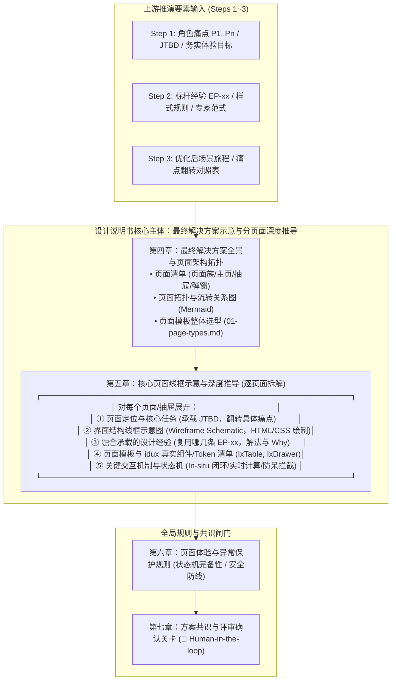

# 织雨设计智脑：标准设计说明书模板 (Design Specification Template)

> 💡 **中枢定位**：
> 本文档是织雨在执行 **【方案系统设计主线】** 步骤 5 的核心交付物模板。
> 它是资深设计师在动工写代码前，向业务规划人员呈递的**“端到端最终解决方案全景共识协议”**。
>
> 🛑 **系统化整合铁律（彻底拒绝碎片化）**：
> **设计说明书绝不是把 1~4 步推演产物机械、孤零零地各放一块内容！**
> 它必须是将每一步的信息（业务痛点、标杆经验、场景旅程、组件选型）**全面汇流、整理并结构化映射到最终的解决方案中**：
> 明确回答本次需求**最终包含哪几个页面、各页面的界面结构线框图如何、每个页面融合承载了哪些标杆设计经验、以及具体采用了哪些页面模板和 idux 真实组件与 Token 样式**。
>
> 📄 **交付格式（强制）**：
> 设计说明书以 **单个自包含 HTML 文件** 交付（内联 CSS、无外部依赖），**可直接在浏览器打开或通过本地预览服务在线查看**：
> * **文件名建议**：`design-spec-[业务名].html`；
> * **视觉规范**：严格遵循 [`tokens-cheatsheet.md`](../../03-design-assets/tokens-cheatsheet.md)（底色 `#F7F9FC`、卡片 `#FFFFFF`、边框 `#E1E5EB`、品牌蓝 `#1C6EFF`、状态浅底深字三元组）；
> * **流程图**：旅程图使用 Mermaid 渲染（CDN 引入），保证在线查看时可缩放、高清晰度；
> * **线框图**：页面结构必须采用自包含 HTML/CSS 语义化线框盒模型（Wireframe UI Components），直观呈现页面各功能区域分布与交互意图；
> * **共识关卡**：输出本说明书后，织雨必须停下来等待规划人员审阅确认，严禁未经确认直接跳到步骤 6 生成前端代码！

---

## 一、章节内容结构（系统化整合骨架，七章固定）

设计说明书将前序推导的所有要素有机汇流，必须完整覆盖以下七大章节：



| 章节 | 标题 | 核心定位与整合说明 |
| :---: | :--- | :--- |
| **一** | **需求洞察与体验目标** | 汇流 Step 1：角色画像、JTBD 本质任务、主场景现状痛点清单、现状操作流程图、务实体验目标（A ➔ B 跨越）。 |
| **二** | **设计思考、发力点与标杆经验选型** | 汇流 Step 2：业务严肃度定性、**核心设计思考与发力点提炼 (源自 2.1)**、标杆案例经验有侧重的传承与装配矩阵 (从 Type-xx 靶向提取 `EP-xx` 及真实组件样式)、专家范式选型。 |
| **三** | **优化后各场景任务旅程** | 汇流 Step 3：痛点翻转对照表（每一旗帜的未来落点）、端到端未来黄金任务流转图（Mermaid 流程图，贯彻 In-situ 就地闭环）。 |
| **四** | **最终解决方案全景与页面拓扑** | **【整体方案示意】** 明确本次需求由哪几个页面/视图组成（主页、抽屉、弹窗），绘制页面间流转关系拓扑图，并完成全局页面模板选型。 |
| **五** | **核心页面线框示意与深度推导** | **【全要素融合核心】** 逐页面深入展开：**① 页面定位与任务 ➔ ② 界面结构线框图 (Wireframe) ➔ ③ 融合承载的设计经验 (EP-xx) ➔ ④ 页面模板与 idux 真实组件/Token 清单 ➔ ⑤ 关键交互机制**。彻底消除要素割裂感。 |
| **六** | **页面体验与异常保护规则** | 汇流调优与防御机制：状态机完备性（加载态/空状态/错误态/超时熔断）、四重防破坏安全带与防呆拦截。 |
| **七** | **方案共识与评审确认关卡** | 明确人机协作共识检查点，主动向业务规划人员汇报并等待明确确认，严禁偷跑代码。 |

---

## 二、HTML 骨架模板（包含 Wireframe 视觉组件与全要素结构）

将下方骨架中的 `[方括号占位]` 替换为真实内容，产出单个 `.html` 文件即可在浏览器中获得兼具专业推演、视觉线框与工程组件映射的方案说明书。

```html
<!DOCTYPE html>
<html lang="zh-CN">
<head>
  <meta charset="UTF-8" />
  <meta name="viewport" content="width=device-width, initial-scale=1.0" />
  <title>织雨体验设计方案说明书：[方案名称]</title>
  <script src="https://cdn.jsdelivr.net/npm/mermaid@10/dist/mermaid.min.js"></script>
  <style>
    :root {
      --bg: #F7F9FC; --card: #FFFFFF; --border: #E1E5EB;
      --text: #2F3540; --text-sub: #6F7785; --text-mute: #A1A7B3;
      --blue: #1C6EFF; --blue-l: #E8F4FF; --blue-border: #BAE6FD;
      --warn-t: #FA8C16; --warn-b: #FFFBE6; --warn-bd: #FFE58F;
      --green-t: #15803D; --green-b: #F0FDF4; --green-bd: #BBF7D0;
      --danger-t: #D9363E; --danger-b: #FEF2F2; --danger-bd: #FFA39E;
    }
    * { box-sizing: border-box; }
    body {
      margin: 0; background: var(--bg); color: var(--text);
      font-family: "Inter", "PingFang SC", "Helvetica Neue", Arial, sans-serif;
      font-size: 13px; line-height: 1.7;
    }
    .wrap { max-width: 1040px; margin: 0 auto; padding: 24px; }
    .doc { background: var(--card); border: 1px solid var(--border); border-radius: 6px; padding: 36px; box-shadow: 0 1px 3px rgba(0,0,0,0.04); }
    h1 { font-size: 22px; line-height: 30px; font-weight: 700; margin: 0 0 16px; color: #1E293B; }
    h2 { font-size: 16px; line-height: 24px; font-weight: 600; margin: 36px 0 14px; padding-bottom: 8px; border-bottom: 1px solid var(--border); color: #1E293B; }
    h3 { font-size: 14px; font-weight: 600; margin: 24px 0 10px; color: #334155; }
    h4 { font-size: 13px; font-weight: 600; margin: 16px 0 6px; color: var(--text-sub); }
    .meta { color: var(--text-sub); font-size: 12px; margin-bottom: 24px; line-height: 2; background: #F8FAFC; padding: 12px 16px; border-radius: 4px; border: 1px solid var(--border); }
    .meta b { color: var(--text); }
    .status { display: inline-block; padding: 2px 8px; border-radius: 2px; background: var(--warn-b); color: var(--warn-t); border: 1px solid var(--warn-bd); font-size: 11px; font-weight: 500; }
    
    table { width: 100%; border-collapse: collapse; margin: 12px 0; font-size: 12px; }
    th { background: #EDF1F7; color: #454C59; font-weight: 500; text-align: left; height: 32px; padding: 0 12px; border-bottom: 1px solid var(--border); white-space: nowrap; }
    td { height: 38px; padding: 0 12px; border-bottom: 1px solid var(--border); }
    .num { text-align: right; font-variant-numeric: tabular-nums; }
    
    .tag { display: inline-block; padding: 1px 8px; border-radius: 2px; font-size: 11px; background: var(--blue-l); color: var(--blue); border: 1px solid var(--blue-border); }
    .tag-exp { display: inline-block; padding: 1px 8px; border-radius: 2px; font-size: 11px; background: var(--green-b); color: var(--green-t); border: 1px solid var(--green-bd); font-weight: 600; }
    .flag { display: inline-block; padding: 1px 6px; border-radius: 2px; font-size: 11px; background: var(--danger-b); color: var(--danger-t); border: 1px solid var(--danger-bd); }
    
    .mermaid { background: #F8FAFC; border: 1px solid var(--border); border-radius: 4px; padding: 16px; margin: 14px 0; text-align: center; overflow-x: auto; }
    ul { margin: 8px 0; padding-left: 20px; }
    li { margin: 4px 0; }

    /* ========== 页面结构线框图视觉组件 (Wireframe UI Layout) ========== */
    .wf-container { background: #F8FAFC; border: 1px dashed #CBD5E1; border-radius: 6px; padding: 16px; margin: 16px 0; }
    .wf-shell { background: #FFFFFF; border: 1px solid #E2E8F0; border-radius: 4px; box-shadow: 0 1px 3px rgba(0,0,0,0.05); overflow: hidden; }
    .wf-header { background: #F1F5F9; border-bottom: 1px solid #E2E8F0; padding: 8px 12px; display: flex; justify-content: space-between; align-items: center; font-size: 11px; font-weight: 600; color: #475569; }
    .wf-body { padding: 12px; }
    .wf-row { display: flex; gap: 10px; margin-bottom: 10px; align-items: center; }
    .wf-col { flex: 1; }
    .wf-card { background: #FAFAFA; border: 1px solid #E5E7EB; border-radius: 3px; padding: 8px 10px; font-size: 11px; }
    .wf-table { width: 100%; border-collapse: collapse; font-size: 11px; margin-top: 6px; }
    .wf-table th { background: #EDF1F7; padding: 6px; border-bottom: 1px solid #E2E8F0; text-align: left; height: auto; }
    .wf-table td { padding: 6px; border-bottom: 1px dashed #E2E8F0; color: #64748B; height: auto; }
    .wf-drawer-overlay { display: flex; background: rgba(15, 23, 42, 0.15); border: 1px dashed #94A3B8; border-radius: 4px; min-height: 240px; position: relative; }
    .wf-drawer-body { width: 340px; background: #FFFFFF; border-left: 2px solid var(--blue); padding: 12px; margin-left: auto; box-shadow: -4px 0 12px rgba(0,0,0,0.08); display: flex; flex-direction: column; }
    .wf-label { display: inline-block; font-size: 10.5px; font-weight: 600; color: #64748B; margin-bottom: 4px; }
    .wf-annotation { font-size: 11px; color: #1E40AF; background: #EFF6FF; padding: 4px 8px; border-radius: 2px; border-left: 3px solid var(--blue); margin-top: 6px; }

    /* 共识关卡样式 */
    .checkpoint { background: var(--blue-l); border: 1px solid #BFDBFE; border-radius: 4px; padding: 16px 20px; margin-top: 36px; font-size: 12px; color: #1E40AF; line-height: 1.8; }
    .checkpoint b { display: block; margin-bottom: 6px; font-size: 13px; color: #1E3A8A; }
  </style>
</head>
<body>
<div class="wrap">
  <div class="doc">
    <h1>🎨 织雨体验设计方案说明书：[方案名称]</h1>
    <div class="meta">
      <b>方案制定者</b>：设计师织雨 (Virtual Designer Zhiyu)<br/>
      <b>产品线归属</b>：[如：SASE 智能云安全平台 ➔ 终端管理 ➔ 终端管控 ➔ 合规基线检测]<br/>
      <b>需求类型定性</b>：[如：Type-07 检测任务与批量巡检类]<br/>
      <b>面向对象</b>：业务规划人员 / 前端工程团队<br/>
      <b>当前状态</b>：<span class="status">⏳ 待规划人员评审确认 (Pending Human Review)</span>
    </div>

    <!-- 一、需求洞察与体验目标 -->
    <h2>一、需求洞察与体验目标</h2>
    <h3>1. 目标用户角色与本质任务 (JTBD)</h3>
    <ul>
      <li><b>核心用户角色</b>：[如：企业安全运维管理员 (SecOps)]</li>
      <li><b>核心本质任务 (JTBD)</b>：[用大白话描述用户要达成的本质任务，而非技术指令]</li>
    </ul>

    <h3>2. 主场景清单与现状痛点 (As-Is Pain Points)</h3>
    <table>
      <thead><tr><th>场景编号</th><th>主场景名称</th><th>触发情境</th><th>主要角色</th><th>现状卡点与心智摩擦</th><th>相关度</th></tr></thead>
      <tbody>
        <tr><td>S1</td><td>[场景名]</td><td>[触发情境]</td><td>[角色]</td><td><b>[痛点名称]</b>：[痛点描述]</td><td>高</td></tr>
        <tr><td>S2</td><td>[场景名]</td><td>[触发情境]</td><td>[角色]</td><td><b>[痛点名称]</b>：[痛点描述]</td><td>高</td></tr>
      </tbody>
    </table>

    <h3>3. 务实体验目标（A ➔ B 对比跨越）</h3>
    <ul>
      <li><b>核心体验目标 1</b>：[产品改造动作] ➔ [用户操作变化] ➔ 解决[痛点问题] ➔ [量化收益指标]</li>
      <li><b>核心体验目标 2</b>：[产品改造动作] ➔ [用户操作变化] ➔ 解决[痛点问题] ➔ [量化收益指标]</li>
    </ul>

    <!-- 二、设计思考、标杆 Job 匹配与经验采纳 -->
    <h2>二、设计思考、标杆 Job 匹配与经验采纳</h2>
    
    <h3>1. 需求类型判定与严肃度定性 (定“度”，不定“向”)</h3>
    <ul>
      <li><b>需求类型判定</b>：[对照 2.2 标杆库门户定性，如：Type-07 检测任务与批量巡检类]</li>
      <li><b>业务属性与严肃度</b>：[如：企业合规管控 / 极高严肃度 (Mission-Critical)]</li>
      <li><b>色彩基调与视觉风格</b>：[如：石墨冷灰底色、严格去框线化、功能分区微浅底、仅高危状态启用柔和红色]</li>
      <li><b>核心架构原则（页面职责分工）</b>：[用清晰专业的话说清页面分工，例如：首页只管「任务」宏观大盘与调度、详情页才看「终端」单机排查与处置，两者父子分明不混淆]</li>
    </ul>

    <h3>2. 业务场景 ➔ 标杆 Job 匹配映射表</h3>
    <div style="background:#F8FAFC;border-left:3px solid var(--blue);padding:8px 12px;margin-bottom:12px;font-size:12px;color:#475569;">
      💡 <b>方法论逻辑</b>：从第一章拆分的业务场景（S1~Sn）出发，去标杆案例库对应分册匹配其标准 Job 节点（如 Job 1、Job 2、Job 3）。场景对应哪个 Job，后续就针对性提炼发力点，并顺理成章将该 Job 下成熟的标杆实战经验（EP-xx）采纳过来。
    </div>
    <table>
      <thead>
        <tr>
          <th style="width:10%;">业务场景</th>
          <th style="width:20%;">场景名称与核心痛点</th>
          <th style="width:22%;">匹配标杆标准 Job 节点</th>
          <th style="width:24%;">Job 核心命题与关注维度</th>
          <th style="width:24%;">经验采纳重点 (EP 靶向承接)</th>
        </tr>
      </thead>
      <tbody>
        <tr>
          <td><b>S1</b></td>
          <td><b>任务配置与下发</b><br/><span style="color:var(--text-sub);font-size:12px;">痛点：配置繁琐易错、影响面未知</span></td>
          <td><b>【Job 1：创建并运行任务】</b><br/><span style="color:var(--text-sub);font-size:12px;">流程：录入配置并圈选对象</span></td>
          <td><b>降低配置心智负荷与前置防呆</b>：入口深度、表单承载形态、对象圈选与大数约束暴露时机。</td>
          <td>采纳 <b>EP-03</b>（800px 抽屉轻量配置）、<b>EP-04</b>（范围即时测算防呆）、<b>EP-05</b>（单一确定主按钮）。</td>
        </tr>
        <tr>
          <td><b>S2</b></td>
          <td><b>任务执行与状态监控</b><br/><span style="color:var(--text-sub);font-size:12px;">痛点：长耗时盲等、离线挂死黑盒</span></td>
          <td><b>【Job 1：创建并运行任务】</b><br/><span style="color:var(--text-sub);font-size:12px;">流程：等待并观察执行态</span></td>
          <td><b>非终态持续反馈与状态机防冲突</b>：无需手动刷新的就地进度暴露、运行期互斥操作锁定与超时容错。</td>
          <td>采纳 <b>EP-01</b>（单列任务卡片流）、<b>EP-02</b>（状态点染与未执行占位）、<b>EP-06</b>（卡底细进度条与加锁置灰）。</td>
        </tr>
        <tr>
          <td><b>S3</b></td>
          <td><b>查看任务结果与排查</b><br/><span style="color:var(--text-sub);font-size:12px;">痛点：结果混杂、跳页断流</span></td>
          <td><b>【Job 2：查看结果与排查问题】</b><br/><span style="color:var(--text-sub);font-size:12px;">流程：看整体结果 ➔ 翻明细 ➔ 钻单机</span></td>
          <td><b>宏观定性、多轮历史回溯与就地下钻</b>：大结论定性、多轮历史归集模型、明细证据下钻不丢上下文。</td>
          <td>采纳 <b>EP-07</b>（头部一句话大结论）、<b>EP-08</b>（父任务聚合历史下拉）、<b>EP-09</b>（右侧抽屉就地排查）。</td>
        </tr>
        <tr>
          <td><b>S4</b></td>
          <td><b>批量处置与闭环</b><br/><span style="color:var(--text-sub);font-size:12px;">痛点：处置脱节、缺乏分级闭环</span></td>
          <td><b>【Job 2：查看结果与排查问题】</b><br/><span style="color:var(--text-sub);font-size:12px;">流程：问题定位 ➔ 就地处置闭环</span></td>
          <td><b>处置动作防呆与高效闭环通道</b>：批量动作置灰防呆、强弱分级处置链路（提醒 vs 动态隔离）。</td>
          <td>采纳 <b>EP-09</b>（批量按钮未勾选置灰防呆）、<b>EP-10</b>（零信任动态隔离防呆确认）。</td>
        </tr>
        <tr>
          <td><b>日常管护</b></td>
          <td><b>任务启停、手动重测与删除</b><br/><span style="color:var(--text-sub);font-size:12px;">诉求：高频操作顺手、高危破坏防呆</span></td>
          <td><b>【Job 3：日常管理与模板维护】</b><br/><span style="color:var(--text-sub);font-size:12px;">流程：日常轻维护与异常防御</span></td>
          <td><b>高频轻操作原地化与破坏性操作防呆</b>：行内轻操作、删除气泡二次确认与对象名回显防误删。</td>
          <td>采纳 <b>EP-01</b>（行内轻操作）、<b>EP-10</b>（删除气泡回显任务名防呆）。</td>
        </tr>
      </tbody>
    </table>

    <h3>3. 核心设计发力点提炼 (结合场景痛点与标杆 Job 诉求)</h3>
    <div style="background:#F8FAFC;border-left:3px solid var(--blue);padding:8px 12px;margin-bottom:12px;font-size:12px;color:#475569;">
      💡 <b>设计推导说明</b>：发力点紧密连接业务场景与所匹配的标准 Job，明确面对管理者的体验卡点如何从交互机制与心智层面破局，再具体落地到标杆实战经验（EP-xx）。
    </div>

    <!-- 重要设计发力点表格 -->
    <table>
      <thead>
        <tr>
          <th style="width:23%;">体验设计发力点</th>
          <th style="width:16%;">承接场景与 Job</th>
          <th style="width:20%;">用户痛点与心理摩擦</th>
          <th style="width:23%;">系统设计解法 (Design Rationale)</th>
          <th style="width:18%;">承载的标杆经验</th>
        </tr>
      </thead>
      <tbody>
        <tr>
          <td><b>[发力点 1: 预置规则轻量配置与受检范围即时测算]</b></td>
          <td>场景 S1 (匹配 Job 1)</td>
          <td>[描述用户配置时的实际担心，如怕手工拼错参数、怕选错部门误伤核心电脑]</td>
          <td>[说明如何通过模块化预置库简化输入，并在保存前实时计算出覆盖终端总量]</td>
          <td>参考单列卡片 (EP-01)、抽屉轻量配置 (EP-03)、范围即时测算 (EP-04)、单一主按钮 (EP-05)</td>
        </tr>
        <tr>
          <td><b>[发力点 2: 长耗时任务进度连续反馈与离线自动容错]</b></td>
          <td>场景 S2 (匹配 Job 1)</td>
          <td>[描述用户等待时的不可预期焦虑，如缺乏执行反馈、怕离线设备卡死整个任务]</td>
          <td>[说明如何通过细进度条提供持续反馈，并对离线失联设备建立超时自动跳过机制]</td>
          <td>参考卡底细进度条 (EP-06)、运行态操作置灰加锁 (EP-06)、离线超时自动跳过</td>
        </tr>
        <tr>
          <td><b>[发力点 3: 违规终端就地深度排查与轻重分级闭环处置]</b></td>
          <td>场景 S3, S4 (匹配 Job 2)</td>
          <td>[描述排查处置脱节与跳页断流，如跳到全量日志排查原因、切换多控制台处置断网]</td>
          <td>[说明如何通过右侧抽屉就地展开违规原因，并提供轻提醒与强管控分级处置通道]</td>
          <td>参考头部一句话大结论 (EP-07)、时光机历史下拉 (EP-08)、抽屉就地排查 (EP-09)、零信任联动隔离 (EP-10)</td>
        </tr>
      </tbody>
    </table>

    <h3>4. 采用的核心交互机制</h3>
    <ul>
      <li><b>核心交互组合</b>：[如：巡检任务周期调度 + 详情下钻排障联动]</li>
      <li><b>机制说明</b>：[如：单列任务卡片流、父任务聚合多轮历史、右侧抽屉双轴就地排查、零信任联动隔离]</li>
    </ul>

    <h3>5. 标杆案例经验按 Job 靶向采纳矩阵 (从 Type-xx 精准提取)</h3>
    <div style="color:var(--text-sub);font-size:12px;margin-bottom:8px;">
      顺着各场景匹配的标杆 Job 节点，将标杆分册中成熟的工程实战经验（EP-xx）靶向采纳并落地：
    </div>
    <table>
      <thead>
        <tr>
          <th style="width:9%;">经验编号</th>
          <th style="width:14%;">归属标杆 Job</th>
          <th style="width:23%;">经验名称与机制</th>
          <th style="width:12%;">对齐产线</th>
          <th style="width:12%;">推荐程度</th>
          <th style="width:30%;">在本方案中的实际落地</th>
        </tr>
      </thead>
      <tbody>
        <tr>
          <td><span class="tag-exp">EP-01</span></td>
          <td><b>Job 1 / Job 3</b><br/><span style="font-size:11px;color:var(--text-sub);">台账与管护</span></td>
          <td><b>单列任务卡片流 (Card)</b></td>
          <td>XDR / SASE</td>
          <td><b>【首选基线】</b></td>
          <td>任务列表首选单列卡片，避免宽表被长名字和多个指标撑爆。首页只放任务，不放单台终端；卡片行内提供轻量操作。</td>
        </tr>
        <tr>
          <td><span class="tag-exp">EP-02</span></td>
          <td><b>Job 1</b><br/><span style="font-size:11px;color:var(--text-sub);">台账指标</span></td>
          <td><b>未执行占位与异常指标点染</b></td>
          <td>SASE / aES</td>
          <td><b>【体验推荐】</b></td>
          <td>从未执行过的任务指标显示「-」而不是「0」；违规数字标红点缀，界面不杂乱。</td>
        </tr>
        <tr>
          <td><span class="tag-exp">EP-03</span></td>
          <td><b>Job 1</b><br/><span style="font-size:11px;color:var(--text-sub);">创建配置</span></td>
          <td><b>右侧抽屉轻量新建 (Drawer)</b></td>
          <td>SASE</td>
          <td><b>【首选基线】</b></td>
          <td>新建任务用 800px 右侧抽屉（对齐 SASE 现行规范），表单填完即走，不跳出当前主列表。</td>
        </tr>
        <tr>
          <td><span class="tag-exp">EP-04</span></td>
          <td><b>Job 1</b><br/><span style="font-size:11px;color:var(--text-sub);">对象圈选</span></td>
          <td><b>圈选对象与前置防呆测算</b></td>
          <td>XDR / SASE</td>
          <td><b>【防呆首选】</b></td>
          <td>勾选部门后，右侧直接算出当前会覆盖多少台电脑（如 2,450 台），心里有底。</td>
        </tr>
        <tr>
          <td><span class="tag-exp">EP-05</span></td>
          <td><b>Job 1</b><br/><span style="font-size:11px;color:var(--text-sub);">创建出口</span></td>
          <td><b>单一主按钮 + 立即执行勾选框</b></td>
          <td>XDR</td>
          <td><b>【首选基线】</b></td>
          <td>抽屉底部只放一个「确定」主按钮，旁边放「立即执行一次」勾选框，避免两个蓝色按钮让人困惑。</td>
        </tr>
        <tr>
          <td><span class="tag-exp">EP-06</span></td>
          <td><b>Job 1</b><br/><span style="font-size:11px;color:var(--text-sub);">运行监控</span></td>
          <td><b>卡底细进度条与操作置灰加锁</b></td>
          <td>SASE / XDR</td>
          <td><b>【体验推荐】</b></td>
          <td>正在检测的任务卡片底部显示细进度条；执行时禁用重跑/删除按钮并提示原因，防止误操作。</td>
        </tr>
        <tr>
          <td><span class="tag-exp">EP-07</span></td>
          <td><b>Job 2</b><br/><span style="font-size:11px;color:var(--text-sub);">结果定性</span></td>
          <td><b>头部一句话大结论定性</b></td>
          <td>SASE</td>
          <td><b>【体验推荐】</b></td>
          <td>点进任务结果页，顶部第一眼直接给结论（如：检测完成，发现 160 台终端违规），不用自己算。</td>
        </tr>
        <tr>
          <td><span class="tag-exp">EP-08</span></td>
          <td><b>Job 2</b><br/><span style="font-size:11px;color:var(--text-sub);">执行模型</span></td>
          <td><b>留档式父任务历史时光机</b></td>
          <td>XDR</td>
          <td><b>【强烈推荐】</b></td>
          <td>多次检测只保留一条任务，在检测时间旁放小下拉箭头，随时切换翻看历史轮次。</td>
        </tr>
        <tr>
          <td><span class="tag-exp">EP-09</span></td>
          <td><b>Job 2</b><br/><span style="font-size:11px;color:var(--text-sub);">排查与处置</span></td>
          <td><b>抽屉就地排查与批量置灰</b></td>
          <td>SASE / aES</td>
          <td><b>【首选基线】</b></td>
          <td>点击某台终端在右侧抽屉看详情，列表不跳转；没勾选电脑时，批量按钮置灰并提示勾选。</td>
        </tr>
        <tr>
          <td><span class="tag-exp">EP-10</span></td>
          <td><b>Job 2 / Job 3</b><br/><span style="font-size:11px;color:var(--text-sub);">处置与防呆</span></td>
          <td><b>任务名原样回显防呆与分级处置</b></td>
          <td>SASE / XDR</td>
          <td><b>【首选基线】</b></td>
          <td>删除任务弹窗里明确写出任务名称二次防呆；对违规终端提供提醒整改或联动隔离。</td>
        </tr>
      </tbody>
    </table>

    <!-- 三、优化后各场景任务旅程 -->
    <h2>三、优化后各场景任务旅程</h2>
    <h3>1. 痛点翻转闭环总览</h3>
    <table>
      <thead><tr><th>场景</th><th>历史痛点</th><th>优化动作</th><th>未来黄金旅程落地节点</th></tr></thead>
      <tbody>
        <tr><td>S1</td><td>规则配置繁琐易错且影响面未知</td><td>预置必装/黑名单双规则库 + 目标终端即时测算</td><td>节点 2「抽屉内轻量装配」</td></tr>
        <tr><td>S2</td><td>巡检如黑盒且容易超时卡死</td><td>三态进度条 + 离线超时自动标记跳过</td><td>节点 3「全局进度可见」</td></tr>
      </tbody>
    </table>

    <h3>2. 端到端未来任务流转流程图 (In-situ 原地闭环)</h3>
    <pre class="mermaid">
graph LR
    Start["业务触发"] --> P1["1. 巡检大盘与终端态势"]
    P1 -->|"点击新建任务"| P2["2. 配置下发抽屉 (EP-01/02)"]
    P2 -->|"下发执行"| P1
    P1 -->|"长耗时轮询 (EP-04)"| P1
    P1 -->|"点击某台违规终端"| P3["3. 终端诊断抽屉 (EP-07)"]
    P3 -->|"发起处置联动"| P4["4. 处置阻断对话框 (EP-10)"]
    P4 -->|"处置完成"| P1
    </pre>

    <!-- 四、最终解决方案全景与页面架构拓扑 -->
    <h2>四、最终解决方案全景与页面架构拓扑</h2>
    <h3>解决方案页面清单与职责划分 (Page Inventory)</h3>
    <table>
      <thead><tr><th>页面编号</th><th>页面/视图名称</th><th>交互形态</th><th>选定页面模板</th><th>核心职责与用户 Job</th></tr></thead>
      <tbody>
        <tr><td><b>Page-01</b></td><td>合规检测任务与终端看板</td><td>主页面 (Main Page)</td><td>标准列表管理/监控套头 (01-page-types)</td><td>全局合规率宏观感知、任务执行监控、全量终端状态表格</td></tr>
        <tr><td><b>Page-02</b></td><td>新建/编辑检测任务抽屉</td><td>右侧抽屉 (Drawer 640px)</td><td>轻量表单抽屉套头</td><td>双维度规则勾选装配、目标范围选择、即时测算并下发</td></tr>
        <tr><td><b>Page-03</b></td><td>终端合规体检诊断抽屉</td><td>右侧抽屉 (Drawer 800px)</td><td>分栏排障双轴套头</td><td>单台终端体检单核对、违规进程定界、单机处置与加白</td></tr>
        <tr><td><b>Page-04</b></td><td>高危联动隔离与处置弹窗</td><td>模态弹窗 (Modal 480px)</td><td>高危操作二次确认套头</td><td>联动 SASE 零信任动态降权/阻断内网权限，二次防呆确认</td></tr>
      </tbody>
    </table>

    <!-- 五、核心页面线框示意与深度推导 -->
    <h2>五、核心页面线框示意与深度推导 (分页面全要素拆解)</h2>
    <p style="color:var(--text-sub);font-size:12px;">
      本章将各前置推导（痛点、标杆经验、idux 组件、Token 规范）全面整合映射到每一个具体界面中，提供直观的布局线框图与工程级映射清单。
    </p>

    <!-- 5.1 Page-01 主页面 -->
    <h3>5.1 Page-01：合规检测任务与终端大盘 (主页面)</h3>
    <ul>
      <li><b>页面定位与核心任务</b>：提供企业合规率顶层体检大盘，统一监控巡检进度，呈现违规终端清单并支持批量处置（提供宏观合规态势与日常运维入口）。</li>
    </ul>

    <!-- 线框图 1 -->
    <div class="wf-container">
      <div class="wf-label">📐 界面结构线框示意图 (Wireframe Layout)</div>
      <div class="wf-shell">
        <div class="wf-header">
          <span>终端管理 / 终端管控 / 合规基线检测</span>
          <div>
            <span class="tag">SASE 产线规范</span>
          </div>
        </div>
        <div class="wf-body">
          <!-- KPI 4 联卡片区 -->
          <div class="wf-row">
            <div class="wf-card wf-col">
              <span class="wf-label">综合合规率 (KPI)</span>
              <div style="font-size:16px;font-weight:700;color:var(--blue);margin:2px 0;">94.2% <span style="font-size:11px;color:var(--green-t);">↑ 2.1%</span></div>
              <span style="font-size:10px;color:var(--text-sub);">合格 2,308 / 总计 2,450 台</span>
            </div>
            <div class="wf-card wf-col">
              <span class="wf-label">当前运行任务进度</span>
              <div style="font-size:12px;font-weight:600;margin:4px 0;">2026 Q3例行巡检 [78%]</div>
              <div style="height:6px;background:#E2E8F0;border-radius:3px;overflow:hidden;"><div style="width:78%;height:100%;background:var(--blue);"></div></div>
            </div>
            <div class="wf-card wf-col">
              <span class="wf-label">待整改违规终端</span>
              <div style="font-size:16px;font-weight:700;color:var(--danger-t);margin:2px 0;">142 台</div>
              <span style="font-size:10px;color:var(--text-sub);">严重 18 / 高危 64 / 中低 60</span>
            </div>
            <div class="wf-card wf-col">
              <span class="wf-label">高频违规项 TOP1</span>
              <div style="font-size:12px;font-weight:600;margin:2px 0;">DLP客户端未装 (88台)</div>
              <span style="font-size:10px;color:var(--text-sub);">ToDesk非法远控 (42台)</span>
            </div>
          </div>

          <!-- 操作栏与筛选区 -->
          <div class="wf-row" style="background:#F1F5F9;padding:6px 10px;border-radius:3px;">
            <div style="display:flex;gap:6px;">
              <span class="tag" style="background:var(--blue);color:#FFF;border:none;">+ 新建检测任务</span>
              <span class="tag" style="background:#FFF;color:var(--text);">批量下发提醒</span>
              <span class="tag" style="background:#FFF;color:var(--text);">导出审计台账</span>
            </div>
            <div style="margin-left:auto;display:flex;gap:6px;">
              <span style="border:1px solid #CBD5E1;background:#FFF;padding:2px 8px;border-radius:2px;font-size:11px;">搜索终端名/IP/责任人...</span>
              <span style="border:1px solid #CBD5E1;background:#FFF;padding:2px 8px;border-radius:2px;font-size:11px;">合规状态: 全部 ▼</span>
            </div>
          </div>

          <!-- 主数据表格 -->
          <table class="wf-table">
            <thead>
              <tr><th>终端名称</th><th>IP / MAC</th><th>所属部门</th><th>使用人</th><th>合规状态</th><th>违规项数</th><th>处置状态</th><th>操作</th></tr>
            </thead>
            <tbody>
              <tr>
                <td><b>DEV-PC-WANGJUE</b></td>
                <td>10.28.14.88</td>
                <td>安全体验研发部</td>
                <td>王工</td>
                <td><span class="flag">违规 (严重)</span></td>
                <td>2 项</td>
                <td><span class="tag" style="background:#FFFBE6;color:#D46B08;border-color:#FFE58F;">待整改</span></td>
                <td><a href="javascript:void(0)" style="color:var(--blue);">[诊断详情]</a> <a href="javascript:void(0)" style="color:var(--blue);">[下发处置]</a></td>
              </tr>
              <tr>
                <td>FIN-PC-LI02</td>
                <td>10.28.16.20</td>
                <td>财务资产部</td>
                <td>李会计</td>
                <td><span class="tag-exp">已合规</span></td>
                <td>0 项</td>
                <td><span class="tag-exp">正常</span></td>
                <td><a href="javascript:void(0)" style="color:var(--blue);">[查看]</a></td>
              </tr>
            </tbody>
          </table>
          <div class="wf-annotation">
            💡 线框说明：顶部 KPI 4 联卡片与操作栏组合；表格行右侧提供原地唤起诊断抽屉的操作锚点，避免任何整页刷新。
          </div>
        </div>
      </div>
    </div>

    <!-- 页面要素表格 -->
    <h4>承载设计经验与 idux 组件选型映射清单 (Page-01)</h4>
    <table>
      <thead><tr><th>区域 / 业务能力项</th><th>承载组件 (idux)</th><th>规范引用</th><th>关键尺寸与 Token 硬指标</th><th>承载设计经验 (Step 2)</th><th>来源</th></tr></thead>
      <tbody>
        <tr>
          <td>页面框架套头与面包屑</td>
          <td><code>IxBreadcrumb</code> + <code>IxPageHeader</code></td>
          <td>01-page-types.md</td>
          <td>石墨底色 `#F7F9FC`，边框 `#E1E5EB`</td>
          <td>产线标准套头</td>
          <td>模板还原</td>
        </tr>
        <tr>
          <td>合规率与进度 4 联卡片</td>
          <td><code>IxCard</code> + <code>IxProgress</code></td>
          <td>tokens-cheatsheet.md</td>
          <td>高度 88px、内边距 12px、8px 网格留白、数字 Outfit 等宽字体</td>
          <td><span class="tag-exp">EP-04</span> 任务三态机进度控制</td>
          <td>标杆复用</td>
        </tr>
        <tr>
          <td>主操作与筛选工具栏</td>
          <td><code>IxButton</code> + <code>IxProSearch</code></td>
          <td>comp-button.md</td>
          <td>主按钮 `h32`、`rounded-[2px]`、主色 `#1C6EFF`；搜索栏固定 `h32`</td>
          <td><span class="tag-exp">EP-09</span> 统一检索过滤</td>
          <td>规范映射</td>
        </tr>
        <tr>
          <td>终端检测结果明细表</td>
          <td><code>IxTable</code> + <code>IxTagGroup</code></td>
          <td>02-table-patterns.md</td>
          <td>表头高 `32px` (`#EDF1F7`)、行高 `40px`、浅底深字三元组标签</td>
          <td><span class="tag-exp">EP-06</span> 多维聚合展示</td>
          <td>标杆复用</td>
        </tr>
      </tbody>
    </table>

    <!-- 5.2 Page-02 抽屉 -->
    <h3>5.2 Page-02：新建/编辑检测任务抽屉 (配置阶段)</h3>
    <ul>
      <li><b>页面定位与核心任务</b>：在不离开主列表的前提下，快速装配必装软件与违规黑名单，即时测算覆盖终端大数并下发（确保配置高效且受检范围即时感知）。</li>
    </ul>

    <div class="wf-container">
      <div class="wf-label">📐 抽屉结构线框示意图 (Drawer Wireframe Layout)</div>
      <div class="wf-drawer-overlay">
        <div style="flex:1;padding:16px;color:#94A3B8;font-size:11px;">(底层 Page-01 主表格视图保底保持可见，半透明遮罩防误触)</div>
        <div class="wf-drawer-body">
          <div class="wf-header" style="background:#FFF;padding:0 0 10px 0;border-bottom:1px solid #E2E8F0;">
            <b>新建终端合规基线检测任务</b>
            <span style="cursor:pointer;color:#94A3B8;">✕</span>
          </div>
          <div style="flex:1;overflow-y:auto;padding-top:10px;font-size:11px;">
            <div style="margin-bottom:10px;">
              <span class="wf-label">1. 基础信息</span>
              <div style="border:1px solid #CBD5E1;padding:4px 8px;border-radius:2px;">任务名称: 2026 Q3办公网终端基线巡检</div>
            </div>
            <div style="margin-bottom:10px;">
              <span class="wf-label">2. 必装软件基线 (勾选预置库)</span>
              <div style="background:#F8FAFC;padding:6px;border:1px solid #E2E8F0;border-radius:2px;">
                ☑️ 深信服 EDR 客户端 (≥3.5.20)<br/>
                ☑️ DLP 数据防泄密客户端<br/>
                ☑️ 统一屏幕水印客户端
              </div>
            </div>
            <div style="margin-bottom:10px;">
              <span class="wf-label">3. 违规软件黑名单 (勾选拦截库)</span>
              <div style="background:#F8FAFC;padding:6px;border:1px solid #E2E8F0;border-radius:2px;">
                ☑️ 非法翻墙代理 (Shadowsocks/Clash)<br/>
                ☑️ 未授权远程控制 (ToDesk/TeamViewer)<br/>
                ☑️ 挖矿木马进程 (XMRig)
              </div>
            </div>
            <div style="margin-bottom:10px;">
              <span class="wf-label">4. 目标终端范围与即时测算</span>
              <div style="border:1px solid #CBD5E1;padding:4px 8px;border-radius:2px;margin-bottom:4px;">已选: 研发中心、财务部 (共2个部门)</div>
              <!-- 即时测算卡片 -->
              <div style="background:#EFF6FF;border:1px solid #BFDBFE;padding:6px;border-radius:2px;color:#1E40AF;">
                📊 <b>即时测算 (EP-02)</b>：覆盖 <b>2,450</b> 台终端（当前在线 2,180 台，离线 270 台）
              </div>
            </div>
          </div>
          <div style="padding-top:10px;border-top:1px solid #E2E8F0;display:flex;justify-content:flex-end;gap:6px;">
            <span class="tag" style="background:#FFF;color:var(--text);">取消</span>
            <span class="tag" style="background:var(--blue);color:#FFF;border:none;">立即下发巡检</span>
          </div>
        </div>
      </div>
    </div>

    <h4>承载设计经验与 idux 组件选型映射清单 (Page-02)</h4>
    <table>
      <thead><tr><th>区域 / 业务能力项</th><th>承载组件 (idux)</th><th>规范引用</th><th>关键尺寸与 Token 硬指标</th><th>承载设计经验 (Step 2)</th><th>来源</th></tr></thead>
      <tbody>
        <tr>
          <td>配置承载外壳</td>
          <td><code>IxDrawer</code></td>
          <td>comp-drawer.md</td>
          <td>宽度固定 `640px`、右侧滑出、遮罩 `z-50`、标题外置通透</td>
          <td><span class="tag-exp">EP-01</span> 轻量抽屉快速配置</td>
          <td>标杆复用</td>
        </tr>
        <tr>
          <td>目标资产多维选择</td>
          <td><code>IxTreeSelect</code> + <code>IxCheckboxGroup</code></td>
          <td>03-form-patterns.md</td>
          <td>输入框 `h32`、支持组织架构多选折叠、选中项带气泡回显</td>
          <td><span class="tag-exp">EP-02</span> 目标即时测算</td>
          <td>标杆复用</td>
        </tr>
        <tr>
          <td>规则组勾选与动态扩展</td>
          <td><code>IxCheckbox</code> + <code>IxCollapse</code></td>
          <td>feature/batch-edit.md</td>
          <td>浅底分组卡片 (`#F8FAFC`)、支持行内自定义添加进程输入</td>
          <td><span class="tag-exp">EP-03</span> 双规则矩阵配置</td>
          <td>体验目标推导</td>
        </tr>
      </tbody>
    </table>

    <!-- 5.3 Page-03 抽屉 -->
    <h3>5.3 Page-03：终端合规体检诊断抽屉 (就地排障)</h3>
    <ul>
      <li><b>页面定位与核心任务</b>：点击某台终端直接滑出，展现必装软件核对结果与违规进程路径，支持原地一键下发处置或加白，彻底消除跳页断流（实现就地排查，消除跳页断流）。</li>
    </ul>

    <div class="wf-container">
      <div class="wf-label">📐 排障抽屉结构线框示意图 (Drawer Wireframe Layout)</div>
      <div class="wf-drawer-overlay">
        <div style="flex:1;padding:16px;color:#94A3B8;font-size:11px;">(主列表高亮锁定当前行，上下文不丢失)</div>
        <div class="wf-drawer-body" style="width:420px;">
          <div class="wf-header" style="background:#FFF;padding:0 0 10px 0;border-bottom:1px solid #E2E8F0;">
            <div>
              <b>DEV-PC-WANGJUE 合规体检诊断</b>
              <div style="font-size:10px;color:var(--text-sub);font-weight:400;">IP: 10.28.14.88 | macOS 14.5 | 责任人: 王工</div>
            </div>
            <span style="cursor:pointer;color:#94A3B8;">✕</span>
          </div>
          <div style="flex:1;overflow-y:auto;padding-top:10px;font-size:11px;">
            <!-- 诊断结论大标签 -->
            <div style="background:#FEF2F2;border:1px solid #FFA39E;padding:8px;border-radius:3px;margin-bottom:12px;">
              <span style="color:var(--danger-t);font-weight:700;">❌ 判定违规：发现 2 项风险</span>
              <div style="color:#7F1D1D;font-size:10px;margin-top:2px;">缺少 1 款企业必备安全软件，且检出 1 个未授权外部远控软件。</div>
            </div>

            <span class="wf-label">【模块一】必须安装软件基线核对</span>
            <div style="border:1px solid #E2E8F0;border-radius:2px;margin-bottom:12px;">
              <div style="padding:6px;border-bottom:1px solid #F1F5F9;display:flex;justify-content:space-between;">
                <span>深信服 EDR 客户端 (v3.5.20)</span>
                <span class="tag-exp">已安装 · 正常运行</span>
              </div>
              <div style="padding:6px;background:#FFF1F0;display:flex;justify-content:space-between;">
                <span>DLP 数据防泄密客户端</span>
                <span class="flag">未检出运行进程 (违规)</span>
              </div>
            </div>

            <span class="wf-label">【模块二】违规软件与风险进程检出</span>
            <div style="border:1px solid #E2E8F0;border-radius:2px;padding:8px;background:#FFF1F0;margin-bottom:12px;">
              <div style="font-weight:600;color:var(--danger-t);">⚠️ ToDesk.exe (未授权远程控制)</div>
              <div style="color:var(--text-sub);font-size:10px;margin:2px 0;">路径: <code>/Applications/ToDesk.app/...</code> | PID: 4921</div>
              <div style="color:var(--text-sub);font-size:10px;">检出时间: 2026-09-21 14:32:05 | 风险等级: 高危</div>
            </div>
          </div>
          <div style="padding-top:10px;border-top:1px solid #E2E8F0;display:flex;justify-content:space-between;align-items:center;">
            <span class="tag" style="background:#FFF;color:var(--text);">申请合规例外(加白)</span>
            <div style="display:flex;gap:6px;">
              <span class="tag" style="background:var(--blue);color:#FFF;border:none;">下发整改弹窗提醒</span>
              <span class="tag" style="background:var(--danger-t);color:#FFF;border:none;">联动零信任动态阻断</span>
            </div>
          </div>
        </div>
      </div>
    </div>

    <h4>承载设计经验与 idux 组件选型映射清单 (Page-03)</h4>
    <table>
      <thead><tr><th>区域 / 业务能力项</th><th>承载组件 (idux)</th><th>规范引用</th><th>关键尺寸与 Token 硬指标</th><th>承载设计经验 (Step 2)</th><th>来源</th></tr></thead>
      <tbody>
        <tr>
          <td>原地诊断排障抽屉</td>
          <td><code>IxDrawer</code></td>
          <td>comp-drawer.md</td>
          <td>宽度 `800px`、双栏结构、`z-50` 遮罩、主背景不发生位移</td>
          <td><span class="tag-exp">EP-07</span> In-situ 抽屉就地排障</td>
          <td>标杆复用</td>
        </tr>
        <tr>
          <td>体检项达标对照清单</td>
          <td><code>IxList</code> + <code>IxTag</code></td>
          <td>comp-tag.md</td>
          <td>行高 36px、达标浅绿底 (`#F0FDF4`)、违规浅红底 (`#FEF2F2`)</td>
          <td><span class="tag-exp">EP-08</span> 诊断证据链可视化</td>
          <td>标杆复用</td>
        </tr>
        <tr>
          <td>违规处置操作区</td>
          <td><code>IxButton</code> + <code>IxPopconfirm</code></td>
          <td>comp-button.md</td>
          <td>高度 `32px`、阻断采用危险按钮 (`color: #FFF, bg: #D9363E`)</td>
          <td><span class="tag-exp">EP-10</span> 强弱分级处置闭环</td>
          <td>标杆复用</td>
        </tr>
      </tbody>
    </table>

    <!-- 六、页面体验与异常保护规则 -->
    <h2>六、页面体验与异常保护规则</h2>
    <ul>
      <li>🛑 <b>长耗时心跳防死信 (EP-04 衍生)</b>：针对离线或弱网终端超过 10 分钟未响应，状态机自动流转为 `离线跳过`，进度条不阻塞，并记录日志。</li>
      <li>🛑 <b>高危阻断二次防呆确认</b>：点击【联动零信任动态阻断】强制挂载 <code>IxPopconfirm</code>，文案明确提示影响：“此操作将切断该员工所有内网系统访问权限，是否确认？”防止误触生产事故。</li>
      <li>🛑 <b>In-situ 上下文锚定</b>：排障抽屉关闭后，主列表自动聚焦保留在原先选中的终端行，绝不重置滚动条位置或分页状态。</li>
      <li>🛑 <b>文案大白话与去技术黑话</b>：客户端弹窗向员工说明时，使用“缺少必备软件【DLP数据防泄密】”，严禁向员工弹出底层报错代码（如 `Error 0x8002`）。</li>
    </ul>

    <!-- 七、方案评审确认关卡 -->
    <h2>七、方案共识与评审确认关卡</h2>
    <div class="checkpoint">
      <b>🚦 规划方案评审确认 (Human-in-the-loop Checkpoint)</b>
      规划老师好，以上为您梳理的【最终解决方案全景与分页面深度推导】设计说明书。请重点把关：<br/>
      1. <b>页面清单与架构拓扑</b>：本方案拆解的 1 个主大盘 + 2 个抽屉 + 1 个对话框是否完全覆盖了合规巡检的端到端闭环？<br/>
      2. <b>线框图与经验融合</b>：各页面的线框结构是否直观，融入的 Type-07 标杆经验（EP-01~10）是否妥当？<br/>
      3. <b>真实 idux 组件与规范</b>：所列组件与尺寸 Token 是否符合预期？<br/>
      <b>若您认可此方案，请回复【确认】或明确指示调整。共识达成后织雨将立即进入步骤 6 输出工程级前端 Demo 代码！</b>
    </div>
  </div>
</div>

<script>
  mermaid.initialize({ startOnLoad: true, theme: "neutral", securityLevel: "loose" });
</script>
</body>
</html>
