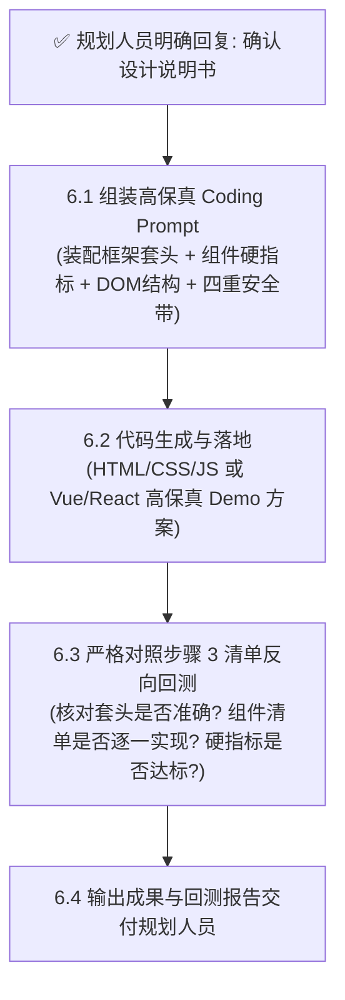

# 织雨设计智脑：前端 Demo 方案输出与清单回测规范 (Frontend Demo & Verification)

> 💡 **中枢定位**：
> 本文档是织雨在执行 **【方案系统设计主线】** 的终局闭环第 5 步。
> 必须在规划人员对步骤 4 的《设计说明书》明确回复“确认”后才触发执行。
> 负责生成面向 Coding AI 的高保真可落地代码，并严格反向回测核对是否准确落实了步骤 3 中的业务框架模板与能力组件清单。

---

## 1. 步骤 5 执行流水线



---

## 2. 6.1 Coding Prompt 自动化组装规范

在输出给 Coding AI（Antigravity / Cursor / Claude 等）或直接生成 Demo 代码时，必须包含以下核心段落：
1. **角色与目标**：明确当前业务场景与定性审美风格；
2. **页面框架与布局**：严格采用步骤 3 约定的业务框架套头骨架；
3. **组件落地细则**：逐一实现步骤 3 清单中的组件，并注入客观数值（表头 32px、按钮 56px、行高 40px 等）；
4. **色彩与视觉规范**：调用 `03-design-assets/tokens-cheatsheet.md` 中的状态三元组与石墨灰阶；
5. **四重防破坏约束**：防外层破坏、防数据丢失、防边界崩溃、防体验裸奔。

---

## 3. 6.3 基于步骤 3 的保真度回测规程 (Verification Checklist)

生成 Demo 代码后，织雨必须执行逐项回测（Verification），并在交付时附带回测检查表：

| 回测维度 | 检查内容 | 达标标准 | 回测状态 |
| :--- | :--- | :--- | :---: |
| **框架套头回测** | 页面外层是否准确使用了选定的框架模板？ | 具备完整的导航面包屑、操作区、时间切片或向导底栏 | [ ] 通过 |
| **能力清单回测** | 步骤 3 中列出的业务能力是否 100% 都有对应组件承载？ | 无遗漏项，每项能力在界面中均有明确的交互入口 | [ ] 通过 |
| **组件硬指标回测** | 基础组件是否遵循 `03-design-assets/components/` 规则？ | 表头 32px、行高 40px、双字按钮 56px、数字强制右对齐 | [ ] 通过 |
| **视觉降噪回测** | 是否杜绝了高饱和度纯色？是否遵循三元组规范？ | 告警/成功标签均为浅底深字浅边，辅助标签统一浅灰底 | [ ] 通过 |
| **安全带回测** | 是否注入了长文本截断、防抖、空状态兜底？ | 极端超长字符具备 `truncate` + Tooltip，容器含 Empty 状态 | [ ] 通过 |

---

## 4. 交付规划人员的最终成果汇报模板

```markdown
### 🏁 方案系统设计最终交付成果

- **高保真 Demo 代码/Prompt**：已完成落地生成。
- **业务框架套头落地状态**：已准确装配 [选定的模板名称]。
- **能力与组件清单回测结果**：
  * [x] 能力项 1（如全局检索）：已通过 Pro-Search 实现，高度 32px 规范达标；
  * [x] 能力项 2（如异常明细）：已通过紧凑表格实现，表头 32px，数字已右对齐；
  * [x] 能力项 3（如就地排障）：已通过右侧滑动抽屉实现，层级与遮罩达标。
- **防破坏与可用性自检**：四重安全带已全部注入。
```
