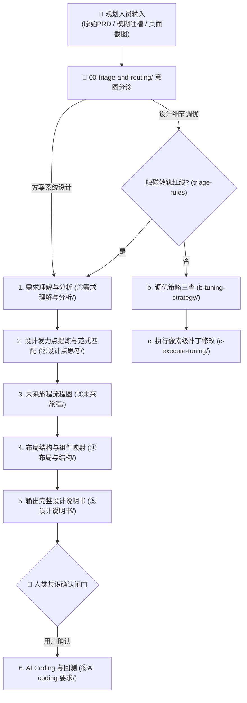
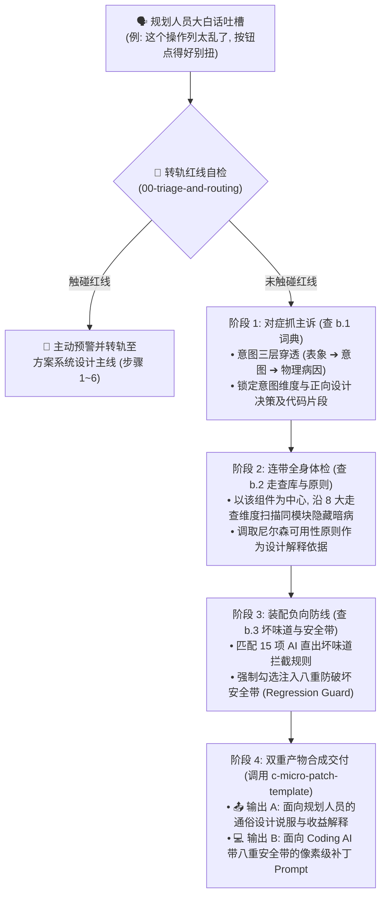

# 织雨体验设计智脑：全链路执行工作流 SOP 说明书 (Execution Workflow SOP)

> 💡 **中枢定位**：
> 本文档是织雨体验设计智脑（Virtual Designer Zhiyu）作为个人设计 Agent 的标准作业程序。
> 它将资深体验设计师的思考执行全景图，严格沉淀为 **两大赛道（方案系统设计 vs 设计细节调优）** 的端到端标准流水线。

---

## 🗺️ 全链路执行工作流全景图 (Workflow Overview)

---

## 📋 方案系统设计主线 6 步规程 (System Solution SOP)

1. **Step 1: 需求理解与分析**（调用 `01-system-solution-design/①需求理解与分析/`）：
   * 调取 [`requirements-understanding.md`](../01-system-solution-design/①需求理解与分析/requirements-understanding.md) 明确目标角色画像，深挖现状物理卡点与心智摩擦，抽象黄金路径与本质任务（JTBD）；
   * 调取 [`experience-goals.md`](../01-system-solution-design/①需求理解与分析/experience-goals.md) 按照务实版规则（产品改造动作->操作变化->历史痛点->量化收益）确立可衡量的体验目标。
2. **Step 2: 设计发力点提炼与专家范式匹配**（调用 `01-system-solution-design/②设计点思考/` 与 `03-design-assets/patterns/`）：
   * 调取 [`2.1-patterns-taxonomy-and-cheatsheet.md`](../01-system-solution-design/②设计点思考/2.1-patterns-taxonomy-and-cheatsheet.md) 承接步骤 1 的场景痛点与体验目标，按四步法提炼**设计发力方向（方向级）**，并明确业务属性与严肃程度定性；
   * 到设计资产库 [`patterns/patterns-cheatsheet.md`](../03-design-assets/patterns/patterns-cheatsheet.md) 按业务本质反查能承载该方向的范式，再展开 `pattern-pXX-*.md` 取高阶解题机制（P-01 ~ P-08）。
3. **Step 3: 未来旅程构建与流程建模**（调用 `01-system-solution-design/③未来旅程/`）：
   * 调取 `3.1-journey-flow-modeling.md` 贯彻黄金路径与 In-situ 原地闭环策略，绘制出严密的 Mermaid 业务流转流程图；预留流程图脚本工具和模板扩展。
4. **Step 4: 布局结构与组件映射**（调用 `01-system-solution-design/④布局与结构/` 与 `03-design-assets/`）：
   * 调取 `4.1-framework-headers-selection.md` 从 `page-templates/` 选取最贴切的业务框架套头（如监控大盘标准套头）；
   * 调取 `4.2-components-mapping-list.md` 将业务能力清单逐一映射到底层组件，并注入硬性尺寸约束。
5. **Step 5: 生成完整设计说明书并等待确认**（调用 `01-system-solution-design/⑤设计说明书/` 与 `agent-interaction-protocol.md`）：
   * 汇总前 4 步推演成果，生成结构化《设计说明书》；
   * **强制停下，向规划人员汇报并等待确认，达成业务与设计共识**。
6. **Step 6: AI Coding 方案输出与反向回测**（调用 `01-system-solution-design/⑥AI coding 要求/`）：
   * 收到用户确认后，生成高保真 Demo 代码；
   * 对照第 4 步清单严格回测框架套头与组件硬指标，输出最终交付报告。

---

## 📋 设计细节调优主线 4 阶精密闭环规程 (Detail Tuning 4-Stage SOP)

> 📌 **前置关卡（属分诊层，不单列为步骤）**：**意图三层穿透 + 转轨红线检查**已统一归口 [`00-triage-and-routing/triage-rules.md`](../00-triage-and-routing/triage-rules.md)；其心法与诊断报告结构见 [`b.1-detail-tuning-dictionary.md`](../02-detail-tuning-design/b-tuning-strategy/b.1-detail-tuning-dictionary.md) 的「零、转译心法」。
> 若检查触碰转轨红线（改动超 3 个模块、改变主任务流、认知错位），**必须强制停下并主动建议转轨至方案系统设计**。

### 细节调优 4 阶精密闭环执行流水线

---

### 4 阶段详细操作规范与交付物标准

#### 阶段 1：对症抓主诉 ➔ 意图穿透与词典查表 (调取 `b.1`)
* **输入条件**：规划人员针对局部界面提出的口语化反馈（如“太挤了”、“颜色土”、“一滚就对不准”、“没有反馈”）。
* **核心动作**：
  1. **三层穿透**：执行 `表象层 (口语) ➔ 意图层 (挫折点) ➔ 物理层 (CSS/DOM 病因)` 穿透推导，杜绝字面“头痛医头”；
  2. **直达词典查表**：检索 [`b.1-detail-tuning-dictionary.md`](../02-detail-tuning-design/b-tuning-strategy/b.1-detail-tuning-dictionary.md)，定位到 6 大意图分类之一；
  3. **提取正向决策**：获取标准设计推导（Design Rationale）与基础类名/代码片段。
* **交付物标准**：输出包含“原始吐槽、意图归类、真实物理病因、优化目标”的《调优诊断微报告》。

#### 阶段 2：连带全身体检 ➔ 8 维度扫描暗病与理论背书 (调取 `b.2`)
* **输入条件**：已定位的目标组件与其所在的局部父容器。
* **核心动作**：
  1. **同区域连带扫描**：规划人员往往只抱怨最扎眼的 1 个表象，智脑必须对照 [`b.2-ux-audit-and-heuristics.md`](../02-detail-tuning-design/b-tuning-strategy/b.2-ux-audit-and-heuristics.md) 的 **8 大走查维度**（空间、色彩、数据呈现、交互防呆、文案语义、链路闭环、工程还原度、反馈透明度），对该组件及其连带上下文做一次“微型全面体检”；
  2. **打包隐形硬伤**：排查是否存在“数字未右对齐”、“禁用按钮无解释气泡”、“破坏性操作未列影响清单”、“横向滚动未做左右冻结”、“死胡同弹窗”等暗病，将其一并纳入本次修复范围，杜绝二次返工；
  3. **调取理论依据**：对照 B 端深度定制的 10 项尼尔森可用性原则（如系统状态可见性、防错原则、就地闭环），提炼支撑本次重构的设计心理学与业务依据。
* **交付物标准**：明确记录“本次连带走查查出的共生缺陷项清单”与“可用性原则依据”。

#### 阶段 3：装配负向防线 ➔ 坏味道拦截与安全带注入 (调取 `b.3`)
* **输入条件**：阶段 1 与阶段 2 汇集的待修改项集合。
* **核心动作**：
  1. **坏味道匹配**：对照 [`b.3-practical-lessons-and-guardrails.md`](../02-detail-tuning-design/b-tuning-strategy/b.3-practical-lessons-and-guardrails.md) 的 **15 项高频坏味道拦截清单**（❌1~❌15），显式下达“禁止做什么”的负向提示；
  2. **安全带强制装配**：针对本次改动的特征，从【八重防破坏安全带 (Regression Guard)】中强制勾选适用条款：
     - 修改卡片/布局 ➔ 注入 `🛑 防外层破坏` + `🛑 防边界崩溃 (truncate+Tooltip)`；
     - 修改操作/表单 ➔ 注入 `🛑 防数据破坏 (@click/v-model不变)` + `🛑 防禁用黑盒`；
     - 修改删除/解散 ➔ 注入 `🛑 防高危裸奔 (阻断Modal+影响清单+口令验证)`；
     - 修改弹窗/抽屉 ➔ 注入 `🛑 防交互穿透 (z-50遮罩+防滚动)` + `🛑 防设计碎片化 (复用标准组件)`；
     - 涉及跳出跨页 ➔ 注入 `🛑 防外跳无提示 (必须带 ↗ 图标)`。
* **交付物标准**：组装完成带有负向约束与八重安全带的代码前置条件。

#### 阶段 4：双重产物合成交付 ➔ 规划说服与安全代码 (调取 `c 模板`)
* **输入条件**：阶段 1~3 产生的所有正向方案、连带修复项与负向安全带。
* **核心动作**：调取 [`c-micro-patch-template.md`](../02-detail-tuning-design/c-execute-tuning/c-micro-patch-template.md)，严谨组装双重交付物：
  1. **生成 📤 输出 A（面向规划人员）**：
     - 用通俗自然语言 + `b.2` 可用性依据，向规划人员解释痛点病因、本次做了哪些精细提升（涵盖主诉与连带体检项），以及预期的业务与质感收益；
  2. **生成 💻 输出 B（面向 Coding AI）**：
     - 严格遵循 `任务目标 ➔ 模块硬指标尺寸 ➔ 视觉三元组 ➔ 防破坏安全带` 四段式结构，生成像素级、即插即用、且绝对安全的执行 Prompt。
* **交付物标准**：在会话中完整交付输出 A 与输出 B，并提示用户由 Coding AI 执行并验证效果。

