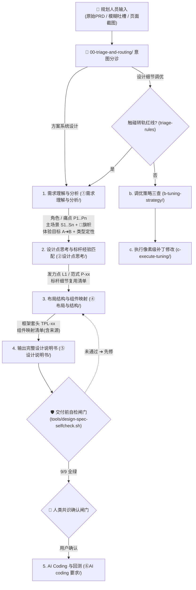
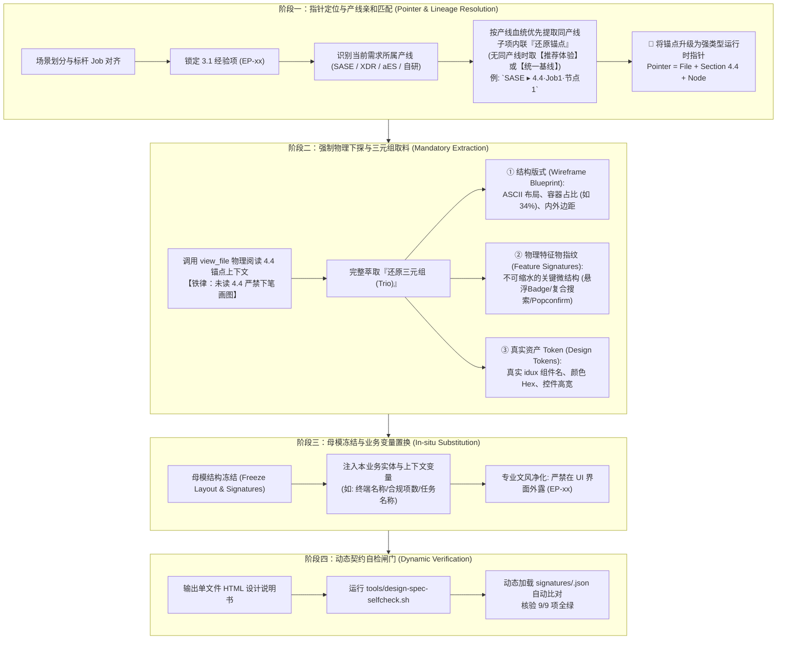

# 织雨体验设计智脑：全链路执行工作流 SOP 说明书 (Execution Workflow SOP)

> 💡 **中枢定位**：
> 本文档是织雨体验设计智脑（Virtual Designer Zhiyu）作为个人设计 Agent 的标准作业程序。
> 它将资深体验设计师的思考执行全景图，严格沉淀为 **两大赛道（方案系统设计 vs 设计细节调优）** 的端到端标准流水线。

---

## 🗺️ 全链路执行工作流全景图 (Workflow Overview)



---

## 📋 方案系统设计主线 5 步规程 (System Solution SOP)

1. **Step 1: 需求理解与分析**（调用 `01-system-solution-design/①需求理解与分析/`）：
   * 调取 [`1.1-需求理解与现状旅程.md`](../01-system-solution-design/①需求理解与分析/1.1-需求理解与现状旅程.md) 明确目标角色画像，深挖现状物理卡点与心智摩擦，抽象黄金路径与本质任务（JTBD）；
   * 调取 [`1.2-体验目标.md`](../01-system-solution-design/①需求理解与分析/1.2-体验目标.md) 按照务实版规则（产品改造动作->操作变化->历史痛点->量化收益）确立可衡量的体验目标；
   * **前置定性**：对照标杆案例库前置类型表，快速完成业务需求类型定性（Type-01~07）。
   * **交付下游**：本步产物（角色 / 痛点编号 `P1..Pn` / 主场景清单 `S1..Sn` / 体验目标 / 类型定性）是 Step 2 的**必需输入**，字段清单见下方「📦 步骤间交接契约」。
2. **Step 2: 设计思考、标杆 Job 匹配与经验采纳**（调用 `01-system-solution-design/②设计点思考/` 与 `03-design-assets/patterns/`）：
   * **判定需求类型与业务严肃度定性**：对照 [`2.2-标杆案例库.md`](../01-system-solution-design/②设计点思考/2.2-标杆案例库.md) 门户完成需求类型定性（Type-01~07），并明确业务严肃程度与色彩基调；
   * **业务场景 ➔ 标杆 Job 匹配映射与单表穿透**：从第一步拆分的业务场景（S1~Sn）出发，去标杆案例库对应分册查看该类型沉淀的标准 Job 节点，将拆分的业务场景与标准 Job 精准对齐匹配，建立**唯一单表穿透大表**（合并原多节表格，包含 7 列表头：`业务场景 | 匹配标杆 Job | 核心设计发力点 | 用户痛点 | 系统设计解法 | 借鉴标杆经验 (EP-xx) | 自行设计补充 (业务自研)`）；
   * **匹配结果裁决（共性采纳 vs 业务独立推导）**：以「**子场景 × 标杆 Job**」为对齐轴逐格比对，做两分裁决 —— ① **匹配得上**：凡与标杆 Job 同构的共性点，直接靶向采纳该 Job 下已沉淀的成熟经验（`EP-xx`）；② **匹配不上**：标杆库未覆盖的部分，转为**业务独立推导**，由资深设计师回到该场景的第一性问题自行设计，并在大表中保留独立列显式说明。**业务独立推导所涉及的组件选型与设计样式，一律以 [`03-design-assets/`](../03-design-assets/) 现有设计资产（页面模板、组件规范、Token）为主来落地，严禁凭空臆造**；
   * **结合场景痛点与 Job 诉求提炼核心设计发力点**：围绕场景痛点与所承接 Job 的本质诉求，提炼 1~3 个方向级设计发力点；
   * **顺着匹配的 Job 靶向采纳标杆设计经验 (EP-xx)**：场景对应哪个 Job，就顺理成章地将标杆分册中该 Job 下成熟的实战经验（EP-xx）采纳过来，汇总成《标杆细节复用清单》（Step 3 的硬输入）；
   * **进入交接契约**：装配规则见下方「🔄 标杆复用与元素还原（Step 2 ⇄ Step 3 的交接契约）」。
3. **Step 3: 最终解决方案架构、页面清单与组件深度装配**（调用 `01-system-solution-design/④布局与结构/` 与 `03-design-assets/`）：
   * **确定解决方案页面清单 (Page Inventory)**：明确本次需求最终包含哪几个页面/视图（主页面、抽屉、弹窗）；
   * **覆盖率自检闸门（定稿页面清单前必做）**：先从 PRD 第一性拆出「**业务对象 × 动作 / 状态**」全集（增 / 删 / 改 / 查 / 状态机动作 / 治理动作），逐项认领**页面落点**；**无法落地的必须显式标注「本期不做 + 原因」，严禁静默消失**。样例见 [`cases/sase-endpoint-compliance-coverage-check.md`](cases/sase-endpoint-compliance-coverage-check.md)；
   * **模板选用与借用规范**：页面模板以命中的标杆经验为取向、在 [`03-design-assets/page-templates/01-page-types.md`](../03-design-assets/page-templates/01-page-types.md) 中选定页面类型 ID。**若暂无专属模板，严禁杜撰不存在的 template ID，必须借用相近模板并显式注明参考案例（如：`套头借用 page-table-overview + 自定义主从分栏，参考 XDR 模板管理案例`）**；
   * **组件与 Token 严格取材**：常规组件名对照 [`03-design-assets/components/idux-component-map.md`](../03-design-assets/components/idux-component-map.md) 映射为真实 idux 组件名（`IxTable`, `IxDrawer`, `IxProgress`, `IxPopconfirm` 等）；**凡映射表中查无对应项的，如实保留该蒸馏的真实组件名，严禁杜撰** ➔ 提取尺寸色值硬指标；
   * **分页面全要素装配顺序（硬性，不可颠倒）**：各页面小节必须严格按以下专业顺序展开：
     1. **页面定位与核心任务**：明确管辖维度、承接 Job 与翻转的痛点编号；
     2. **【置顶】设计经验与组件选型映射清单 (Table First)**：置于线框图上方。采用双轨制标注：标杆复用标注 `<span class="tag-exp">EP-xx</span>`（实线绿），业务自研标注 `<span class="deriv">业务独立推导</span>`（虚线灰）；
     3. **【居中】界面结构线框图 (Wireframe Second · 基于经验反向提取案例样式)**：利用通用原语绘制语义化结构线框。**线框结构严禁凭空臆造，必须顺着本页面所承载 `EP-xx` 经验项在分册第三节内联记录的「还原锚点」，按产线血统优先匹配调取对应标杆案例第四节（4.4 核心流程节点）中蒸馏沉淀的线框版式、宽高尺寸与信息分区进行转译落地**；标杆未覆盖的自研区域，统一依照 `03-design-assets/` 通用资产规范进行规范化补齐；严格保证 UI 控件文本 100% 真实干净，严禁在按钮/标签文本中写入 `(EP-xx)`；
     4. **【底部】设计批注 (wf-annotation)**：阐述架构选择的 Why 依据、CRUD 动作闭环与异常保护；
   * **专业文风规范 (去 AI 套话与黑话)**：全篇采用简约、清晰、直白的设计师专业语言，拒绝“极速赋能”、“零心智负担”等空洞口号与人设吹嘘，用务实的痛点、具体操作动作与量化前后对比说话。
4. **Step 4: 生成系统化整合型设计说明书并等待确认**（调用 `01-system-solution-design/⑤设计说明书/` 与 `agent-interaction-protocol.md`）：
   * **单文件自包含 HTML 说明书**：严格遵循五大固定章节骨架，将评审共识关卡置于第五章末尾 `<div class="checkpoint">`，不设独立第六章；
   * **交付前自检（轻量闸门，未过不得汇报）**：出稿后运行 `bash tools/design-spec-selfcheck.sh <design-spec-xxx.html>` 取得 **9/9 全绿**（校验结构、组件真实性、模板真实性、色值、无红按钮、引用有效性、经验落点、左右表单结构、动态标杆特征物契约），排查硬伤后方可进入共识确认；
   * **强制停下，到达「🚦人机共识确认闸门」**：向规划人员汇报并等待确认，达成业务与设计共识，严禁偷跑代码。
5. **Step 5: AI Coding 方案输出与反向回测**（调用 `01-system-solution-design/⑥AI coding 要求/`）：
   * 收到用户确认后，生成高保真 Demo 代码；
   * 对照第 3 步清单严格回测框架套头与组件硬指标，输出最终交付报告。

---

## 📦 步骤间交接契约（Step 1 ➔ 5 的产物链）

> 📌 **为什么需要它**：5 个 Step 若只"自己干自己的"，信息会在交接处流失，最终《设计说明书》必然缺章少件 —— 这就是"单兵作战"的病根。本节把 5 步定义成**一条产物链**：每步**必须消费上游产物**，并**必须交付下游可用的产物**。
> 🎯 **唯一收敛点**：所有步骤的有效产物，**最终必须全部汇入《设计说明书》**。**任何产出了却不进说明书的，都是无效工作。**

### 一、产物链总表

| 步骤 | 必须消费（上游输入） | 必须交付（下游产物） | 关键字段（缺则下游无法工作） |
| :---: | :--- | :--- | :--- |
| **1 需求理解与分析** | 用户原始输入 / PRD / 吐槽 / 截图 | ① 目标角色 + 痛点清单（`P1..Pn`）<br>② 主场景清单 `S1..Sn`（含触发情境 / 角色 / Job / **痛点旗帜 `🚩Sx-Py`** / 相关度）<br>③ 各主场景**现状**任务流程图<br>④ 务实版体验目标（A ➔ B + 度量标准 + 上线验证指标）<br>⑤ **需求类型定性（`Type-0x`）** | 痛点必须有编号；体验目标必须有度量；类型定性必须给出 |
| **2 设计点思考** | ①~⑤ 全部 | ① 核心业务矛盾与设计发力点清单（`L1` 方向级，1~3 条，含标杆学习侧重导向）<br>② 业务属性与严肃程度定性<br>③ 选定专家范式（`P-01~P-08`）<br>④ **标杆案例经验传承矩阵**（承载各发力点的 `EP-xx` 解法机制、组件样式、尺寸、颜色、模板 + 出处）<br>⑤ 各要素选型结论 | 发力点须能追溯到痛点编号并指明标杆学习侧重点；传承清单每项须有出处 |
| **3 布局与结构** | ① 发力点清单 `L1` 与 **《标杆细节复用清单》**<br>② 页面模板与 idux 组件库 | ① **最终解决方案页面清单**（主页/抽屉/弹窗）<br>② **逐页面界面结构线框图 (Wireframe)**<br>③ **分页面装配清单**（承载的 EP-xx 经验 + 真实 idux 组件 + 尺寸色值 Token + 来源追溯）<br>④ 关键交互机制与页面体验保护规则 | 必须按页面分别装配；必须使用真实 idux 组件名；每项标明来源 |
| **4 设计说明书** | ①~③ 全部 | **五章整合型完整说明书**（单文件 HTML，包含 Wireframe 视觉组件与分页面全要素展开） | 五章齐备，页面清单、线框图、经验融合与组件映射无割裂 |
| **5 AI Coding** | 用户确认后的说明书 | ① 高保真 Demo<br>② **回测报告**（对照 Step 3/4 分页面映射清单逐项核验） | 回测必须**引用说明书中的组件与指标条目** |

### 二、三条交接铁律

> ⚠️ **不许跨级臆造**：若上游产物缺失或字段不全，**必须停下向上游追问 / 补齐**，严禁下游自行猜测填补。
> ⚠️ **不许产出不落地**：任何一步的产物若最终不进《设计说明书》或 Step 5 回测，即为无效工作。
> ⚠️ **每步必须回链**：下游引用上游内容时须保留其编号（痛点 `🚩S1-P1` / 经验 `EP-07` / 模板 `page-table-overview` / 组件 `IxTable`），实现**端到端可追溯**。

### 三、收敛校验（设计说明书 = 唯一出口）

五章与来源步骤的映射如下；**任一章节空缺、或其来源步骤产物缺失，即判定为上游交接断裂，必须回补而非臆造**：

| 说明书章节 | 来源步骤 | 上游缺件时的处理 |
| :--- | :--- | :--- |
| 一、需求洞察与体验目标 | Step 1 | 回 Step 1 补齐角色 / 痛点 / 体验目标 |
| 二、设计思考、发力点与标杆经验选型 | Step 2 | 回 Step 2 补齐 2.1 设计思考与发力点清单（含标杆学习侧重）、类型定性、EP 经验复用矩阵与范式 |
| 三、最终解决方案全景与页面架构拓扑 | Step 3 | 回 Step 3 补齐页面清单 |
| 四、核心页面线框示意与深度推导 | Step 3（全要素整合） | 回 Step 3/2 补齐各页面线框图、承载 EP 经验与 idux 组件 |
| 五、页面体验与异常保护规则 | Step 3 | 回 Step 3 补齐异常保护规则 |

---

## 🛡️ 交付前自检闸门（防错机制 · 每份说明书必过）

> 📌 **为什么需要它**：说明书的三类高频错（**内容漏页 / 资产引用错 / 样式不合规与执行降级**）此前只能靠人工逐轮发现。本闸门把"**交付前必过机器自检**"固化为流程动作，让错误在交付前被拦住，而不是靠规划人员事后挑错。

**执行方式（Step 4 出稿后、汇报前）**：

```bash
bash tools/design-spec-selfcheck.sh design-spec-<业务名>.html
# 退出码 0 = 9/9 全绿（可进入「🚦 人机共识确认闸门」）；1 = 存在未通过项（必须先修）
```

| # | 检查项 | 判定标准 | 拦住的历史病 |
| :---: | :--- | :--- | :--- |
| 1 | 结构完整性 | 五章齐备 + 存在分页面小节 | 章节缺失 |
| 2 | 组件真实性 | 每个 `Ix*` 要么在 `idux-component-map.md` 登记，要么显式声明来源 | **杜撰组件名** |
| 3 | 模板真实性 | 每个 `page-*` 要么在 `01-page-types.md` 存在，要么显式声明（库缺口 / 产线差异） | **杜撰模板 ID** |
| 4 | 色值合规 | 所有色值命中 `03-design-assets/` 全量色板 | **AI 自造色值** |
| 5 | 按钮用色铁律 | 无"危险型"按钮、无红色实心按钮 | **红色按钮** |
| 6 | 引用可解析 | 引用的 `.md` 文件全部存在 | 失效引用 |
| 7 | 经验落点 | 每条被引用的 `EP-xx` 在「四、核心页面」中都有承载 | **空头引用** |
| 8 | 表单左右结构 | 严格遵循左 Label 右 Control 水平左右结构，严禁上下堆叠反模式 | **表单上下堆叠** |
| 9 | 标杆特征物保真度 | **动态契约驱动**：自检引擎动态加载对应类型的 `signatures/<Type-xx>.json`，核验声明 EP 的物理指纹 | **经验执行降级与缩水** |

**自检机制设计原则（平台脚本与类型契约完全解耦）**：
> 💡 **平台引擎零硬编码**：自检脚本 `tools/design-spec-selfcheck.sh` 严禁直接写死特定业务或特定 EP（如写死 EP-06 进度条）。
> 校验项 9 采用**数据驱动动态特征指纹契约比对**：根据说明书第一章声明的 `Type-0x`，动态检索 `01-system-solution-design/②设计点思考/标杆案例库/signatures/` 对应配置。未沉淀契约的类型自适应优雅放行，已沉淀契约的类型严格执行物理指纹比对，保证 Type-01~07 全赛道高扩展性。

**三条纪律**：

> ⚠️ **未过闸不得汇报**：自检 FAIL 时**严禁**进入「🚦 人机共识确认闸门」，更严禁偷跑 Step 5 代码。
> ⚠️ **偏离必须声明**：凡未命中资产的引用（组件 / 模板 / 色值），必须在稿内**写明来源或豁免依据**，否则一律判为缺陷。
> ⚠️ **闸门可回填资产**：若因资产库缺登记而反复 FAIL，应**回填 `03-design-assets/` 或 `signatures/`**，而不是在稿内绕过。

---

## 🔄 标杆还原锚点『解引用与三元组取料』端到端执行逻辑指引（AI 必遵闭环流水线）

> 📌 **核心定位**：本指引是 AI 体验设计智脑在执行「标杆经验落地」时的**底层操作型协议（Operational Protocol）**。
> ⚠️ **历史病因根治**：以往 AI 容易将经验项中的「还原锚点」当成论文参考文献（静态注释）或仅在末尾摆设，且缺乏产线血统优先意识导致混采异构产线 Token；在输出线框图时凭基座大模型的模糊泛化记忆自由发挥，导致诸如“进度条悬浮百分比丢失”、“复合搜索框退化为普通按钮”等**执行严重降级（退化）**。本指引建立**端到端 4 阶精密闭环**，强制物理解引用，杜绝东补西凑。



### 4 阶段详细操作规范与执行铁律

#### 阶段一：指针解析与产线亲和匹配 (Pointer & Lineage Resolution)
* **输入**：业务场景对齐的标准 Job 节点 ＋ 当前业务所属产线。
* **执行动作（3 步精密定位）**：
  1. **锁定经验项与四分类层级**：查阅对应类型分册【第三节 3.1 设计经验库】，命中成熟经验项（`EP-xx`），识别其内部拆解的 `【统一基线】`、`【推荐体验】`、`【形态分流】`、`【例外场景】`；
  2. **产线血统/亲和性优先路由 (Product-Line Affinity)**：
     - 首先识别当前具体需求属于哪条产线（如 SASE、XDR、aES 或自研新系统）；
     - 若经验项下列出了多个产线的样本规格，**100% 优先匹配与当前产线同名的子项与内联锚点**（例如 SASE 需求优先锁定 `` `SASE ▸ 4.4·JobN·节点M` ``），继承本产线原生组件尺寸（如 `1125×126`）、布局间距与语义色 Token；
     - 若本产线无专属样本或当前需求为独立新系统，则优先采纳标杆级的 `【推荐体验】`，或遵循全产线共识的 `【统一基线】`；
  3. **轻量内联锚点物理寻址**：读取子描述末尾内联的反引号代码块（格式：`` `产线 ▸ 4.4·JobN·节点M` ``），将其升级为强类型运行时指针：
     `Pointer = 01-system-solution-design/②设计点思考/标杆案例库/Type-0x-xxx.md ➔ #### 4.4 案例名 ➔ 流程节点 M`。

#### 阶段二：强制物理解引用与三元组取料 (Mandatory Extraction)
* **【AI 工具调用前置铁律】**：在输出该页面的界面结构线框图（Wireframe）之前，AI **必须物理调用 `view_file` 下探到 4.4 节点具体行**进行阅读取料！严禁跳过 4.4 直接凭大模型参数化记忆凭空臆造。
* **取料交付物：提取完整「还原三元组 (Trio)」**：
  1. **① 结构版式骨架 (Wireframe Blueprint)**：
     - 直接提取 4.4 蒸馏的原汁原味 ASCII 线框骨架；
     - 锁定容器布局比例（如：SASE 任务卡左侧基础信息区占卡宽 `34%`、规则库左列表 `295px` + 右面板 `844px`）。
  2. **② 物理特征物微结构 (Sensory Feature Signatures)**：
     - 提取标杆设计中最具辨识度、体验质感与防呆价值的不可缩水细节；
     - *案例特征举例*：
       - `EP-06` 运行态：必须是卡底嵌底细进度条（`2px`）＋ 骑在末端的半透明白底阴影浮动数值标签（`rgba(255,255,255,0.95)` / `border: 1px #E1E5EB` / `box-shadow` / `position: absolute`）；
       - `EP-09` 列表工具栏：必须是复合检索输入框（`IxProSearch` 尺寸与下拉切换），严禁退化为简陋的纯文本或单一操作按钮；
       - `EP-10` 原地轻管护：改名必须是行内铅笔图标 `✎` 唤起原地 Input，删除/重扫必须用白色气泡 `Popconfirm`；
       - `EP-11` 规则模板库：必须是左侧 295px 卡片流 + 右侧详情的主从分栏布局。
  3. **③ 真实资产 Token (Design Tokens)**：
     - 提取真实 idux 组件名（`IxCard`, `IxTag`, `IxProgress`, `IxProSearch` 等）；
     - 提取精准尺寸与色值（`#1C6EFF`, `#E1E5EB`, `#CF171D`, `r2`）。

#### 阶段三：母模冻结、业务变量代换与无痕装配 (In-situ Substitution)
* **执行机制**：**母模冻结（Template Freeze）**。
  - 将阶段二从 4.4 提取的结构版式与物理特征微结构作为不可篡改的母模；
  - 仅将当前具体业务需求的数据实体（如当前需求的“基线合规项、弱密码检测、终端名称”）作为变量注入替换；
  - 严禁借由业务差异破坏或简化标杆的版式与微结构（例如把进度条擅自改回普通的进度条组件，或把复合搜索框删减为普通文字）。
* **UI 文风脱敏铁律**：
  - 界面线框图与原型中的按钮、标签、提示文字必须 100% 真实纯净；
  - **严禁在 UI 界面文本中拼接 `(EP-xx)` 或设计学术术语**（如严禁出现 `[取消检测 (EP-06)]`）；经验归属与来源一律写在线框图上方的《设计经验与组件选型映射清单》表格中。

#### 阶段四：动态契约自检闸门 (Dynamic Verification)
* **执行动作**：说明书单文件 HTML 输出后，执行自检脚本 `bash tools/design-spec-selfcheck.sh <spec.html>`；
* **校验逻辑**：自检引擎动态加载对应类型的 `signatures/<Type-xx>.json`，自动核验本次说明书实际声明的全部 EP 项的物理特征指纹；
* **闭环裁决**：若存在任何特征物缺失（如浮动标签丢失、复合检索框丢失），自检直接阻断并报出具体缺失项，必须就地修齐至 9/9 全绿后方可进入共识闸门。

---

## 📋 设计细节调优主线 4 阶精密闭环规程 (Detail Tuning 4-Stage SOP)

> 📌 **前置关卡（属分诊层，不单列为步骤）**：**意图三层穿透 + 转轨红线检查**已统一归口 [`00-triage-and-routing/triage-rules.md`](../00-triage-and-routing/triage-rules.md)；其心法与诊断报告结构见 [`b.1-设计细节吐槽转译词典.md`](../02-detail-tuning-design/b-tuning-strategy/b.1-设计细节吐槽转译词典.md) 的「零、转译心法」。
> 若检查触碰转轨红线（改动超 3 个模块、改变主任务流、认知错位），**必须强制停下并主动建议转轨至方案系统设计**。

### 细节调优 4 阶精密闭环执行流水线


---

### 4 阶段详细操作规范与交付物标准

#### 阶段 1：对症抓主诉 ➔ 意图穿透与词典查表 (调取 `b.1`)
* **输入条件**：规划人员针对局部界面提出的口语化反馈（如“太挤了”、“颜色土”、“一滚就对不准”、“没有反馈”）。
* **核心动作**：
  1. **三层穿透**：执行 `表象层 (口语) ➔ 意图层 (挫折点) ➔ 物理层 (CSS/DOM 病因)` 穿透推导，杜绝字面“头痛医头”；
  2. **直达词典查表**：检索 [`b.1-设计细节吐槽转译词典.md`](../02-detail-tuning-design/b-tuning-strategy/b.1-设计细节吐槽转译词典.md)，定位到 6 大意图分类之一；
  3. **提取正向决策**：获取标准设计推导（Design Rationale）与基础类名/代码片段。
* **交付物标准**：输出包含“原始吐槽、意图归类、真实物理病因、优化目标”的《调优诊断微报告》。

#### 阶段 2：连带全身体检 ➔ 8 维度扫描暗病与理论背书 (调取 `b.2`)
* **输入条件**：已定位的目标组件与其所在的局部父容器。
* **核心动作**：
  1. **同区域连带扫描**：规划人员往往只抱怨最扎眼的 1 个表象，智脑必须对照 [`b.2-界面体验与可用性.md`](../02-detail-tuning-design/b-tuning-strategy/b.2-界面体验与可用性.md) 的 **8 大走查维度**（空间、色彩、数据呈现、交互防呆、文案语义、链路闭环、工程还原度、反馈透明度），对该组件及其连带上下文做一次“微型全面体检”；
  2. **打包隐形硬伤**：排查是否存在“数字未右对齐”、“禁用按钮无解释气泡”、“破坏性操作未列影响清单”、“横向滚动未做左右冻结”、“死胡同弹窗”等暗病，将其一并纳入本次修复范围，杜绝二次返工；
  3. **调取理论依据**：对照 B 端深度定制的 10 项尼尔森可用性原则（如系统状态可见性、防错原则、就地闭环），提炼支撑本次重构的设计心理学与业务依据。
* **交付物标准**：明确记录“本次连带走查查出的共生缺陷项清单”与“可用性原则依据”。

#### 阶段 3：装配负向防线 ➔ 坏味道拦截与安全带注入 (调取 `b.3`)
* **输入条件**：阶段 1 与阶段 2 汇集的待修改项集合。
* **核心动作**：
  1. **坏味道匹配**：对照 [`b.3-避坑指南.md`](../02-detail-tuning-design/b-tuning-strategy/b.3-避坑指南.md) 的 **15 项高频坏味道拦截清单**（❌1~❌15），显式下达“禁止做什么”的负向提示；
  2. **安全带强制装配**：针对本次改动的特征，从【八重防破坏安全带 (Regression Guard)】中强制勾选适用条款：
     - 修改卡片/布局 ➔ 注入 `🛑 防外层破坏` + `🛑 防边界崩溃 (truncate+Tooltip)`；
     - 修改操作/表单 ➔ 注入 `🛑 防数据破坏 (@click/v-model不变)` + `🛑 防禁用黑盒`；
     - 修改删除/解散 ➔ 注入 `🛑 防高危裸奔 (阻断Modal+影响清单+口令验证)`；
     - 修改弹窗/抽屉 ➔ 注入 `🛑 防交互穿透 (z-50遮罩+防滚动)` + `🛑 防设计碎片化 (复用标准组件)`；
     - 涉及跳出跨页 ➔ 注入 `🛑 防外跳无提示 (必须带 ↗ 图标)`。
* **交付物标准**：组装完成带有负向约束与八重安全带的代码前置条件。

#### 阶段 4：双重产物合成交付 ➔ 规划说服与安全代码 (调取 `c 模板`)
* **输入条件**：阶段 1~3 产生的所有正向方案、连带修复项与负向安全带。
* **核心动作**：调取 [`c-局部调优补丁执行模板.md`](../02-detail-tuning-design/c-execute-tuning/c-局部调优补丁执行模板.md)，严谨组装双重交付物：
  1. **生成 📤 输出 A（面向规划人员）**：
     - 用通俗自然语言 + `b.2` 可用性依据，向规划人员解释痛点病因、本次做了哪些精细提升（涵盖主诉与连带体检项），以及预期的业务与质感收益；
  2. **生成 💻 输出 B（面向 Coding AI）**：
     - 严格遵循 `任务目标 ➔ 模块硬指标尺寸 ➔ 视觉三元组 ➔ 防破坏安全带` 四段式结构，生成像素级、即插即用、且绝对安全的执行 Prompt。
* **交付物标准**：在会话中完整交付输出 A 与输出 B，并提示用户由 Coding AI 执行并验证效果。

