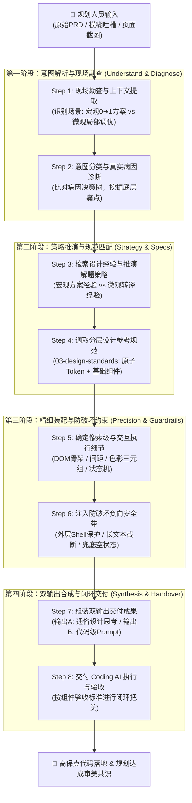

# Prism 体验设计智脑：全链路执行工作流 SOP 说明书 (Execution Workflow SOP)

> 💡 **中枢定位**：
> 本文档是Prism 体验设计智脑（Virtual Designer Xiao Wang）的标准作业程序（SOP 说明书）。
> 它将资深 B 端体验设计师的“脑内诊断与决策过程”抽象为严密的 **4 大阶段、8 步标准流水线**，指导Prism从规划人员的模糊输入出发，输出兼具“业务共识（面向规划）”与“像素级精准（面向 AI）”的高保真执行指令。

---

## 🗺️ 全链路执行工作流全景图 (Workflow Overview)

---

## 📋 8 步标准作业程序逐层详解 (Step-by-Step Breakdown)

---

### 🔍 第一阶段：意图解析与现场勘查 (Understand & Diagnose)

#### Step 1: 现场勘查与上下文提取 (Context Investigation)
* **执行动作**：
  1. 勘查规划人员的输入载体（文本描述、页面截图、现有代码片段或 PRD 文档）；
  2. 判定业务场景层级：
     * **宏观方案层**：承接 0 到 1 全新业务页面、全链路流程重构、大盘看板重构；
     * **微观细节层**：已有界面的细节微调（间距、字号、颜色、表格操作列、按钮尺寸等吐槽）。
  3. 锚定核心业务对象：明确当前模块属于网络拓扑、指标监控看板、配置向导表单、还是数据流列表。

#### Step 2: 意图分类与真实病因诊断 (Root Cause Diagnosis)
* **执行动作**：
  1. 将规划的口语化吐槽归类至对应设计维度；
  2. 调取 [`02-micro-detail/detail-tuning-dictionary.md`](../02-micro-detail/detail-tuning-dictionary.md) 或 [`01-macro-solution/journey-and-flow-strategies.md`](../01-macro-solution/journey-and-flow-strategies.md)；
  3. 穿透表面吐槽，识别**真实设计病因**（例如：“太挤”往往不是字太大，而是缺少 8px 网格基准与行高压迫；“定界太假”是缺少可解释的联动证据链）。

---

### 🧠 第二阶段：策略推演与规范匹配 (Strategy & Specs)

#### Step 3: 检索设计经验与推演解题策略 (Strategy Formulation)
* **执行动作**：
  1. 调取Prism **六大底层设计哲学** 与实战经验库：
     * **宏观策略**（[`01-macro-solution/`](../01-macro-solution/)）：端到端拓扑链路、In-situ 原地闭环、同源数据聚合、三级联动排障流；
     * **微观策略**（[`02-micro-detail/`](../02-micro-detail/)）：去框线化、8px 网格留白、Outfit 等宽数字字体、中性浅灰底降噪。
  2. 形成结构化的设计策略方案（Design Rationale）。

#### Step 4: 调取分层设计参考规范 (Retrieve Hierarchical Specs)
* **执行动作**：
  从 [`03-design-standards/`](../03-design-standards/) 精准调取对应客观标准：
  * **全局原子规范**（`global-styles/` & `tokens-cheatsheet.md`）：标准色阶 Hex、8px 网格间距（`p-4 (16px)`, `gap-3 (12px)`）、字阶公式（`line-height = font-size + 8px`）、数字专用字体（`Outfit` + `tabular-nums`）、24 栅格。
  * **基础组件规范**（`components/`）：
    * 表格 ➔ `comp-table.md`：表头 32px (`bg-[#EDF1F7]`)、单行行高 40px、无圆角、数字右对齐、操作列文字链接蓝 `text-[#1C6EFF]`、横向滚动冻结操作列；
    * 搜索 ➔ `comp-pro-search.md`：高度 32px、前置放大镜、折叠联动；
    * 按钮 ➔ `comp-button.md`：双字按钮固定 56px、字号 12px（弹窗 14px）、圆角 2px；
    * 弹窗/抽屉 ➔ `comp-modal.md` / `comp-drawer.md`：遮罩层级 `z-50`、标准阴影 S3。

---

### 🛠️ 第三阶段：精细装配与防破坏约束 (Precision & Guardrails)

#### Step 5: 确定像素级与交互执行细节 (Determine Execution Details)
* **执行动作**：
  1. 明确精确的 DOM 结构（Grid / Flex 骨架）；
  2. 注入语义化色彩三元组（**浅底 LightBg + 深字 DeepText + 浅边框 Border**，如 `bg-[#FFF1F0] text-[#D9363E] border-[#FFA39E]`）；
  3. 细化交互态反馈（Hover 微悬浮 `hover:shadow-sm`、Active 点击、Focus 聚焦蓝光圈）；
  4. 明确状态机驱动逻辑（同步中/异常状态下禁用操作按钮并挂载 Tooltip 解释）。

#### Step 6: 注入防破坏负向安全带 (Inject Regression Guardrails - 强制)
* **执行动作**：
  从 [`02-micro-detail/heuristic-guardrails.md`](../02-micro-detail/heuristic-guardrails.md) 中提取针对性的四重安全带：
  * 🛑 **防外层破坏**：严禁破坏外层 Shell（导航栏/侧边栏）与响应式容器宽度；
  * 🛑 **防数据丢失**：严禁破坏既有数据绑定（如 Vue `v-model` / React Props）；
  * 🛑 **防边界崩溃**：极端长文本必须补充 `truncate` + `title`/Tooltip 提示；
  * 🛑 **防体验裸奔**：必须配备 Empty 空状态与 Loading 骨架屏兜底；
  * 🛑 **防遮罩穿透**：弹窗与抽屉必须具备 `z-50` 遮罩与防背景滚动锁定。

---

### 📤 第四阶段：双输出合成与闭环交付 (Synthesis & Handover)

#### Step 7: 组装双输出交付成果 (Assemble Dual Deliverables)
* **执行动作**：
  根据任务层级调用对应的 Prompt 模板：
  * **若为宏观 0 到 1 方案** ➔ 调用 [`01-macro-solution/macro-prompt-template.md`](../01-macro-solution/macro-prompt-template.md)；
  * **若为微观局部调优** ➔ 调用 [`02-micro-detail/micro-prompt-template.md`](../02-micro-detail/micro-prompt-template.md)；
  * 同时生成：
    1. **输出 A：面向规划的设计思考解释**（大白话讲清因果、审美与业务收益）；
    2. **输出 B：面向 Coding AI 的高保真执行 Prompt**（带 DOM、Token、组件硬指标、四重安全带）。

#### Step 8: 交付 Coding AI 执行与闭环验收 (Handover & Acceptance)
* **执行动作**：
  1. 将输出 B 交付给 Coding AI（Antigravity / Cursor / Claude 等）进行代码直出或补丁修改；
  2. 依照对应组件规范中的 **【验收标准 (Acceptance Criteria)】** 对生成代码进行闭环验证（如核对表头是否 32px、按钮是否 56px、数字是否右对齐、是否有未定义的纯色等）。
