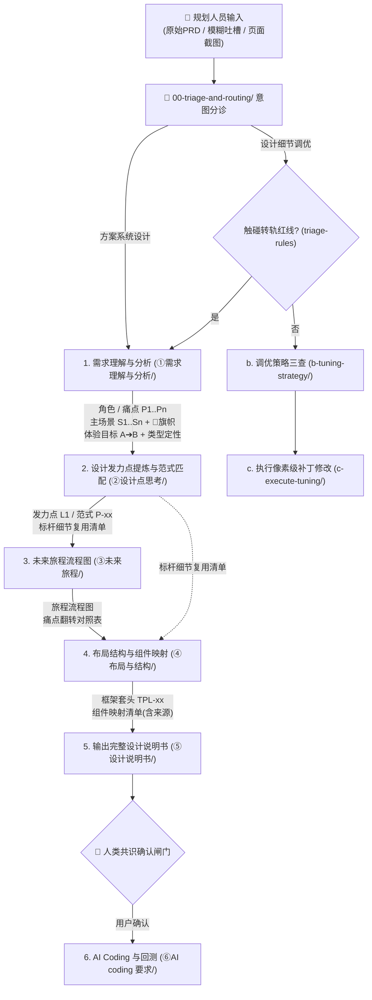
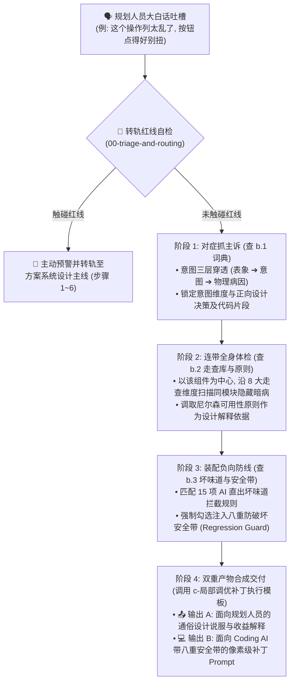

# 织雨体验设计智脑：全链路执行工作流 SOP 说明书 (Execution Workflow SOP)

> 💡 **中枢定位**：
> 本文档是织雨体验设计智脑（Virtual Designer Zhiyu）作为个人设计 Agent 的标准作业程序。
> 它将资深体验设计师的思考执行全景图，严格沉淀为 **两大赛道（方案系统设计 vs 设计细节调优）** 的端到端标准流水线。

---

## 🗺️ 全链路执行工作流全景图 (Workflow Overview)

---

## 📋 方案系统设计主线 6 步规程 (System Solution SOP)

1. **Step 1: 需求理解与分析**（调用 `01-system-solution-design/①需求理解与分析/`）：
   * 调取 [`1.1-需求理解与现状旅程.md`](../01-system-solution-design/①需求理解与分析/1.1-需求理解与现状旅程.md) 明确目标角色画像，深挖现状物理卡点与心智摩擦，抽象黄金路径与本质任务（JTBD）；
   * 调取 [`1.2-体验目标.md`](../01-system-solution-design/①需求理解与分析/1.2-体验目标.md) 按照务实版规则（产品改造动作->操作变化->历史痛点->量化收益）确立可衡量的体验目标；
   * **前置定性**：对照标杆案例库前置类型表，快速完成业务需求类型定性（Type-01~07）。
   * **交付下游**：本步产物（角色 / 痛点编号 `P1..Pn` / 主场景清单 `S1..Sn` / 体验目标 / 类型定性）是 Step 2 的**必需输入**，字段清单见下方「📦 步骤间交接契约」。
2. **Step 2: 标杆案例借鉴、发力点提炼与专家范式匹配**（调用 `01-system-solution-design/②设计点思考/` 与 `03-design-assets/patterns/`）：
   * **强制查阅标杆**：调取 [`2.2-标杆案例库.md`](../01-system-solution-design/②设计点思考/2.2-标杆案例库.md) 门户完成类型定性，再进入 [`标杆案例库/`](../01-system-solution-design/②设计点思考/标杆案例库/) 中该需求类型的分册，对照其【通用设计场景清单】进行完整度自检（⚠️ 注意：**当前库内仅有 Type-07「XDR 检测任务」完成蒸馏**，其余类型分册内容较浅或为占位，不可直接当作成熟经验复用）；
   * 调取 [`2.1-设计思考与发力点.md`](../01-system-solution-design/②设计点思考/2.1-设计思考与发力点.md) 承接步骤 1 的场景痛点与体验目标，按四步法提炼**设计发力方向（L1 方向级）**，并明确业务属性与严肃程度定性；
   * 到设计资产库 [`patterns/patterns-cheatsheet.md`](../03-design-assets/patterns/patterns-cheatsheet.md) 按业务本质反查能承载该方向的范式，再展开 `pattern-pXX-*.md` 取高阶解题机制（P-01 ~ P-08）。
   * **产出《标杆细节复用清单》（Step 4 的硬输入）**：从案例蒸馏（分册第四节）中**提取可复用的设计细节**并汇总成清单 —— **颜色 Token、尺寸硬指标、组件选型、页面模板 / 框架套头、关键交互态**；逐项注明出处（如 `案例A / E1 呈现架构`）。**未命中本次需求的条目留空并标记「待推导」，严禁臆造。**
   * **进入交接契约**：装配规则见下方「🔄 标杆复用与元素还原（Step 2 ⇄ Step 4 的交接契约）」。
3. **Step 3: 未来旅程构建与流程建模**（调用 `01-system-solution-design/③未来旅程/`）：
   * 调取 `3.1-未来旅程.md` 贯彻黄金路径与 In-situ 原地闭环策略，绘制出严密的 Mermaid 业务流转流程图；预留流程图脚本工具和模板扩展。
   * **交付下游**：旅程流程图与**痛点翻转对照表**（每条 `🚩Sx-Py` 的落点）是 Step 4 确定页面与状态范围、开展布局映射的依据。
4. **Step 4: 最终解决方案架构、页面清单与组件深度装配**（调用 `01-system-solution-design/④布局与结构/` 与 `03-design-assets/`）：
   * **确定解决方案页面清单 (Page Inventory)**：明确本次需求最终包含哪几个页面/视图（主页面、抽屉、弹窗），绘制页面间流转关系拓扑图；
   * **模板与组件严格取材顺序（硬性，不可颠倒）**：必须**先消费 Step 2 产出的《标杆细节复用清单》与 EP 经验** ➔ 页面模板严格对照 [`03-design-assets/page-templates/01-page-types.md`](../03-design-assets/page-templates/01-page-types.md) 确定页面类型 ID（如 `page-table-overview`, `page-form-drawer`, `page-detail-drawer`）➔ 真实前端组件严格对照 [`03-design-assets/components/idux-component-map.md`](../03-design-assets/components/idux-component-map.md) 映射 `IxTable`, `IxDrawer`, `IxProgress`, `IxPopconfirm` 等标准组件名 ➔ 提取尺寸色值硬指标（`h32`, `h28`, `rounded-[2px]`, `#1C6EFF` 等）；
   * **绘制界面结构线框图 (Wireframe Schematics)**：为每个页面绘制语义化区域线框（头部套头、筛选栏、卡片区、主表格/拓扑区、操作底栏等）；
   * **分页面全要素装配与来源追溯**：按页面逐一绑定【页面定位与Job ➔ 线框图 ➔ 承载设计经验 ➔ 真实 idux 组件/Token ➔ 交互机制】，标明来历（`标杆复用 EP-xx` / `模板还原` / `体验目标推导`）。
5. **Step 5: 生成系统化整合型设计说明书并等待确认**（调用 `01-system-solution-design/⑤设计说明书/` 与 `agent-interaction-protocol.md`）：
   * **彻底杜绝信息割裂**：绝不把 1~4 步产物机械堆叠，而是全面汇流并整理为**最终解决方案全景示意与分页面深度推导**，生成单文件自包含 HTML 说明书（包含七大固定章节与 Wireframe 视觉组件）；
   * **强制停下，到达「🚦人机共识确认闸门」**：向规划人员汇报并等待确认，达成业务与设计共识，严禁偷跑代码。
6. **Step 6: AI Coding 方案输出与反向回测**（调用 `01-system-solution-design/⑥AI coding 要求/`）：
   * 收到用户确认后，生成高保真 Demo 代码；
   * 对照第 4 步清单严格回测框架套头与组件硬指标，输出最终交付报告。

---

## 📦 步骤间交接契约（Step 1 ➔ 6 的产物链）

> 📌 **为什么需要它**：6 个 Step 若只"自己干自己的"，信息会在交接处流失，最终《设计说明书》必然缺章少件 —— 这就是"单兵作战"的病根。本节把 6 步定义成**一条产物链**：每步**必须消费上游产物**，并**必须交付下游可用的产物**。
> 🎯 **唯一收敛点**：所有步骤的有效产物，**最终必须全部汇入《设计说明书》**。**任何产出了却不进说明书的，都是无效工作。**

### 一、产物链总表

| 步骤 | 必须消费（上游输入） | 必须交付（下游产物） | 关键字段（缺则下游无法工作） |
| :---: | :--- | :--- | :--- |
| **1 需求理解与分析** | 用户原始输入 / PRD / 吐槽 / 截图 | ① 目标角色 + 痛点清单（`P1..Pn`） ② 主场景清单 `S1..Sn`（含触发情境 / 角色 / Job / **痛点旗帜 `🚩Sx-Py`** / 相关度） ③ 各主场景**现状**任务流程图 ④ 务实版体验目标（A ➔ B + 度量标准 + 上线验证指标） ⑤ **需求类型定性（`Type-0x`）** | 痛点必须有编号；体验目标必须有度量；类型定性必须给出 |
| **2 设计点思考** | ①~⑤ 全部 | ① 设计发力点（`L1` 方向级，1~3 条） ② 业务属性与严肃程度定性 ③ 选定专家范式（`P-01~P-08`） ④ **《标杆细节复用清单》**（传承的 `EP-xx` 解法机制、组件样式、尺寸、颜色、模板 + 出处） ⑤ 各要素选型结论 | 发力点须能追溯到痛点编号；清单每项须有出处 |
| **3 未来旅程** | ① 主场景清单 + 痛点旗帜 ② 发力点 `L1` | ① 优化后各场景旅程流程图（Mermaid） ② **痛点翻转对照表**（`🚩Sx-Py` ➔ 优化动作 ➔ 旅程落点） | **每条痛点必须在旅程中有明确落点** |
| **4 布局与结构** | ① 旅程流程图（页面与状态清单） ② **《标杆细节复用清单》** ③ 页面模板与 idux 组件库 | ① **最终解决方案页面清单与关系拓扑图**（主页/抽屉/弹窗） ② **逐页面界面结构线框图 (Wireframe)** ③ **分页面装配清单**（承载的 EP-xx 经验 + 真实 idux 组件 + 尺寸色值 Token + 来源追溯） ④ 关键交互机制与页面体验保护规则 | 必须按页面分别装配；必须使用真实 idux 组件名；每项标明来源 |
| **5 设计说明书** | ①~④ 全部 | **七章整合型完整说明书**（单文件 HTML，包含 Wireframe 视觉组件与分页面全要素展开） | 七章齐备，页面清单、线框图、经验融合与组件映射无割裂 |
| **6 AI Coding** | 用户确认后的说明书 | ① 高保真 Demo ② **回测报告**（对照 Step 4/5 分页面映射清单逐项核验） | 回测必须**引用说明书中的组件与指标条目** |

### 二、三条交接铁律

> ⚠️ **不许跨级臆造**：若上游产物缺失或字段不全，**必须停下向上游追问 / 补齐**，严禁下游自行猜测填补。
> ⚠️ **不许产出不落地**：任何一步的产物若最终不进《设计说明书》或 Step 6 回测，即为无效工作。
> ⚠️ **每步必须回链**：下游引用上游内容时须保留其编号（痛点 `🚩S1-P1` / 经验 `EP-07` / 模板 `page-table-overview` / 组件 `IxTable`），实现**端到端可追溯**。

### 三、收敛校验（设计说明书 = 唯一出口）

七章与来源步骤的映射如下；**任一章节空缺、或其来源步骤产物缺失，即判定为上游交接断裂，必须回补而非臆造**：

| 说明书章节 | 来源步骤 | 上游缺件时的处理 |
| :--- | :--- | :--- |
| 一、需求洞察与体验目标 | Step 1 | 回 Step 1 补齐角色 / 痛点 / 体验目标 |
| 二、标杆经验学习与设计选型 | Step 2 | 回 Step 2 补齐类型定性 / EP 经验复用矩阵 / 范式 |
| 三、优化后各场景任务旅程 | Step 3 | 回 Step 3 补齐旅程与痛点翻转对照 |
| 四、最终解决方案全景与页面架构拓扑 | Step 4 | 回 Step 4 补齐页面清单与关系拓扑图 |
| 五、核心页面线框示意与深度推导 | Step 4（全要素整合） | 回 Step 4/2 补齐各页面线框图、承载 EP 经验与 idux 组件 |
| 六、页面体验与异常保护规则 | Step 4 | 回 Step 4 补齐异常保护规则 |
| 七、方案共识与评审确认关卡 | Step 5 (共识闸门) | 停下来向规划人员汇报，等待明确确认 |

---

## 🔄 标杆复用与元素还原（Step 2 ⇄ Step 4 的交接契约）

> 📌 **本节的定位**：它是**跨步骤的交接契约**（Step 2 提炼 ➔ Step 4 还原 ➔ Step 5 汇总），不属于任何单一步骤，故单独成节。
> ⚠️ **为什么必须交接**：标杆案例蒸馏出的设计细节（颜色 / 尺寸 / 组件 / 页面模板）如果 Step 2 只拿来做"场景覆盖度自检"而不交接给 Step 4，这些细节就等于白学 —— **这是"标杆学习"最常见的断点。**

### 一、Step 2 产出：先学经验 ➔ 再提炼《标杆细节复用清单》

| 层级 | 来源 | 取什么 | 取不到时 |
| :---: | :--- | :--- | :--- |
| **① 先吃经验** | 该类型分册【第三节 设计经验库】 | 已沉淀的经验条目（`EP-xx`） | 经验为空 / 未覆盖该要素 → **下探 ②** |
| **② 再看案例** | 该类型分册【第四节 案例蒸馏】 | 案例的**设计细节**：颜色 Token、尺寸硬指标、组件选型、页面模板 / 框架套头、关键交互态 | 案例未覆盖本次范围 → 记为「**待推导**」，交 Step 4 |

* **Step 2 交付物 ➔《标杆细节复用清单》**：逐项注明出处（如 `案例A / E1 呈现架构`）；未命中的条目留空并标「待推导」，**严禁臆造**。

### 二、Step 4 消费：先还原清单 ➔ 再补通用规范 ➔ 最后兜底

| 顺序 | 动作 | 取材处 | 来源标注 |
| :---: | :--- | :--- | :--- |
| **1** | **还原 Step 2 清单中的命中项** | Step 2 产出的《标杆细节复用清单》 | `案例X 还原` |
| **2** | 用**通用资产规范补齐硬指标**（尺寸 / 色值 / 组件规范） | [`03-design-assets/`](../03-design-assets/)（`page-templates/`、`components/`、`tokens-cheatsheet.md`） | 随上一行 |
| **3** | 清单中标记「待推导」的部分自行推导 | [`1.2-体验目标.md`](../01-system-solution-design/①需求理解与分析/1.2-体验目标.md) + [`2.1-设计思考与发力点.md`](../01-system-solution-design/②设计点思考/2.1-设计思考与发力点.md) | `体验目标推导` |

### 三、取材纪律（不可越级）

> ⚠️ **顺序不可颠倒**：先消费标杆清单 ➔ 再补通用规范 ➔ 最后才自行推导。**严禁跳过前两步直接自由发挥** —— 这是"标杆学习"能否真正落地的分水岭。
> ⚠️ **兜底不是降级**：第 3 步不是"没办法了随便画"，而是回到"这次到底要解决什么问题"的第一性推导 —— 这正是资深设计师区别于模板套用的价值所在。
> ⚠️ **可回填**：若第 3 步产出了可泛化的规律，应回填分册【第三节】（写入 `3.1 设计经验`；证据不足则先入 `3.2 待确认经验`）。

### 四、汇总出口

* 三源结果统一写入 [`5.0-设计说明书标准模板.md`](../01-system-solution-design/⑤设计说明书/5.0-设计说明书标准模板.md)，并在第四章「业务能力与组件映射清单」的**「来源」列逐项标注**；
* 逐要素的填写模板见该类型分册的「五、本次设计要素选型工作表」。

---

## 📋 设计细节调优主线 4 阶精密闭环规程 (Detail Tuning 4-Stage SOP)

> 📌 **前置关卡（属分诊层，不单列为步骤）**：**意图三层穿透 + 转轨红线检查**已统一归口 [`00-triage-and-routing/triage-rules.md`](../00-triage-and-routing/triage-rules.md)；其心法与诊断报告结构见 [`b.1-设计细节吐槽转译词典.md`](../02-detail-tuning-design/b-tuning-strategy/b.1-设计细节吐槽转译词典.md) 的「零、转译心法」。
> 若检查触碰转轨红线（改动超 3 个模块、改变主任务流、认知错位），**必须强制停下并主动建议转轨至方案系统设计**。

### 细节调优 4 阶精密闭环执行流水线

---

### 4 阶段详细操作规范与交付物标准

#### 阶段 1：对症抓主诉 ➔ 意图穿透与词典查表 (调取 `b.1`)
* **输入条件**：规划人员针对局部界面提出的口语化反馈（如“太挤了”、“颜色土”、“一滚就对不准”、“没有反馈”）。
* **核心动作**：
  1. **三层穿透**：执行 `表象层 (口语) ➔ 意图层 (挫折点) ➔ 物理层 (CSS/DOM 病因)` 穿透推导，杜绝字面“头痛医头”；
  2. **直达词典查表**：检索 [`b.1-设计细节吐槽转译词典.md`](../02-detail-tuning-design/b-tuning-strategy/b.1-设计细节吐槽转译词典.md)，定位到 6 大意图分类之一；
  3. **提取正向决策**：获取标准设计推导（Design Rationale）与基础类名/代码片段。
* **交付物标准**：输出包含“原始吐槽、意图归类、真实物理病因、优化目标”的《调优诊断微报告》。

#### 阶段 2：连带全身体检 ➔ 8 维度扫描暗病与理论背书 (调取 `b.2`)
* **输入条件**：已定位的目标组件与其所在的局部父容器。
* **核心动作**：
  1. **同区域连带扫描**：规划人员往往只抱怨最扎眼的 1 个表象，智脑必须对照 [`b.2-界面体验与可用性.md`](../02-detail-tuning-design/b-tuning-strategy/b.2-界面体验与可用性.md) 的 **8 大走查维度**（空间、色彩、数据呈现、交互防呆、文案语义、链路闭环、工程还原度、反馈透明度），对该组件及其连带上下文做一次“微型全面体检”；
  2. **打包隐形硬伤**：排查是否存在“数字未右对齐”、“禁用按钮无解释气泡”、“破坏性操作未列影响清单”、“横向滚动未做左右冻结”、“死胡同弹窗”等暗病，将其一并纳入本次修复范围，杜绝二次返工；
  3. **调取理论依据**：对照 B 端深度定制的 10 项尼尔森可用性原则（如系统状态可见性、防错原则、就地闭环），提炼支撑本次重构的设计心理学与业务依据。
* **交付物标准**：明确记录“本次连带走查查出的共生缺陷项清单”与“可用性原则依据”。

#### 阶段 3：装配负向防线 ➔ 坏味道拦截与安全带注入 (调取 `b.3`)
* **输入条件**：阶段 1 与阶段 2 汇集的待修改项集合。
* **核心动作**：
  1. **坏味道匹配**：对照 [`b.3-避坑指南.md`](../02-detail-tuning-design/b-tuning-strategy/b.3-避坑指南.md) 的 **15 项高频坏味道拦截清单**（❌1~❌15），显式下达“禁止做什么”的负向提示；
  2. **安全带强制装配**：针对本次改动的特征，从【八重防破坏安全带 (Regression Guard)】中强制勾选适用条款：
     - 修改卡片/布局 ➔ 注入 `🛑 防外层破坏` + `🛑 防边界崩溃 (truncate+Tooltip)`；
     - 修改操作/表单 ➔ 注入 `🛑 防数据破坏 (@click/v-model不变)` + `🛑 防禁用黑盒`；
     - 修改删除/解散 ➔ 注入 `🛑 防高危裸奔 (阻断Modal+影响清单+口令验证)`；
     - 修改弹窗/抽屉 ➔ 注入 `🛑 防交互穿透 (z-50遮罩+防滚动)` + `🛑 防设计碎片化 (复用标准组件)`；
     - 涉及跳出跨页 ➔ 注入 `🛑 防外跳无提示 (必须带 ↗ 图标)`。
* **交付物标准**：组装完成带有负向约束与八重安全带的代码前置条件。

#### 阶段 4：双重产物合成交付 ➔ 规划说服与安全代码 (调取 `c 模板`)
* **输入条件**：阶段 1~3 产生的所有正向方案、连带修复项与负向安全带。
* **核心动作**：调取 [`c-局部调优补丁执行模板.md`](../02-detail-tuning-design/c-execute-tuning/c-局部调优补丁执行模板.md)，严谨组装双重交付物：
  1. **生成 📤 输出 A（面向规划人员）**：
     - 用通俗自然语言 + `b.2` 可用性依据，向规划人员解释痛点病因、本次做了哪些精细提升（涵盖主诉与连带体检项），以及预期的业务与质感收益；
  2. **生成 💻 输出 B（面向 Coding AI）**：
     - 严格遵循 `任务目标 ➔ 模块硬指标尺寸 ➔ 视觉三元组 ➔ 防破坏安全带` 四段式结构，生成像素级、即插即用、且绝对安全的执行 Prompt。
* **交付物标准**：在会话中完整交付输出 A 与输出 B，并提示用户由 Coding AI 执行并验证效果。

