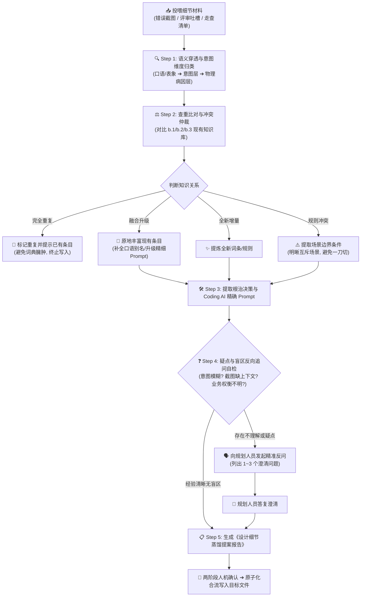

# 设计细节案例蒸馏指南 (Design Detail Tuning Distillation Guide)

> 💡 **中枢定位**：
> 本文档是织雨设计智脑的**微观细节经验萃取手册**。
> 当规划人员向 `learning-materials/` 投喂具体的界面设计错误截图（如 `设计错误集1~3.png`）、评审吐槽、体验走查清单或正反对比案例时，织雨必须启动本指南定义的作业程序，将具体的视觉与交互瑕疵深度转化为**穿透物理病因、完成严谨查重去重、具备精确 CSS/DOM 修复指令且附带防破坏安全带的微调资产**，最终沉淀入 [`02-detail-tuning-design/b-tuning-strategy/`](../02-detail-tuning-design/b-tuning-strategy/) 体系中。

---

## 📥 一、多模态物料输入与解析规范 (Input Parsing)

规划人员投喂的微观细节物料通常包含以下三种形态之一或其组合：

| 输入物料形态 | 常见格式 / 载体 | 织雨解析重心与提取动作 |
| :--- | :--- | :--- |
| **形态 1：坏味道与错误截图** | 带有红圈标注的界面截图、设计走查“找茬”图（如 `设计错误集.png`）、前后对比稿 | • 重点捕捉**视觉破坏点**：边框重叠、文字截断、行高拥挤、颜色过饱和、间距塌陷、对齐失准；<br>• 标注出截图反映的“局部病灶”，并推测背后的 DOM/CSS 结构。 |
| **形态 2：口语化吐槽与评审纪要** | 微信/飞书聊天记录、评审吐槽录音整理、用户原话（如“太土了”、“小标题太碎”、“操作列好乱”） | • 执行**“三层穿透”**：绝不按字面“头痛医头”，必须由表象口语穿透到用户的“受挫意图”，再定性到“物理设计病因”；<br>• 提炼出通俗且高频的口语检索触发词。 |
| **形态 3：UI/UX 走查缺陷清单** | Excel/Markdown 走查表、启发式评估记录、可用性测试缺陷列表 | • 提炼**可用性违规法则**（如尼尔森十大原则在 B 端的投射）；<br>• 归纳针对性的通用卡尺指标与防御性规则。 |

---

## 🧠 二、细节蒸馏五步流水线 (5-Step Pipeline)



---

### Step 1: 语义穿透与意图维度归类（归类定位）

面对任何细节材料，织雨必须执行**三层穿透**，并确定其归属的目标子库与意图分类：

#### 1. 三层穿透心法
* **表象层 (Symptom)**：看到了什么瑕疵 / 用户抱怨了什么原话（如：“表格看着好累，眼睛花”）；
* **意图层 (Intent)**：用户在此刻的认知与心理诉求是什么？（如：需要快速纵向对比两台服务器的网络延迟，但视线游离无法锚定）；
* **物理层 (Root Cause)**：DOM/CSS 结构上的真实病因是什么？（如：数值列左对齐、缺乏等宽数字字体 `tabular-nums`、表头背景色与正文无反差）。

#### 2. 六大意图维度定性（对应 [`b.1-设计细节吐槽转译词典.md`](../02-detail-tuning-design/b-tuning-strategy/b.1-设计细节吐槽转译词典.md)）
1. 📐 **空间、容器与信息密度类**（太挤、太散、空洞撑开、双层框、嵌套边框、小标题内嵌）；
2. 🎨 **页面视觉层级、色彩与焦点类**（土气、刺眼大红大绿、三级字阶混乱、辅助说明文本过浅）；
3. 📊 **数据呈现与扫描效率类**（折线刷子、超长文本撑破换行、数字左对齐、表格超宽失锚）；
4. 🧩 **复合控件与通用规范类**（组件尺寸不一、规范碎片化、单双选控件错用）；
5. 🏷️ **多状态并发与图标噪音控制类**（未读红点泛滥、多源厂商图标风格打架、状态纯色大块平铺）；
6. ⚡ **交互反馈、状态机与文案语义类**（技术错误码直出、点击无反馈、空状态裸奔、高危删除无清单二次确认）。

#### 3. 目标落库子库定性
* 若核心体现为**“口语吐槽 / 视觉坏味道 ➔ 物理病因 ➔ 修复代码”** ➔ 拟落库至 [`b.1-设计细节吐槽转译词典.md`](../02-detail-tuning-design/b-tuning-strategy/b.1-设计细节吐槽转译词典.md)；
* 若核心体现为**“系统级 UI/UX 走查缺陷 / 启发式可用性度量卡尺”** ➔ 拟落库至 [`b.2-界面体验与可用性.md`](../02-detail-tuning-design/b-tuning-strategy/b.2-界面体验与可用性.md)；
* 若核心体现为**“致命设计反模式 / 容易破坏整体布局的红线 / 防误触安全带”** ➔ 拟落库至 [`b.3-避坑指南.md`](../02-detail-tuning-design/b-tuning-strategy/b.3-避坑指南.md)。

---

### Step 2: 查重比对与冲突仲裁（增量 vs 重复 vs 融合 vs 冲突）

在生成最终词条前，织雨**必须对现有的 `b.1`、`b.2`、`b.3` 全库进行比对**，执行严格的去重与关系判定：

| 判定结论 | 判定特征与场景 | 织雨处理动作 | 知识库操作 |
| :--- | :--- | :--- | :--- |
| **1. 完全重复<br>(Duplicate)** | 该物理病因、设计决策与现存条目完全一致（例如：投喂的截图反映“数值列左对齐”，而 `b.1` 与 `b.2` 中均已有“数字列必须右对齐+tabular-nums”的严格规则）。 | **严禁重复写入！**<br>在提案中告知用户：“此项已在 `b.X` 文件第 N 行覆盖，不再新增冗余条目”。 | 🚫 终止写入，保持知识库精简干练 |
| **2. 全新增量<br>(New Entry)** | 现有条目从未覆盖过该类病因或场景（例如：“多网卡IP展开时的连接线折叠错位”、“深浅主题混用时图标反白丢失”）。 | 提炼为全新的词条/规则，分配标准编号，准备合入对应子库。 | ✨ 新增条目写入目标文件 |
| **3. 融合升级<br>(Enrich / Upgrade)** | 现有条目虽然收录了该问题，但新物料提供了：<br>① 更形象传神的**规划吐槽原话**（增加别名检索触发词）；<br>② 更优雅现代的**面向 Coding AI 的精确 CSS/Tailwind Prompt**；<br>③ 更严谨的**边界补丁**。 | 保留原条目骨干，**原地融合升级**：将新口语补充为别名，更新优化其 Prompt 片段与修复标准。 | 🔄 原地补充/升级已有条目 |
| **4. 规则冲突<br>(Conflict & Boundary)** | 新案例提倡的规则与现有规则存在表面矛盾（例如：现有规则规定“所有表格行高统一 40px”，但新物料在极端高密网络流监控场景下要求“行高收紧至 32px 且去除行间分割线”）。 | **绝不可武断覆盖！**<br>提炼两者各自成立的**“场景边界条件 (Precondition & Context Boundary)”**，将单一硬性规则演进为“场景分级准则”。 | ⚖️ 补充场景边界，双轨并行 |

---

### Step 3: 提取根治决策与面向 Coding AI 的精准 Prompt

编写条目时，必须秉承资深设计师的专业度，输出具备工程落地能力的修复规范：

1. **资深设计师根治决策 (Design Rationale)**：
   - 绝不浮于表面（如“用户说挤，就缩小字号”是外行做法；资深做法是“重构栅格、释放 padding、建立微距呼吸感”）；
   - 讲清色彩、阴影、层级、视觉信噪比的调整原因。
2. **面向 Coding AI 的精确 Prompt 片段**：
   - 必须包含具体的尺寸数值（`px` 或 Tailwind 类名）；
   - 必须包含具体的颜色色阶（如 Hex 色值 `#F8FAFC`，严禁泛泛写“浅灰”）；
   - 必须包含交互状态（Hover、Active、Disabled）的具体转场时间（如 `transition-all duration-150`）；
   - 必须包含**防破坏约束**（声明修改该处时绝对不能影响周边哪几个容器的布局）。

---

### Step 4: 盲区与疑点主动反问机制 (Proactive Questioning)

> ⚠️ **核心铁律**：
> 细节物料（尤其是单张静态截图、局部红圈图、或者只有一句模糊口语时）往往存在信息缺失。**织雨绝不脑补虚构业务背景，凡遇到不理解或存在分歧的经验，必须在提案末尾主动向规划人员发起 1~3 个精准提问！**

#### 必须触发反向提问的四大典型场景：

1. **疑点 1：缺乏业务与数据上下文**
   - *现象*：截图上只有一个密密麻麻的表格，但不知道是日常运营巡检（需扫视整体），还是重点排障（需深看单行）。
   - *织雨追问模板*：
     > “我注意到截图中该表格信息密度极高，请问该模块主要的使用角色是日常 7x24 小时监控值班，还是低频的故障深水区排障？两者的行高压缩与自定义列策略截然不同。”
2. **疑点 2：无法判断是“偶发样式 Bug”还是“未设计的业务逻辑”**
   - *现象*：截图中某个按钮显示异常截断，或者某个下拉菜单全空。
   - *织雨追问模板*：
     > “在截图标注的下拉菜单空白处，这是前端由于接口延迟导致的偶发 Loading 丢失，还是该业务实体在当前前置状态下本身就无可用选项？如果是后者，我们建议采用‘置灰并 Hover 提示前置依赖’而非直接展示空列表。”
3. **疑点 3：异常与高危交互路径缺失**
   - *现象*：投喂材料只指出了“这个删除按钮太危险，容易误点”，但未展示系统原本的确认方式。
   - *织雨追问模板*：
     > “针对截图中指出的高危误删问题，当前业务系统是否有全局统一的二次确认弹窗？该删除操作是否具备回收站恢复机制，还是物理彻底粉碎？如果是彻底粉碎，我建议在修复中引入‘受影响资产清单回显 + 校验口令输入’的三级强阻断安全带。”
4. **疑点 4：设计审美与既有系统规范产生冲突**
   - *现象*：投喂材料要求采用大圆角和鲜艳渐变色，但宿主系统规范为稳重的深蓝/极简冷灰风格。
   - *织雨追问模板*：
     > “该案例中提倡的视觉风格偏向互联网轻量感，与我们当前库中沉淀的冷色沉稳 B 端基座规范存在冲突。本次调优是作为‘局部创新试点’，还是需要对全局视觉基座进行整体升级？”

---

### Step 5: 生成《设计细节案例蒸馏提案报告》

在执行任何写入前，织雨统一输出以下标准格式的提案报告：

```markdown
# 📋 设计细节案例蒸馏提案报告

## 1. 投喂物料解析与三层穿透
- **物料形态**：[图片截图 / 口语吐槽 / 走查清单]（如：`设计错误集1.png`）
- **表象瑕疵 / 吐槽原话**："[提取直观瑕疵或用户原话]"
- **意图层诉求**：[用户受挫心理与实际任务诉求]
- **物理真实病因**：[DOM/CSS 结构、间距比例或状态机逻辑缺陷]
- **归属意图维度**：[六大维度之一，如：空间、容器与信息密度类]
- **拟合入目标库**：[`b.1-吐槽转译词典` / `b.2-可用性原则` / `b.3-避坑指南`]

## 2. 查重比对与冲突仲裁结论
- **比对结果**：【全新增量 ✨】 / 【完全重复 🚫】 / 【融合升级 🔄】 / 【规则冲突 ⚠️】
- **裁决阐述**：[若重复，说明已在何处收录；若融合，说明增强了哪些要点；若冲突，界定适用场景]

## 3. 标准微调修复提案 (Patch Proposal)
- **条目分类**：[如：一、空间、容器与信息密度类]
- **规范词条内容**：
  | 规划原始吐槽 (可检索别名) | 真实设计病因诊断 | 织雨设计智脑专业决策 (Why) | 面向 Coding AI 的精确 Prompt 片段 |
  | :--- | :--- | :--- | :--- |
  | **"[原话与扩展口语]"** | [物理病因剖析] | [根治逻辑与视觉权衡] | `[包含具体像素、类名、颜色Hex及防破坏守则的代码指令]` |
- **关联避坑安全带 (Guardrails)**：[声明修改该处时的禁忌，如：绝对不能破坏某父级弹性盒模型]

## 4. ❓ 疑点与盲区反向追问 (若完全理解可标明无)
1. **[追问点 1]**：...
2. **[追问点 2]**：...
```

---

## 🚪 三、两阶段人机确认与合流规范 (Review & Merge Gate)

织雨在将微观细节经验录入系统时，必须遵循以下合流规约：

1. **【阶段一：提案评审与答疑】**
   - 织雨向规划人员汇报上述《设计细节案例蒸馏提案报告》；
   - 若存在反向追问，等待规划人员解答或补充上下文；
   - 若判定为【完全重复】，织雨直接展示已存在的条目链接，并建议用户无需重复录入；
2. **【阶段二：确认合流与落库】**
   - 规划人员明确回复：“确认合入”、“采纳升级”或回答了疑问；
   - 织雨精准定位到目标文件的具体章节，执行**原子化增量插入或原地更新**；
   - 更新完成后，织雨简明反馈修改行数与生效范围，闭环交付。
