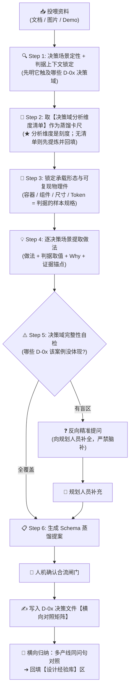

# 通用设计案例蒸馏指南 (Cross-Type Design Cases Distillation Guide)

> 💡 **中枢定位**：
> 本文档是织雨设计智脑的**横向经验萃取手册**，与 [`需求大类标杆案例蒸馏指南.md`](需求大类标杆案例蒸馏指南.md) 并列为一对姊妹指南：
> * **需求大类指南**：以「需求类型（Type-01~07）」为轴，**纵向**沉淀"这类需求标杆怎么做" → 落 `需求大类设计决策/` 各类型分册（**候选经验池**）；
> * **本指南**：以「决策域（D-01~10）」为轴，**横向**沉淀"同一决策场景下各产线怎么选、判据与阈值是什么" → 落 [`通用设计决策/`](../01-system-solution-design/②设计思考与决策/通用设计决策/) 各决策文件（**裁决尺 + 兜底网**）。
>
> 📦 **两类产出物（缺一不可）**：
> 1. **对照证据**（证据层）→ 写入对应 `D-0x` 决策文件的【横向对照矩阵】；
> 2. **设计经验**（沉淀层）→ 横向对比多产线后归纳，写入同文件的【设计经验库】区。

---

## 🎯 零、第一性要求：蒸馏信息必须"挂靠"在【决策场景 × 分析维度】坐标上

> **铁律**：通用蒸馏不是还原某个方案的页面族，而是把**多个方案在同一个决策场景下的做法摆到同一把尺子上对照**，收敛出"什么条件下该选哪种"的可判定结论。决策场景是"骨架"，分析维度是"刻度"，物料是"实测读数"。

**为什么必须这样**：**决策场景（D-0x ①）是下游检索的唯一索引**。下游设计师遇到的从来不是"这是哪类需求"，而是"这里到底该用卡片还是表格、该用弹窗还是抽屉"——他按**选择困境**来问，答案必须是一句可判定的判据，而不是一段描述。

| 下游环节 | 要用本指南产出的什么 | 怎么检索 |
| :--- | :--- | :--- |
| Step 2 裁决候选方案 | 经验 / 阈值 / 分流结论 | 按**决策场景**命中（如"D-02 ② 列表用卡片还是表格"） |
| Step 2 裁决大类内多案例冲突 | 同一决策场景下各产线的做法高下 | 按**决策场景**对齐多产线样本 |
| Step 4 布局与组件映射 | 容器选型与 Token 硬指标 | 顺条目内联的**还原锚点**取料 |

> ⚠️ **反过来说**：答不上"什么条件选哪个"的内容，只是描述而非决策——**下游既检索不到、也无法据此裁决**，那样的蒸馏等于白做。

---

## 📥 一、多模态物料输入与解析规范 (Input Parsing)

规划人员投喂的材料通常包含以下三种形态之一或其组合，织雨必须按对应规范解析：

| 输入物料形态 | 常见格式 / 载体 | 织雨解析重心与提取动作 |
| :--- | :--- | :--- |
| **形态 1：文档资料** | PDF 复盘报告、PRD 需求文档、Markdown 说明、飞书文档 | • 提炼**设计取舍的动机**：为什么从 A 方案改成 B 方案、改了以后解决什么；<br>• 挖掘文档中"为什么这么选"的原话与约束条件（量级 / 字段数 / 严肃度）。 |
| **形态 2：界面图片** | 页面全景截图、局部细节对比图、流程草图 | • 剖析**承载形态**（卡片 / 表格 / 抽屉 / 弹窗 / 向导）与控件尺寸比例；<br>• 主动标记"图片未展示的隐性取值"（如分页阈值、最大列数）。 |
| **形态 3：可访问 Demo** | 线上系统控制台、本地 HTML 原型、交互原型链接 | • 实测**同一决策点的落地取值**（表格列数、抽屉宽度、弹窗与抽屉的边界）；<br>• **能取 DOM/样式级真实数值最佳**（直接落 Token 硬指标与判据阈值）。 |

> 🔌 **遇到"内网系统打不开"怎么办（前置动作）**：
> 若目标系统位于**内网**，内置浏览器直连时常报 `ERR_CERT_AUTHORITY_INVALID`。正确做法：先用 [`tools/internal-reverse-proxy.js`](../tools/internal-reverse-proxy.js) 在本地开一条访问通道（用法见 [`tools/README.md`](../tools/README.md)），再以 `http://127.0.0.1:<独占端口>` 访问取证。无法建通道时才退回"形态 2：界面图片"，并在来源声明中如实标注局限。

> 🛠️ **共用规程说明**：本节流程与大类指南完全一致。**物料解析规范、内网通道、人机确认流程属"共用器官"**，以 [`需求大类标杆案例蒸馏指南.md`](需求大类标杆案例蒸馏指南.md) 为准，本指南**只写通用线的差异部分**，避免两份文档双写漂移。

---

## 🧠 二、蒸馏执行流水线（6 步）



---

### Step 1: 决策场景定性 + 判据上下文锁定（先明决策域，再辨取值）

同一决策场景（如"列表用卡片还是表格"），在业务量级、字段规整度、严肃度不同的场景下，答案截然不同。**脱离判据取值的通用结论就是空话。**

织雨必须首先从物料中提炼出以下 **5 大关键要素**：

1. **决策场景定性（首要判定）**：
   - 对照 [`通用设计决策/00-索引与决策域.md`](../01-system-solution-design/②设计思考与决策/通用设计决策/00-索引与决策域.md) 的【一、决策域】逐条核对，明确该方案在 **D-01~10** 中**哪些决策点上有明确取舍**（可多选）；
   - 若某决策点物料未涉及，标 `⚠️ 未覆盖`，留待 Step 5 反向追问；
2. **分析维度取值（本指南的"业务上下文"）**：
   - 从物料中提取该方案成立所依赖的**客观自变量**：量级（几十 / 上千 / 数万）、字段数 / 列数、配置项数、控件体量、是否需保留上下文、业务严肃度……；
   - ⚠️ 这些变量是通用的**共享坐标系**（见 [`2.0-设计决策总览与调度.md`](../01-system-solution-design/②设计思考与决策/2.0-设计决策总览与调度.md) 第四节），必须与大类经验使用同一套口径；
3. **需求类型归属（交叉引用，非本指南落库轴）**：该方案的业务类型是 Type-0X？用于定位它在哪本大类分册，供建立锚点；
4. **产品与业务赛道定位**：该产品管什么？处于什么赛道？——它解释"为什么这个产线会这么选"；
5. **决策的直接动因**：这次取舍是为了解决什么具体摩擦（怕改错 / 怕盲等 / 怕漏配 / 数据量爆炸）？

---

### Step 2: 取【决策域分析维度清单】作为蒸馏卡尺（★ 本指南核心铁律）

根据 Step 1 判定的决策域，进入 [`通用设计决策/00-索引与决策域.md`](../01-system-solution-design/②设计思考与决策/通用设计决策/00-索引与决策域.md) 对应 **D-0x** 决策点，**拿它的分析维度清单作为本次蒸馏的基准卡尺**：

1. **先查**：该决策域是否已锁定【分析维度清单】？
2. **已有分析维度清单** → **直接作为刻度尺**，逐分析维度去物料里"读数"；
3. **尚无分析维度清单（该决策域首次蒸馏）→ 本步必须按大章法先提炼并回填**：
   - **Step 2.1 抽象决策场景（一决策点一问句，可判定、二选一或多选）**：
     * **命名接地气直击选择困境**：拒绝中台黑话，用设计师会真的问出口的话（如 `列表该用卡片还是表格？`、`新增/编辑该用页面、弹窗还是抽屉？`、`破坏性删除要不要二次确认，确认到什么程度？`）；
     * **一个问句只装一个选择困境**：不要把"容器选型"和"信息密度"混在一句里，遇复合场景拆成多条；
     * **问句必须中立、可判定**：读完后能据此二选一/多选一，而不是一段开放描述；
   - **Step 2.2 建立前置独立的分析维度（可测量）与分水岭**：
     * **分析维度必须可测量、可读值**（量级 / 字段规整度 / 列数 / 配置项数 / 控件体量 / 是否需保留上下文 / 业务严肃度 ……），而不是主观形容词；
     * **每个变量给出阈值 / 分水岭**（如 `量级 ≥ 1000 → 表格`、`字段 > 7 → 需详情页`）；
   - **核心铁律**：分析维度与问句必须**前置独立、具备通用性**，严禁掺杂特定案例的专属字段或取值！
     * 🚫 **三类典型"答案前置"（一经发现必须重写）**：
       ① **把解法写进变量**：❌「是否选用了 800px 抽屉？」→ ✅「控件体量与是否需保留上下文」；
       ② **把结论写进问句**：❌「为什么 XDR 用卡片而 SASE 用表格？」→ ✅「承载形态取决于哪些变量（量级 / 字段规整度 / 成对指标）？」；
       ③ **把实测取值写进问句**：❌ 问句里出现 `1152px` / `640px` / `#1C6EFF` → ✅ 数值只属于案例层与经验层的「选型关键指标」。
     * ✅ **自检判据**：把本决策文件**全部案例暂时"忘掉"**，这段问句与变量是否仍能审任何同场景需求？不能 → 它就是从案例反写的，重写。
4. **严禁**：跳过分析维度清单自由发挥，或只填自己感兴趣的变量。

**逐变量蒸馏时的三种情况与处理**：

| 物料中的情况 | 处理 |
| :--- | :--- |
| 该分析维度**有明确取值** | 正常记录（取值 + 做法 + Why + 证据锚点） |
| 该分析维度**未明说但可合理推断** | 记录，并显式标注「**推断**」 |
| 该分析维度**完全没覆盖** | 标 `⚠️ 未覆盖`，并进入 Step 5 的反向追问清单 —— **严禁虚构填补** |

---

### Step 3: 锁定承载形态与可复现物理件（为判据提供"样本规格"）

判据只回答"选哪个""，而"选中的那个长什么样"必须能**被复现**——否则下游拿到结论也画不出来。因此必须先锚定该方案在**每个触及决策点上的物理承载**：

1. **承载形态盘点**：该决策点落地成了什么容器？（卡片流 / 高密度表格 / 左树+表格 / 抽屉 / 弹窗 / 步骤条 ……）
2. **可复现物理件**：容器/组件的**真实名称**、关键尺寸、区块划分、样式 Token 硬指标；
3. **阈值取数**：该方案实际触发的判据取值（本次列表实际多少列、多少个配置项、多大量级）；
4. **与资产库的对齐（硬性）**：组件名尽量对照 [`03-design-assets/components/idux-component-map.md`](../03-design-assets/components/idux-component-map.md) 映射；**查无对应项的如实保留蒸馏名，严禁为凑映射而杜撰**。

> 📌 这份"承载形态与物理件"清单是后续所有经验落地做法的**规格底座** —— 先看清实物，再把做法收敛进经验层。

---

### Step 4: 逐决策场景解构做法（做法 + 判据取值 + Why + 证据锚点）

> 💡 **实战作业动线铁律：先具象 ➔ 后抽象（物理承载先行，判据收网末尾）**
> * **核心痛点**：通用蒸馏主要目的是沉淀**可裁决、可复现的选型经验**。若一上来就谈抽象判据，极易陷入"泛泛而谈"，失去落脚点；
> * **正向实战作业流水线**：
>   ```text
>   ┌────────────────────────────────────────────────────────────────────────────┐
>   │                   极速蒸馏实操流水线（先具象 ➔ 后抽象）                       │
>   ├────────────────────────────────────────────────────────────────────────────┤
>   │ 1️⃣ 第一步（抓物理承载）：这个决策点落地成什么容器 / 组件 / 尺寸 / Token        │
>   │ 2️⃣ 第二步（读判据取值）：本次处在什么量级 / 多少列 / 多少配置项 / 是否需上下文 │
>   │ 3️⃣ 第三步（写设计 Why）：为什么选 A 而非业界常见的 B？牺牲了什么换到什么？    │
>   │ 4️⃣ 第四步（收网）：把做法回写成"分析维度 + 阈值 + 结论"的可判定三元组          │
>   └────────────────────────────────────────────────────────────────────────────┘
>   ```

对每个触及的决策场景，逐项解构（对应对照矩阵区）：

1. **🎨 做法与物理规格（先抓肉眼可见的物理骨架）**：
   - 该决策点的落地做法（选了哪个容器/控件），配**代表性截图或线框图锚点**；
   - 绑定在各组件上的 Token 硬指标（如 `Drawer` 宽 `800px`、`Table` 表头高 `32px`）；
2. **📏 判据取值实测**：记录该方案实际满足的分析维度取值（量级、列数、配置项数……）；
3. **💡 Why 因果推演（紧扣判据问句，文字脱水无废话）**：
   - **紧密呼应 Step 2 的判据问句**：是对"什么条件下该选哪种"在真实约束下的实战回应；
   - **脱水紧凑格式（禁止多余标签）**：统一 `* **【判据主题】为什么方案 A 而非方案 B**：[核心推导]`；
   - **资深因果三问必答**：为什么选 A 而不用业界常见的 B？为什么在某个细节上反常识克制？牺牲了什么换到什么？
4. **🏷️ 结论回写**：把上面三项收敛为一条可判定的**三元组** —— `分析维度（取值）→ 阈值 / 分水岭 → 结论`；结论须归入四分类之一：【统一基线】/【推荐体验】/【形态分流】/【例外场景】。

> 🛑 **物理规格、判据取值、Why 三者缺一不可（硬性）**：只有做法没有判据 = 无法裁决；只有判据没有规格 = 无法复现；没有 Why = 沦为散文。
> ⚠️ **未覆盖的分析维度显式标 `⚠️ 未覆盖`**；仅靠推断的标「**推断**」，严禁虚构填补。

---

### Step 5: 决策域完整性自检与反向主动追问（核心铁律）

> 🛑 **蒸馏防偷懒红线**：静态截图、单页 PDF 或静态 PRD 通常**只呈现理想状态下的主流程**，极易遗漏深水区决策：
> - 空态 / 无权限 / 加载失败时，容器与控件怎么退化；
> - 破坏性删除 / 下线的二次确认分级与防呆强度；
> - 量级突变（几十 → 数万）时承载形态的分流边界；
> - 无权限时操作是隐藏还是置灰，及提示口径。

**执行规则**：若某些**分析维度**在物料中**完全没有提及且无法合理推导**，织雨**绝对严禁假装没看见或自行脑补**！必须在蒸馏报告末尾**主动发起结构化反向提问**：

> 🗣️ **反向提问标准话术模板**：
> "本次投喂的资料中，我已提取了该方案在【D-02 承载选型、D-05 操作防呆】上的取舍。但针对此类决策点常考的分析维度，资料中尚未体现：
> 1. **关于 [D-03 信息密度]**：表格列数上限是多少？超过多少列触发横向滚动或列设置？分页与虚拟滚动的分水岭在哪个量级？
> 2. **关于 [D-04 状态表达]**：空态 / 加载中 / 无权限分别用什么容器与文案承接？
> 3. **关于 [D-05 操作防呆]**：破坏性操作是否需要二次确认？是 Popconfirm 还是 Modal？是否要求回显对象名或口令？
> 请协助补充这几项的实际取值与判据，以便我将其作为完备的设计经验合入知识库！"

---

### Step 6: 写入决策文件 + 横向归纳经验（不可省略的收尾）

1. **写入对照证据**：按【3.2 横向对照矩阵 Schema】，归并进对应 `D-0x` 决策文件【横向对照矩阵】的**对应决策场景节**（场景为纲、产线为行；同一产线里结论相同的多个模块收敛为一个「族」，**不**另起案例块）；
2. **横向归纳（★ 从"做法"变"经验"的关键一步 · 三步归流法）**：
   - **禁止机械追加产线**：多产线蒸馏本质是在同一决策场景下的竞品分析，维度高度一致。**严禁**后到产线机械追加一行完事；
   - **执行三步归流法**：
     * **Step 1 投影对齐**：将新产线做法投影到已有的**分析维度**上（量级 / 字段规整度 / 是否需上下文 ……）；
     * **Step 2 三态关系判定与裁决**：
       | 多产线横向对比结果 | 归纳与裁决逻辑 | 结论标记格式 |
       | :--- | :--- | :--- |
       | **做法一致 / 共识** | 提炼为跨产线的强制底线 | 标记 **`【统一基线】`** |
       | **同场景解法不同但有体验高下** | 进行 UX 权衡裁决，给出体验更优解与理由 | 标记 **`【推荐体验】`** |
       | **因分析维度取值不同而分叉** | 梳理分叉变量，建立清晰的分流判据 | 标记 **`【形态分流】`**（用 ① ② ③ 列出判据与推荐方案） |
       | **极端 / 边缘约束** | 记录特殊限制下的处理 | 标记 **`【例外场景】`** |
     * **Step 3 原地合流更新**：直接在已有经验条目中丰富多产线样本，**只有发现该决策点出现全新分叉变量时，才允许新增 D-0x ① 编号**；
   - **命名与排版规范**：
     * **真实产品名替换**：一律直接使用真实产品名（如 XDR、SASE、aES），严禁"案例 A/B/C"；
     * **排版符号分割**：经验内容用 `【统一基线】`、`【推荐体验】`、`【形态分流】① ② ③`、`【例外场景】` 与 `<br>` 分割；
   - **来源标记**：织雨归纳的记 `🤖 推理`（需人工复核）；规划人员口述的记 `👤 人工`；
3. **更新状态**：在决策文件头部与 [`通用设计决策/00-索引与决策域.md`](../01-system-solution-design/②设计思考与决策/通用设计决策/00-索引与决策域.md) 回填"已对照产线 N 条 / 设计经验 M 条 / 待确认 K 条"。

---

## 📋 三、标准 Schema

### 3.1 决策域与分析维度清单 Schema（写入 `00-索引与决策域.md` 的 D-01~10）

```markdown
| 编号 | 决策域 | 收什么决策点（决策场景） | 分析维度清单 | 对应资产参考（待对齐） |
| :---: | :--- | :--- | :--- | :--- |
| **D-0X** | [决策域名] | • <决策场景 A><br>• <决策场景 B> | 量级 / 字段规整度 / 列数 / 配置项数 / 控件体量 / 是否需保留上下文 / 业务严肃度 … | `patterns/0X`、`page-templates` |
```

* **决策场景必须中立、可判定**：读完能据此二选一/多选一，不是开放描述；
* **分析维度必须可测量**：写清变量名与量纲，不写主观形容词；
* 本表是「多产线 × 决策场景」对照的**列基准**。

### 3.2 横向对照矩阵 Schema（写入 `D-0x` 决策文件【横向对照矩阵】）

```markdown
### 场景 D-0x ①「<判据问句，如：列表该用卡片还是表格？>」

> 📐 **一场景一节**：以**决策场景**为纲、**产线**为行；同一产线里结论相同的多个模块收敛为「**族（成员枚举）**」，**严禁**按「产品-模块」逐个拆成案例块。分流分支多于一条时，用首列「分流分支 / 取值档」区分，不要另起一节。
> 🎨 **「承载形态与关键规格」列须写全 Token 硬指标**——**尺寸 / 圆角 / 色值 / 字号 / 阴影 / 间距**六项；组件级 Token 对齐 [`03-design-assets/`](../03-design-assets/)（[`tokens-cheatsheet.md`](../03-design-assets/tokens-cheatsheet.md) / [`components/`](../03-design-assets/components/)），行内只写**实测尺寸与差异项**，同一场景的公共项提为表前「**共用组件 Token 基线**」块，避免逐行重复。

| 分流分支 / 取值档 | 产线 | 模块（族） | 判据取值（量级 ｜ 列数 ｜ 配置项 ｜ 是否需保留上下文 …） | 承载形态与关键规格 | 该样本的独有取舍 |
| :--- | :--- | :--- | :--- | :--- | :--- |
| ①A <分支条件> | XDR | <模块 / 族（成员枚举）> | 量级 [..] ｜ 列数 [..] | <容器 + Token：宽/高 · 圆角 · 色值 · 字号 · 阴影 · 间距> | <为什么这么选 / 牺牲了什么换到什么> |
| ①B <分支条件> | SASE | <模块 / 族> | … | … | … |

* **共用 Why（紧扣判据问句，只写分支特有推导）**：
  * **【判据主题】为什么方案 A 而非方案 B**：[核心推导与权衡结论]
  * **【反常识 / 克制点】**：…
* **还原锚点**：`` `<产线> ▸ D-0x ①` ``（证据来自大类分册案例时追加 `` `<产线> ▸ 4.4·JobN·节点M` ``）
* **蒸馏日期 / 覆盖局限**：[YYYY-MM-DD] ｜ [未取到的分析维度]
```

> 🔒 **单一事实源铁律**：案例的完整页面族解构**只存于大类分册**。本区**不复制案例正文**，只保留"该方案在这个决策点上的做法 + 取值 + 锚点"，防止同一案例两处双写漂移。

### 3.3 设计经验条目 Schema（写入 `D-0x` 决策文件【设计经验库】区）

```markdown
### 2.1 设计经验 (EP-01 ~ EP-0N)

| 编号 | 归属决策场景 | 设计经验项（统一基线 / 推荐体验 / 形态分流 / 例外场景） | 备注（特殊场景 / 体验权衡 / 避坑红线） | 来源 |
| :---: | :--- | :--- | :--- | :---: |
| **EP-01** | 【D-0x ① <决策场景问句，如：列表该用卡片还是表格？>】 | **【统一基线】**<br>[跨产线共识规则] ＋ **各产线样本与内联锚点**（展开列出各产线样本，如 `XDR 12,685 项` `` `XDR ▸ D-0x ①` ``；`SASE 13 项` `` `SASE ▸ D-0x ①` ``）。<br><br>**【推荐体验】**<br>[同场景下体验最优的最佳实践] `` `产线 ▸ D-0x ①` ``。<br><br>**【形态分流】**<br>① [变量取值一] ➔ [解法与产线样本] `` `产线 ▸ D-0x ①` ``；<br>② [变量取值二] ➔ [解法与产线样本] `` `产线 ▸ D-0x ①` ``。<br><br>**【例外场景】**<br>• [边缘 / 极端场景的处理机制] `` `产线 ▸ D-0x ①` ``。 | **【避坑红线 / 选型依据】**<br>• [什么条件下别这么用 / 阈值量级 / 体验权衡] | 🤖 推理 / 👤 人工 |

### 2.2 待确认经验 (EQ-01 ~ EQ-xx)
| 编号 | 归属决策场景 | 候选经验项（含出处定位） | 存疑点 | 来源 |
| :---: | :--- | :--- | :--- | :---: |
| **EQ-01** | 【D-0x ① <问句>】 | [候选结论，用直白设计语言描述] `` `产线 ▸ D-0x ①（存疑待测）` `` | [为什么还不能沉淀，如仅由逻辑推断尚未实测] | 🤖 推理 / 👤 人工 |
```

> 🧭 **防泛化铁律**：
> * **证据锚点**防"经验泛化"——每条经验必须有出处与适用范围，可复核；
> * **没有证据锚点的经验 = 不可信，不得写入。**

* **标准化四分类分层组织**：每条经验按业务共性收敛为四大标准标签：
  - `【统一基线】`：跨产线一致共识的处理规则（必须列出所有涵盖该规则的产线）；
  - `【推荐体验】`：同场景下处理最优、体验最顺畅的标杆推荐；
  - `【形态分流】`：根据量级、字段规整度、控件体量等客观变量分叉的解法空间；
  - `【例外场景】`：业务特殊限制或极端边缘场景的处理办法。
* **1~N 条即可**，不追求条数齐整；织雨判断合理的经验**可直接沉淀进正式条目**；证据不足的先入待确认。

### 3.3.1 经验条目撰写要求（★ 写经验前必读）

> **定位**：经验条目是下游 Step 2 直接拿去裁决候选的**成品干货**。写成"信息层级要清晰"这类全局空话，看起来高级，实际既检索不到、也裁决不了。

| # | ✅ 要这样写 | ❌ 不要这样写 |
| :---: | :--- | :--- |
| **① 说人话** | 用设计师会真的问出口的话：「列表该用卡片还是表格？」 | 中台黑话与生造词：「承载形态资产化」「信息熵降维」 |
| **② 经验可测量** | 写明变量与量纲：「量级 ≥ 1000」「字段 > 7」「配置项 ≥ 4~5」 | 主观形容词：「数据比较多时」「比较复杂时」 |
| **③ 给分水岭与失效边界** | 写清"什么时候这么选、什么时候别用" | 只写正例、不提反例与失效条件 |
| **④ 一条一问句** | 一条经验 = 一个决策场景；按四分类清晰分层 | 把若干决策点用分号堆在一条里 |
| **⑤ 证据锚点齐备** | 证据锚点（多产线） | ① 只给结论不指路；② 无证据锚点（必漂移）；③ 仅列单一产线 |
| **⑥ 术语用通用设计语言** | 用 `Drawer` / `Table` / `Popconfirm` 等通用名 | 自造缩写、产品内部代号 |

> 🔍 **三秒自检**：把这条经验念给一个没参与本项目的设计师听 —— 他能否当场复述出「**什么条件下、选哪个、为什么**」？不能 → 重写。

### 3.4 决策文件整体骨架（一决策域一文件）

```text
# D-0X <决策域名>
> 返回索引 / 邻接决策域链接
> 状态：已对照产线 N 条 ｜ 设计经验 M 条 ｜ 待确认 K 条
> 可追溯契约（每条经验标「证据锚点 + 来源」；每个对照样本标「蒸馏日期 + 覆盖局限」）

═══ 上半部分：经验层（稳定资产 · 最终沉淀物）═══
一、决策场景清单（母尺）  （本域收哪些可判定选择困境）
二、设计经验库            （D-0x ① 设计经验 ／ 待确认，见 3.3 经验 Schema）

═══ 下半部分：证据层 ═══
三、横向对照矩阵          （按决策场景分节，节内以「产线」为行对照其做法与取值，见 3.2 对照 Schema）
```

### 3.5 精简四律（防止决策文件随案例数膨胀）

> **背景**：决策文件是**给 AI 读的资产**，不是工作日志。以下四律**与 Schema 同级，必须遵守**。

| # | 戒律 | 具体含义 | 反例（禁止） |
| :---: | :--- | :--- | :--- |
| **①** | **禁止过程性标注** | 只记录**结论与证据**，不记录"这次比上次改了什么、哪天补采的" | ❌「🔧 本次已修正旧判据」「（上次未取到，本次补齐）」 |
| **②** | **经验层只留"选型关键指标"，线框级细节归证据层** | 条目只带**决定"选不选它"的 1~2 个关键指标**（如整卡 `1152×124`、量级阈值），内部区块、元素摆放、逐项 Token 表交给证据区/资产库 | ❌ 经验只写"用抽屉"却不给宽度阈值；也 ❌ 把案例线框的行高 / 分隔线整段抄进经验条 |
| **③** | **同一"陈述"只写一处** | 证据区写过的不在经验层复述；样式结构与逐项 Token 只在证据区/资产库写一次 | ❌ 同一未覆盖项在来源声明与结论里各写一遍 |
| **④** | **不写通用常识与装饰** | 只写**该决策点特有**的经验；放之四海皆准的话不写 | ❌「注意用户体验」「信息层级要清晰」；装饰性横幅与空模板 |

> ✅ **自查方法**：删掉某段后，**下游（Step 2 裁决 / Step 4 资产映射）会不会取不到料**？会 → 留；不会 → 删。

---

## 🔗 四、可追溯契约与下游衔接

### 4.1 可追溯契约（硬性）

* 每条**经验**必须齐备两项：**证据锚点**（格式 `` `<产线> ▸ D-0x ①` ``，若来自大类案例则追加 `` `<产线> ▸ 4.4·JobN·节点M` ``）+ **来源**（`🤖 推理` / `👤 人工`）；
* 每个**对照样本**必须标注「蒸馏日期 + 覆盖局限」；
* **无来源的内容一律不得写入决策文件。**

### 4.2 与 SOP 交接契约的衔接（决定裁决质量）

通用产出的经验必须能**直接支撑** Step 2 的候选裁决与 Step 4 的资产装配：

| 下游要什么 | 从本指南产出的哪里取 |
| :--- | :--- |
| 候选方案的裁决尺（选哪个） | 经验条目的「设计经验项（统一基线 / 推荐体验 / 形态分流 / 例外场景）」 |
| 多案例冲突时的体验高下 | 经验条目的「【推荐体验】」及其理由 |
| 容器 / 组件选型 | 经验条目内联的「还原锚点」 |
| 颜色 / 尺寸 / 字阶 Token | 必要时顺证据锚点回案例取完整规格 |

> ⚠️ **若蒸馏时没落出这些，Step 2 就裁决不了** —— **蒸馏质量直接决定裁决质量**。
> 🔗 **取料链路固定为两步**：`命中经验(D-0x ①) ➔ 读设计经验项与备注 ➔ 顺「还原锚点」回案例取完整结构`。经验层回答"选什么、为什么"，资产层与案例层回答"长什么样、怎么摆"；两层缺一，复现必然走样。

---

## 🚪 五、三阶段人机确认与合流规范 (Review & Merge Gate)

织雨提炼通用经验时，必须遵循三阶段协同流程：

1. **【阶段一：提案与补齐】**
   - 织雨输出《通用设计案例蒸馏提案报告》；
   - 若存在未覆盖的分析维度，附带"反向提问清单"，等待规划人员解答或确认；
2. **【阶段二：确认与写入】**
   - 规划人员回复"确认无误，写入"或回答补充问题；
   - 织雨按 Schema 写入 [`通用设计决策/`](../01-system-solution-design/②设计思考与决策/通用设计决策/) 下**对应决策域的文件**（一域一文件，追加对照样本到【横向对照矩阵】、更新【设计经验库】区）；
   - **同步执行横向归纳**：与已有产线逐变量对比，回填【设计经验库】区（见 Step 6）；
   - **同步沉淀特征物签名契约**（可选，待与 `signatures/` 机制对齐）：为新增经验登记物理特征指纹，供下游说明书自检引擎校验；
   - 若本次判定出**新的决策域**，需同步在 [`00-索引与决策域.md`](../01-system-solution-design/②设计思考与决策/通用设计决策/00-索引与决策域.md) 的【一、决策域】新增编号行；
3. **【阶段三：结束语反向确认（必做铁律）】**
   - 每次合流完成后，织雨**必须**主动发起复核邀请：
     > 🙋 **请您复核**：本次蒸馏已按标准 Schema 落库。其中若有 **未被如实呈现的判断依据或取舍意图**，或 **哪一处的理解与您的原意有偏差**，请直接指出，我会立即修正并补齐；
   - 同时应主动说明：**本次有哪些分析维度因物料未覆盖而未能蒸馏**（呼应 Step 5 的反向提问清单）。

---

## 🧭 附：本指南与《需求大类标杆案例蒸馏指南》的对照

| 维度 | 需求大类指南 | 本指南 |
| :--- | :--- | :--- |
| **索引轴** | 需求类型（Type-01~07）× 核心 Job 旅程 | 决策域（D-01~10）× 分析维度 |
| **第一性铁律** | 挂靠【核心 Job 旅程 × 三层递进透镜】 | 挂靠【决策场景 × 分析维度坐标】 |
| **产出 1（证据层）** | 案例（页面族解构 + 线框图） | 横向对照矩阵（多产线同问句对照） |
| **产出 2（沉淀层）** | 设计经验库（EP-xx） | 设计经验库（判据 + 阈值 + 四分类结论） |
| **落库位置** | `需求大类设计决策/Type-0X-*.md` | `通用设计决策/D-0X-*.md` |
| **锚点格式** | `` `产线 ▸ 4.4·JobN·节点M` `` | `` `产线 ▸ D-0x ①` ``（可追加大类锚点） |
| **与对方的关系** | 提供**候选经验池**（具体优于抽象） | 提供**裁决尺与兜底网**（回答"什么条件下选哪个"） |

> 🔗 **两库协同**：素材上首选大类方案经验；但"选哪一个、够不够用"由本指南判据裁决；大类未覆盖的设计点由本指南兜底。**不是上下级，而是"候选集 + 选择函数"。**
