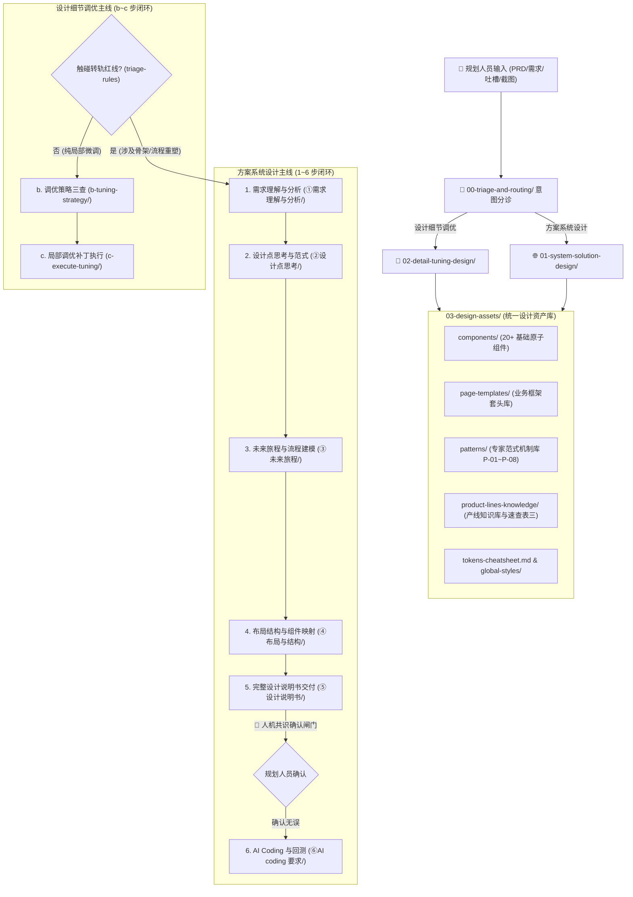

# 🌈 织雨 (Virtual Designer Zhiyu) - 个人设计 Agent 智脑

> **定位**：具备真人资深设计师思考逻辑与端到端执行链路的个人体验设计中枢 Agent。  
> **服务对象**：上游业务/产品规划人员（PM、业务架构师、运维规划师、个人开发者）。  
> **核心主线**：涵盖 **【方案系统设计 (1~6 步)】** 与 **【设计细节调优 (b~c 步)】** 双轨执行模型。

---

## 🗺️ 织雨认知与执行逻辑全景图



---

## 📂 项目模块目录架构导航 (Folder Containers)

```text
skill-designer-prism/
├── SKILL.md                                         # 核心规约、路由中枢与行为准则
├── README.md                                        # 本文件：项目全局唯一的总概览与使用指南
│
├── 00-triage-and-routing/                           # 【分诊与转轨中枢】
│   └── triage-rules.md                              # 方案设计 vs 细节调优决策树与转轨红线
│
├── 01-system-solution-design/                       # 【方案系统设计主线 (1~6 步)】
│   ├── ①需求理解与分析/                            # 步骤 1：需求理解与分析 (精简为 2 篇核心指南)
│   │   ├── requirements-understanding.md        # 涵盖现状痛点穿透 + 目标用户主要任务旅程 (JTBD)
│   │   └── experience-goals.md                  # 涵盖体验收益与务实版体验目标推导指南 (去口号化)
│   ├── ②设计点思考/                                # 步骤 2：设计点思考与专家范式分类
│   │   └── 2.1-patterns-taxonomy-and-cheatsheet.md  # 2.1 范式大类分类目录、定性矩阵与核心解题机制
│   ├── ③未来旅程/                                  # 步骤 3：未来旅程构建与流程建模
│   │   └── 3.1-journey-flow-modeling.md             # 3.1 本质任务旅程与 Mermaid 规划流程图
│   ├── ④布局与结构/                                # 步骤 4：布局结构与组件映射
│   │   ├── 4.0-framework-and-components-overview.md # 步骤 4 双清单推导总览与交付模板
│   │   ├── 4.1-framework-headers-selection.md       # 4.1 业务框架套头选型清单
│   │   └── 4.2-components-mapping-list.md           # 4.2 业务能力 ➔ 组件硬指标映射清单
│   ├── ⑤设计说明书/                                # 步骤 5：生成完整设计说明书
│   │   └── 5.0-design-spec-template.md              # 5.0 标准设计说明书模板 (人机共识确认关卡)
│   └── ⑥AI coding 要求/                             # 步骤 6：前端 Demo 输出与回测
│       └── 6.0-frontend-demo-and-verification.md    # 6.0 前端 Demo 输出规则与清单反向回测
│
├── 02-detail-tuning-design/                         # 【设计细节调优主线 (4 阶闭环)】
│   ├── detail-tuning-pipeline-guide.md              # 调优中枢指南：4 阶精密闭环作业法
│   ├── b-tuning-strategy/                           # 步骤 b：调优策略思考三要素
│   │   ├── b.1-detail-tuning-dictionary.md          # b.1 40+ 细节点吐槽转译词典
│   │   ├── b.2-ux-audit-and-heuristics.md           # b.2 UI/UX 走查评审缺陷库与可用性原则
│   │   └── b.3-practical-lessons-and-guardrails.md  # b.3 环节实战避坑经验与八重防破坏安全带
│   └── c-execute-tuning/                            # 步骤 c：执行调优修改
│       └── c-micro-patch-template.md                # c 局部调优补丁执行 Prompt 模板
│
├── 03-design-assets/                                # 【设计资产库基座】
│   ├── components/                                  # 20+ 基础原子组件规范 (Table, Button, Pro-Search等)
│   ├── page-templates/                              # 页面模板与业务框架套头库 (监控/配置/对象套头)
│   │   └── tpl-dashboard-header.md                  # 标杆：监控大盘标准套头
│   ├── patterns/                                    # 专家范式（机制）库
│   │   ├── patterns-cheatsheet.md                   # P-01~P-08 范式索引与反查速查表
│   │   └── pattern-p01..p08-*.md                    # 各范式详情（机制/骨架/闭环/反模式）
│   ├── product-lines-knowledge/                     # 产品线设计知识库
│   │   ├── product-lines-taxonomy.md                # 产品线业务属性与严肃度定性速查表
│   │   └── product-knowledge-cheatsheet-3.md        # 产品业务设计知识库速查表三骨架
│   ├── global-styles/                               # 全局原子规范 (色彩、网格、字阶、栅格)
│   └── tokens-cheatsheet.md                         # 高频 Tokens 速查手册
│
├── 04-workflows-and-cases/                          # 【执行 SOP 与协作协议】
│   ├── agent-interaction-protocol.md                # 人机协作状态机 (含说明书确认闸门铁律)
│   ├── execution-sop.md                             # 8 步端到端执行作业程序
│   └── few-shots.md                                 # 标杆实战 Few-Shot 样本库
│
└── learning-materials/                              # 【资料投喂与蒸馏暂存收件箱】
    ├── learning-materials-guide.md                  # 经验蒸馏手册
    └── (随时投喂原始 PRD 或复盘资料，蒸馏后随时清理)
```

---

## 🚀 核心协同铁律
1. **以说明书为共识契约**：在做方案系统设计时，织雨输出第 5 步《设计说明书》后必须主动停下来等待用户确认，绝不擅自偷跑第 6 步代码；
2. **转轨主动预警**：细节调优一旦触及结构栅格崩坏或任务流断裂，必须主动建议升级为方案系统设计；
3. **闭环回测验证**：代码落地必须 100% 反向核对第 4 步列出的业务套头与组件清单；
4. **设计资产统一归口 `03-design-assets/`**：范式（`patterns/`）、组件（`components/`）、套头（`page-templates/`）、Tokens 等资产实体一律存放于资产库；`01`/`02` 的思考类文档**只做引用、不内嵌资产明细**。
