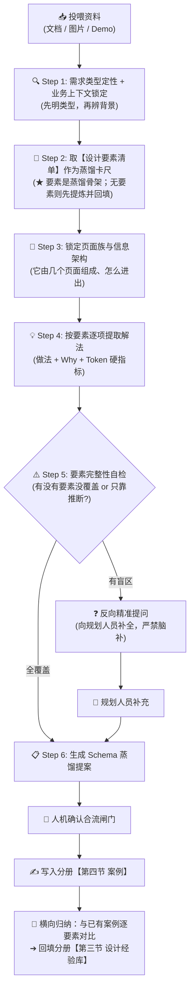

# 标杆方案案例蒸馏指南 (Benchmark Cases Distillation Guide)

> 💡 **中枢定位**：
> 本文档是织雨设计智脑的**高维经验萃取手册**。
> 当规划人员向 `learning-materials/` 投喂优秀的业务方案（文档 / 截图 / Demo）并要求学习时，织雨必须启动本指南定义的作业程序，把具体的页面设计深度萃取为**带有业务背景、以设计要素为轴、具备底层因果（Why）且可被 Coding AI 复用**的结构化资产，按需求类型沉淀入 [`01-system-solution-design/②设计点思考/标杆案例库/`](../01-system-solution-design/②设计点思考/标杆案例库/) 下对应的**类型分册**（门户总览见 [`2.2-标杆案例库.md`](../01-system-solution-design/②设计点思考/2.2-标杆案例库.md)）。
>
> 📦 **两类产出物（缺一不可）**：
> 1. **案例**（证据层）→ 写入分册【第四节】；
> 2. **经验**（沉淀层）→ 横向对比多案例后归纳，写入分册【第三节】。

---

## 🎯 零、第一性要求：蒸馏信息必须"挂靠"在核心 Job 旅程与三层递进透镜上

> **铁律**：蒸馏不是写散文，也不是孤立页面的功能清单，而是**按该需求类型的【核心 Job 旅程 × 三层递进透镜】逐项填格与推演**。Job 旅程是"骨架"，三层透镜（需求 ➔ 交互 ➔ 布局Token）是"因果透视尺"，物料是"实测内容"。

**为什么必须这样**：设计要素（核心 Job 旅程节点）是**下游复用的唯一索引**。按 [`execution-sop.md`](../04-workflows-and-cases/execution-sop.md) 的交接契约：

| 下游环节 | 要用蒸馏产出的什么 | 怎么检索 |
| :--- | :--- | :--- |
| Step 2 产出《标杆细节复用清单》 | 颜色 / 尺寸 / 组件 / 页面模板 / 交互态 | **按 Job 旅程及其三层透镜逐项抽取**（Job 节点 = 抽取的行索引） |
| Step 4 布局与组件映射 | 交互选型与 Token 硬指标 | 按 Job 节点命中即还原（来源标 `案例X 还原`） |
| 第三节经验归纳 | 同一 Job 节点下多案例的做法差异 | **按 Job 旅程与三层透镜做横向对比**（Job 节点 = 对比的对齐轴） |

> ⚠️ **反过来说**：不挂靠 Job 旅程与三层递进透镜的蒸馏内容，**下游既检索不到因果依据、也无法跨案例横向对齐** —— 那样的蒸馏等于白做。

---

## 📥 一、多模态物料输入与解析规范 (Input Parsing)

规划人员投喂的材料通常包含以下三种形态之一或其组合，织雨必须按对应规范解析：

| 输入物料形态 | 常见格式 / 载体 | 织雨解析重心与提取动作 |
| :--- | :--- | :--- |
| **形态 1：文档资料** | PDF 复盘报告、PRD 需求文档、Markdown 说明、飞书文档 | • 提炼**业务演进背景**、新老方案对比（Before ➔ After）、核心考核指标；<br>• 挖掘文档中"为什么这么改"的立项初衷与用户反馈原话。 |
| **形态 2：界面图片** | 页面全景截图、局部细节对比图、系统报错截图、流程草图 | • 剖析**信息呈现架构**（单表 / 双栏 / 卡片）、控件尺寸比例、视觉色彩信噪比；<br>• 识别信息层级，并主动标记"图片未展示的隐性流程"。 |
| **形态 3：可访问 Demo** | 线上系统控制台、本地 HTML 原型、交互原型链接 | • 体验**动态交互反馈**（Hover / Click / Loading 态）、瞬时状态机流转；<br>• 测试长文本截断、横向滚动、极端数据表现。**能取 DOM/样式级真实数值最佳**（可直接落 Token 硬指标）。 |

> 🔌 **遇到"内网系统打不开"怎么办（前置动作）**：
> 若目标系统位于**内网**，内置浏览器直连时常报 `ERR_CERT_AUTHORITY_INVALID`（自建 CA 不被信任，且内嵌 Chromium 不提供"继续前往"入口），此时**不要反复重试、也不要求规划人员逐页截图**。
> 正确做法：先用 [`tools/internal-reverse-proxy.js`](../tools/internal-reverse-proxy.js) 在本地开一条访问通道（用法见 [`tools/README.md`](../tools/README.md)），再以 `http://127.0.0.1:<独占端口>` 访问并取证。
> 若确实无法建立通道（如代理亦不可达），才退回"形态 2：界面图片"，并**在案例来源声明中如实标注该局限**。

---

## 🧠 二、蒸馏执行流水线（6 步）



---

### Step 1: 需求类型定性 + 专属业务上下文锁定（先明类型，再辨背景）

不同产品线的业务逻辑截然不同（如：公有云强调租户隔离与配额计费，企业内网 SASE 强调员工终端零信任与秒级阻断）。**脱离业务背景的蒸馏就是死搬硬套。**

织雨必须首先从物料中提炼出以下 **7 大关键要素**：
1. **需求场景简述（解决什么问题 —— 首要必填）**：
   - 用 **1~3 句大白话**说清：**这个需求当时为业务解决了什么问题、什么痛点？改造动机是什么？**
   - **仅当物料为复盘 / 改造类文档时**，补充 **Before ➔ After 一句话对比**（改造前怎么熬 ➔ 改造后什么体验）；**实访既有方案时不写** —— 这类案例没有"改造前"，硬凑只会把"痛点 ➔ 方案"伪装成 Before/After，并与上一句重复；
   - ⚠️ 这是案例的 **"需求档案首行"**：读者即使不读全篇，也应能秒懂这个需求为何存在；
2. **所属需求类型定性（首要判定）**：
   - 对照门户 [`2.2-标杆案例库.md`](../01-system-solution-design/②设计点思考/2.2-标杆案例库.md) 的【二、类型识别判据与边界】逐条核对，明确属于 Type-01~07 中的哪一类；
   - 若为复合方案，指出"核心主类型"与"次要辅助类型"；
3. **产品与业务赛道定位**：该产品管什么？处于什么赛道？
4. **核心目标角色与心智压力**：使用者是谁？他最大的心理压力和恐惧是什么？（怕改错背锅？怕排障跳页断流？）；
5. **管理实体的物理特性**：对象的量级（几十还是数万）？变动频次（毫秒级动态还是一年不变）？
6. **业务关键操作频次**：高频日常监控，还是低频重大变更？
7. **本次设计的北极星目标**：这个方案最核心要解决的 1~2 个根本问题是什么？

---

### Step 2: 取【核心 Job 旅程与设计要素清单】作为蒸馏卡尺（★ 本指南核心铁律）

根据 Step 1 判定的需求类型，进入该类型分册的【第二节 设计要素清单】，**拿它作为本次蒸馏的基准卡尺**：

1. **先查**：该类型分册是否已有【设计要素清单】？
2. **已有要素清单** → **直接作为卡尺**，逐 Job 节点、逐层透镜（需求/交互/视觉）去物料里"填格"；
3. **尚无要素清单（该类型首次蒸馏）→ 本步必须按大章法先提炼要素并回填分册第二节**：
   - **Step 2.1 抽象核心 Job（数量弹性 2~5 个，命名接地气直击动作）**：
     * **数量弹性（2~5 个以内）**：不用硬性限制非得 3 个，但也**严禁切得过细过碎**（例如把“创建、填写、等待执行”硬拆成 5 个独立的大 Job，遇到复杂业务会导致结构爆炸）。合理的 Job 粒度应能完整覆盖端到端闭环；
     * **命名接地气，拒绝中台黑话**：严禁使用“创编”、“下钻”、“沉淀”、“赋能”等官方中台黑话！必须采用直击动作、接地气的动宾短语或日常大白话（例如：`创建并运行任务`、`查看结果与排查问题`、`日常管理与模板维护`）；
     * **Job 内部顺着时序流程节点递进**：时序动线作为 Job 内部的操作演进主线（例如在 Job 1 下标注：`覆盖流程：在列表找入口 ➔ 填配置选资产 ➔ 保存并跑起来`）；
   - **Step 2.2 建立前置独立的三层递进透镜与自检问句母尺（资深设计师通用思考体系）**：在每个 Job 节点下，建立前置独立、具备通用思考性的自检问句与可选解法空间。面对任何新类型需求，资深设计师严格对照以下**三大透镜通用思考自检子项母尺**自顶向下客观推导：
     - 🔍 **需求能力层（业务规则与能力完备性）**：
       * **支持哪些能力**：系统底层需支持哪些核心作业机制与服务能力？
       * **覆盖哪些分支场景**：覆盖哪些常规分支、特殊场景、创建模式或纳管模式？
       * **任务执行状态和逻辑有哪些**：全生命周期包含哪些状态机阶段？各状态流转互斥与加锁逻辑如何？
       * **结果有哪些情况**：最终结果输出有哪些业务定性情况（成功/风险/失败/异常面）？
       * **相关的配置项和字段都有哪些**：需录入哪些配置项与字段？各字段间存在何种先后校验依赖？
       * **异常和边缘场景如何处理**：遇到资源耗尽、网络不可达、能力不匹配、并发冲突与极端异常如何防御？
     - 🧭 **交互方式层（动线长短、易用性与防呆）**：
       * **入口多深**：操作入口置于几级层级？是否显性引导、能否跨模块上下文直达？
       * **步骤多少**：端到端完成该 Job 需经过几步操作？能否进一步压减步骤？
       * **相关操作采用什么交互形式**：选用整页向导、弹窗、抽屉、行内就地编辑还是气泡确认？海量对象如何圈选？
       * **如何进行各类操作反馈**：终结操作后如何反馈？是否自动跳回闭环？如何杜绝操作悬空？
       * **如何展示各种状态**：非终态与终态如何向用户表达？异步执行期间如何就地暴露进度与耗时？
       * **是否有一些基于简单高效相关的设计点**：是否有前置防呆联动收窄、轻量分流出口、就地原地编辑、微反馈降噪等提效亮点？
     - 🎨 **呈现的布局架构层（物理承载、空间秩序与Token规范）**：
       * **整个旅程都有哪些页面，UI展示形式如何**：全流程涉及哪几个物理页面？依据数据特质容器选用卡片流、高密度表格还是多步向导？
       * **首屏要展示哪些信息**：首屏必须展示哪些核心指标与关键字段？信息层级如何科学切分？
       * **信息量级如何**：面对单条还是万级以上海量对象？如何做到大吞吐承载且无横向滚动？
       * **如何进行布局**：空间切分逻辑（上下分层 vs 左右分栏）、对齐方式与信息密度如何规划？
       * **相关样式 Token 如何**：容器尺寸、边距、异常视觉抓手（透明渐变底 vs 中性底红字标签）、状态条高度、严重度语义色与组件级硬指标规格是什么？
   - **核心铁律**：自检问句必须**前置独立、具备通用思考性**，严禁掺杂特定案例的专属字段或取值！
4. **严禁**：跳过要素自由发挥，或只填自己感兴趣的要素。

**逐要素蒸馏时的三种情况与处理**：

| 物料中的情况 | 处理 |
| :--- | :--- |
| 该 Job 维度**有明确做法** | 正常记录（实测做法 + Why 因果 + Token 硬指标） |
| 该 Job 维度**未明说但可合理推断** | 记录，并显式标注「**推断**」 |
| 该 Job 维度**完全没覆盖** | 标 `⚠️ 未覆盖`，并进入 Step 5 的反向追问清单 —— **严禁虚构填补** |

---

### Step 3: 锁定页面族与信息架构（先于组件级细节产出）

优秀的方案从来不是孤立的一页，而是**以某个枢纽页为中心的页面族**。必须先回答"它由几个页面组成、各自承担什么"：

1. **页面族盘点**：枢纽列表页 / 详情页 / 新建向导页 / 可复用资产库页 …… 各有哪些？（**能给出真实路由最佳**）；
2. **职责与入口契约**：每个页面承担什么职责？返回路径是否统一？（如 `backBtn + 面包屑 backList + backUrl`、子页权限继承父级）；
3. **主键传递规则**：页面之间靠什么主键串联？（如详情页取 `parent_id ?? task_id`，以承载同一任务族的多轮历史）；
4. **页面与线框图 1:1 覆盖契约（硬性）**：页面族地图中登记的每一个页面，在 Step 4（案例 4.4）中**必须均配有对应的高保真等宽字符线框图**。严禁出现“地图里写了页面、后文却无图无真相”的断层。

> 📌 这份"页面族地图"是后续所有要素落地做法的**骨架底座** —— 先看清全貌，再落到组件。产出物必须是**表格或清单**。

---

### Step 4: 按 Job 内部时序流程解构解法（实测三透镜 + 页面线框图 + Why 因果）

> 💡 **实战作业动线铁律：先具象 ➔ 后抽象（呈现与交互先行，需求能力末尾打标）**
> 
> * **核心痛点**：蒸馏主要目的是沉淀**高复用性的设计经验（布局/动线/Token/防呆）**。若一上来就先啃抽象的“需求能力”，不仅冷启动阻力大，还极易陷入“产品经理式的需求合理性审计与业务辩论”的泥潭，耗时失控；
> * **正向实战作业流水线（先具象 ➔ 后抽象）**：
>   ```text
>   ┌────────────────────────────────────────────────────────────────────────┐
>   │                   极速蒸馏实操流水线（先具象 ➔ 后抽象）                   │
>   ├────────────────────────────────────────────────────────────────────────┤
>   │ 1️⃣ 第一步（抓物理呈现）：看页面构成 / 画线框图 / 抓容器与组件 / 取 Token 硬指标 │
>   │ 2️⃣ 第二步（理操作交互）：顺着时序动线跑一遍 / 抓入口、步骤、防呆细节、操作反馈  │
>   │ 3️⃣ 第三步（写设计 Why）：为什么用这个容器而不是那个？为什么这样防呆？          │
>   │ 4️⃣ 第四步（5~10分钟反向收网）：对照界面事实，打标该 Job 支撑的需求能力特征（不超过10分钟） │
>   └────────────────────────────────────────────────────────────────────────┘
>   ```
> * **需求能力的真实定位（防沉溺红线）**：
>   - **不是**：评判业务需求是否合理、分析底层数据库/协议/算法（严禁深挖！）；
>   - **而是**：① 作为新需求来时的**「指纹检索与快速匹配标签 (Search Fingerprint)」**；② 作为支撑设计决策的**「客观物理自变量 (Given Facts)」**（如：对象 14 万条、配置 5 字段、异步执行中加锁）；
>   - **界面上画了什么就记什么事实标签，界面没露出的纯底层后台逻辑一律不深究、不脑补、直接跳过**；
>   - **80 / 20 精力分配法则**：80% 精力死磕交互动线、线框图、组件与 Token；仅 20% 精力极简打标需求特征。

在每个 Job 内部，顺着用户的真实时序流程节点展开解构（对应案例 `4.4`）：

1. **🎨 呈现布局、线框图与 Token 硬指标（先抓肉眼可见的物理骨架）**：
   - **首次登场页面必配全景高保真线框图 (ASCII Wireframe)**：
     * 当页面在流程节点中**第一次出现**（如起点台账列表页、走向配置向导页、结果详情页、资产库模板页），必须绘制完整的全景高保真线框图；
     * 真实刻画：页面头部（面包屑/标题/帮助）、全局操作区与筛选条（Pro-Search/按钮）、核心容器（卡片流/高密表/向导/穿梭框）、组件相对排布与分页结构；
   - **后续流程节点回到同一页面时：严禁重复绘制全景大图，必须采用「局部状态/交互对比线框图」**：
     * **流转回台账看执行状态**：如配置提交后返回管理列表展示运行中态、排队态或状态机锁定，**严禁重画列表全景大图**，应仅绘制「运行中/调度中卡片局部态」或「状态机禁用态 Tooltip」对比线框；
     * **列表上的就地轻运维**：如就地行内重命名、删除操作的二次确认气泡，**严禁重画列表全景大图**，应仅绘制「行内编辑态」或「Popconfirm 气泡展开态」局部交互线框；
     * **价值**：既避免了通篇冗余重复的巨幅线框图，又能让评审者秒级聚焦在状态变迁与微交互细节上；
   - **承载组件选型与 Token 硬指标强绑定（严禁脱离组件的裸数值）**：
     * 必须**明确读取并写出具体落地使用了哪些组件**（如 `Button`、`Tag`、`Table`、`Pro-Search`、`Popconfirm`、`Drawer`、`Stepper`、三栏穿梭框等），并对照标准组件；
     * 严禁孤立裸数值，必须明确写明**哪个组件对应什么硬指标**（如 `Button` 高 `32px` / 背景 `#1C6EFF`，`Tag` 20px / 失败 `#FFEEEE`，`Table` 表头高 `32px` 底 `#EDF1F7`，`Popconfirm` 白底 / 确认 `h24`）；
     * 记录首屏容量与海量数据大吞吐承载机制。

2. **🧭 交互方式实测（顺着时序动线跑出操作质感）**：
   - 入口深浅与触达链路（几步直达）；
   - 容器形态选型与单选/多选联动形态随动；
   - 前置防呆与容错收窄规则（杜绝提交拦截）；
   - 出口动线（轻量分流出口，避免悬空与跳页上下文丢失）；
   - 挖掘基于**简单高效**相关的亮点设计微细节（如原地编辑、微气泡复用降噪）。

3. **💡 Why 因果推演（紧扣自检问句，文字脱水无废话）**：
   - **紧密呼应第二节自检问句**：是对第二节【前置思考性自检问句】在真实案例约束下的实战回应与权衡论证；
   - **脱水紧凑格式（禁止多余标签）**：统一采用 `* **【考量主题】为什么方案 A 而非方案 B**：[核心推导]`，去除“▸ 回应自检”、“➔ 权衡因果”等冗余标签；
   - **资深因果三问必答**：
     * 为什么选方案 A，而坚决不用业界传统的方案 B？
     * 为什么在某个细节上做出反常识的克制？
     * 这个设计牺牲了什么，换到了什么？

4. **🔍 需求能力反向收网打标（5~10分钟快速提取事实自变量，严格控制在10分钟以内）**：
   - **定位**：此时已理清界面和动线，以客观审视视角，**极速提取作为设计因果源头的物理自变量**；
   - **打标清单**：
     * 业务能力与分支场景：支持单次还是周期？圈选是静态还是动态？
     * 数据规模体量：几百条还是十万级？（直接佐证为什么选某种容器/穿梭框）；
     * 状态机与约束边界：非终态是否有排队/运行中？锁定了哪些操作？（直接佐证按钮置灰/加锁）；
   - **防沉溺原则**：仅做事实记录，不质疑需求合理性，不探讨底层技术实现。

> 🛑 **时序动线、局部线框、实测三透镜与 Why 呼应缺一不可（硬性）**：时序倒置会破坏理解动线；无局部线框无法表达状态机；脱离自检的 Why 会沦为散文。
> ⚠️ **未覆盖的 Job 维度显式标 `⚠️ 未覆盖`**；仅靠推断的标「**推断**」，严禁虚构填补。

---

### Step 5: 要素完整性自检与反向主动追问（核心铁律）

> 🛑 **蒸馏防偷懒红线**：静态截图、单页 PDF 或静态 PRD 通常**只呈现理想状态下的主流程（Happy Path）**，极易遗漏深水区：
> - 异常与网络抖动时界面的反馈（连通性失败报什么？）；
> - 破坏性删除 / 注销的二次确认与防呆；
> - 极限长字段、空状态或零数据的兜底；
> - 批量操作超限时的熔断与限流。

**执行规则**：若某些**设计要素**在物料中**完全没有提及且无法合理推导**，织雨**绝对严禁假装没看见或自行脑补**！必须在蒸馏报告末尾**主动发起结构化反向提问**：

> 🗣️ **反向提问标准话术模板**：
> "本次投喂的资料中，我已深度提取了该方案在【Job 1 任务创建、Job 2 任务结果查看】上的优秀做法。但针对此类需求必考的设计维度，资料中尚未体现：
> 1. **关于 [Job 1 · 调度控制与生产防护]**：多任务并发是否有配额与限速？是否存在避峰维护时间窗？失败时的错误码与自愈指引是什么？
> 2. **关于 [Job 3 · 任务管护 / 破坏性分级防御]**：执行删除 / 下线时，现场如何防误删？有无显式回显对象名或口令确认？不可操作状态是否提供了置灰 Tooltip 说明？
> 3. **关于 [极限与空态]**：无数据、超长文本、超量结果时界面如何兜底？
> 4. **关于 [通知触达与订阅]**：任务结束（成功 / 失败）时是否会主动通知负责人？走站内消息、邮件还是 IM？还是需要用户自己回来看？
> 请协助补充这几项的实际设计考虑，以便我将其作为完备的标杆经验合入知识库！"

---

### Step 6: 写入分册 + 横向归纳经验（不可省略的收尾）

1. **写入案例**：按【3.2 案例条目 Schema】，追加到该类型分册的【第四节】；
2. **横向归纳（★ 从"案例"变"经验"的关键一步）**：
   - 把本案例与**该分册已有案例**，在同一设计要素上**逐项对比**：
     | 对比结果 | 归纳去向 |
     | :--- | :--- |
     | 做法**一致** | 归纳为经验条目，写入 `3.1 设计经验` |
     | 做法**不一致** | 写入 `3.1 设计经验`，并在「备注」里写明 **什么条件下用哪种** |
     | **冲突且证据不足** | 写入 `3.2 待确认经验`，**留白，不硬编结论** |
   - **来源标记**：织雨归纳的记 `🤖 推理`（需人工复核）；规划人员口述的记 `👤 人工`；
3. **更新分册状态**：在分册头部回填"已蒸馏案例 N 个 / 设计经验 M 条 / 待确认 K 条"。

---

## 📋 三、三套标准 Schema

### 3.1 要素 Schema（写入分册【第二节 设计要素清单】）

```markdown
## 二、设计要素清单（基于核心业务 Job 与三层递进观察点）

> 📐 **设计要素推导方法论（大章法）**：
> 1. **Step 1：拆解核心 Job（数量控制在 2~5 个以内，命名接地气直击动作）** —— 资深设计师不按孤立页面切块，也不切成过度细碎的步骤，而是抽象出 2~5 个覆盖端到端闭环的接地气核心 Job（如：`创建并运行任务`、`查看结果与排查问题`、`日常管理与模板维护`），内部顺着时序流程演进；
> 2. **Step 2：在每个 Job 节点建立三层递进透镜** —— 按照 **「① 需求能力 ➔ ② 交互方式 ➔ ③ 呈现的布局架构」** 递进逼问，形成自洽的因果链。

### 【Job X：[接地气 Job 名称，如：创建并运行任务]】
> **核心命题**：[该 Job 解决的核心业务问题与闭环目标]
> 🔄 **覆盖流程**：`[节点1 ➔ 节点2 ➔ 节点3]`

| 观察维度 | 核心考量 (Why it matters) | 前置思考性自检问句 (对照资深设计师思考母尺子项) | 可选解法空间 (Decision Matrix) |
| :--- | :--- | :--- | :--- |
| **🔍 需求能力**<br>*(业务规则与完备性)* | [业务底层能力的完备度、对象圈选的灵活度与前置规则边界] | 1. **【支持能力与分支场景】**：[支持哪些能力？覆盖哪些分支场景？]<br>2. **【执行状态与流转逻辑】**：[任务执行状态和逻辑有哪些？]<br>3. **【结果情况与配置依赖】**：[结果有哪些情况？相关的配置项和字段都有哪些？]<br>4. **【异常与边缘场景处理】**：[异常和边缘场景如何处理？] | • `解法A` ／ `解法B` |
| **🧭 交互方式**<br>*(动线长短与易用防呆)* | [降低长链路心智负荷，保障信息流动顺畅与防错] | 1. **【入口多深与步骤多少】**：[入口多深？步骤多少？]<br>2. **【交互形式与状态展示】**：[相关操作采用什么交互形式？如何展示各种状态？]<br>3. **【操作反馈与高效设计点】**：[如何进行各类操作反馈？是否有一些基于简单高效相关的设计点？] | • `解法A` ／ `解法B` |
| **🎨 呈现布局架构**<br>*(物理承载与视觉规范)* | [大规模数据承载力、视觉扫视动线与样式一致性] | 1. **【旅程页面与UI展示形式】**：[整个旅程都有哪些页面，UI展示形式如何？]<br>2. **【首屏信息与信息量级】**：[首屏要展示哪些信息？信息量级如何？如何进行布局？]<br>3. **【样式Token与视觉规范】**：[相关样式Token如何？异常抓手与局部组件规范是什么？] | • `解法A` ／ `解法B` |
```

* **要素定义要求**：要素 = **核心业务客体的核心 Job 节点（2~5个）**，而非孤立页面或过度细碎的步骤；
* **三层透镜递进**：每个 Job 必须具备 **🔍需求能力 ➔ 🧭交互方式 ➔ 🎨呈现布局架构** 三层透视；
* **自检问句前置独立**：自检问句是客观考量尺，**严禁掺杂具体案例的做法或特定数值**；
* 本表同时是「案例 × 要素」对比的**行基准**。

### 3.2 案例条目 Schema（写入分册【第四节】）

```markdown
### 案例 [字母]：[产品/系统名] - [模块/功能名称]

> 📌 **案例一句话画像**：[用一句话高度概括业务特征]

#### 4.0 蒸馏日期与覆盖局限
* **蒸馏日期**：[YYYY-MM-DD]
* **覆盖局限**：[未拍到的深水区场景，与 Step 5 的反向提问清单对应]。⚠️ 单产品来源时，注明"不可直接等同于行业共性"

#### 4.1 需求场景简述 (Problem Statement)
* **解决什么问题**：[1~3 句大白话，讲清业务缘起、痛点与改造动机]
* **改造前 ➔ 改造后 (Before ➔ After)**（**仅复盘 / 改造类物料填写**）：[…… ➔ ……]
* **为什么值得沉淀**（选填）：[典型性与稀缺性]

#### 4.2 业务上下文
* **管理对象特征**：[数量级 / 变化频次 / 异构程度]
* **目标角色与压力**：[角色 / 核心心智]

#### 4.3 页面族与信息架构
* **页面族地图（附真实路由）**：
  | 路由 | 页面 | 定位与旅程承载 |
  | :--- | :--- | :--- |
  | [如 /xxx/list] | [枢纽列表页] | [所有入口的起点与返回点，承载 Job 1 入口与执行态] |
* **导航与返回契约**：[统一 backBtn + 面包屑 + backUrl；子页权限继承父级]
* **主键传递规则**：[如 详情页取 parent_id ?? task_id，承载多轮历史]

#### 4.4 按核心 Job 逐项解构与 Why 因果推演（★ 顺着 Job 内部真实时序流程节点展开）

##### ▸ 【Job 1：[接地气 Job 名称，如创建并运行任务]】解构
> 🔄 **操作流程**：`在列表找入口 ➔ 填配置选资产 ➔ 保存并跑起来`

* **流程节点 1：[页面名称，如任务管理列表（创建任务入口）]**
  * **承载页面**：`[真实路由]`
  * **线框图（首次登场页面必配全景高保真线框图）**：
```text
┌────────────────────────────────────────────────────────────────────────────────────┐
│ 面包屑：[模块名称] / [当前页面标题]                               [右上全局操作/说明] │
├────────────────────────────────────────────────────────────────────────────────────┤
│ [ 主操作按钮(新建入口) ] [ 次要操作 ]             [ 🔍 Pro-Search 复合检索 | 筛选 ]  │
│ ↓ 间距标注 (如 8px / 16px)                                                          │
│ ┌ 核心承载容器（如：卡片流 Card Grid / 高密度表格 Table）────────────────────────┐ │
│ │ ① 区域标题 / 核心指标 / 状态标识 (Tag)                                          │ │
│ └─────────────────────────────────────────────────────────────────────────────────┘ │
│ [ 底部操作栏 / 批量动作 ]                       [ 分页条：共 N 项 ｜ ‹ 1 › ｜ 每页 M 项 ] │
└────────────────────────────────────────────────────────────────────────────────────┘
```
  * **🎨 呈现布局与 Token（先抓物理骨架）**：
    - 承载容器与组件：[明确列出落地使用的标准组件：Card、Table、Button、Tag、Pro-Search 等]；
    - 组件级 Token 硬指标：[明确绑定到具体组件上，如 Button 高 32px / 背景色 #1C6EFF]；
    - 量级承载：[首屏容量、海量数据吞吐机制]。
  * **🧭 交互方式实测（顺着动线理细节）**：[入口层级深度、操作步骤、联动随动、前置防呆与容错收窄、轻量出口分流、简单高效设计亮点]
  * **💡 Why 因果推演（紧扣自检问句）**：
    - **【自检主题】为什么选用方案 A 而非方案 B**：[核心推导与权衡结论]
    - **【自检主题】为什么做出某种细节克制/强编码**：[核心推导与权衡结论]
  * **🔍 需求能力打标（末尾5~10分钟反向收网）**：[提取作为设计自变量的事实特征：业务机制、数据量级、状态加锁约束；严格控制在10分钟内，不探究后台非呈现逻辑]

* **流程节点 2：[走向页面，如新增任务向导（配置与保存）]**
  * **承载页面**：`[真实路由]`
  * **线框图（全景向导/复杂表单线框图）**
  * （三层透镜实测 + 组件级 Token + 脱水 Why 因果推演齐备）

* **流程节点 3：[返回列表，如任务管理列表（执行闭环与状态机）]**
  * **承载页面**：`[真实路由]`
  * **线框图（局部状态对比线框图，严禁重复绘制全景大图）**：
```text
┌ 运行中 / 调度中卡片局部态 (不重绘整页大图，仅聚焦局部状态对比) ──────────────────┐
│ ① 任务名     ● 执行中(进度条/动态指示 #1C6EFF)        [ 操作A(置灰) ] [ 操作B(置灰) ] │
│ ───────────────────────────────────────────────────────────────────────────────── │
│   ② 状态机互斥锁定：执行中不可重跑、不可删除 (Hover Tooltip 提示说明)             │
└───────────────────────────────────────────────────────────────────────────────────┘
```
  * （三层透镜实测 + 状态机 Token + 脱水 Why 因果推演齐备）

##### ▸ 【Job 2：[接地气 Job 名称，如查看结果与排查问题]】解构
> 🔄 **操作流程**：`看概览大数 ➔ 翻明细证据 ➔ 钻进资产看详情`
（按流程节点展开：详情全景线框图 + 就地抽屉排查 + 三层透镜实测 + 脱水 Why）

##### ▸ 【Job 3：[接地气 Job 名称，如日常管理与模板维护]】解构
> 🔄 **操作流程**：`就地改名/气泡防误删 ➔ 集中维护可复用模板`
（按流程节点展开：行内轻管护局部线框图 + 模板资产库全景线框图 + 三层透镜实测 + 脱水 Why）

#### 4.5 本案例的贡献与局限
* **贡献**：[它最值得学的骨架是什么]
* **局限**：[单产品？深水区未覆盖？哪个维度缺失？]
```

### 3.3 经验条目 Schema（写入分册【第三节】）

```markdown
### 3.1 设计经验
| 编号 | 归属 Job 与维度 | 设计经验项 | 备注（特殊场景 / 不适用情形） | 来源 | 匹配案例 |
| :---: | :--- | :--- | :--- | :---: | :--- |
| **EP-01** | 【Job X · 呈现布局】 | [经验结论，自带硬指标色值/尺寸/类名] | [什么条件下适用 / 不适用] | 🤖 推理 / 👤 人工 | 案例 A |

### 3.2 待确认经验（证据不足 / 存疑，尚未正式沉淀）
| 编号 | 归属 Job 与维度 | 候选经验项 | 存疑点 | 来源 | 参考案例 |
| :---: | :--- | :--- | :--- | :---: | :--- |
| **EQ-01** | 【Job X · 需求能力】 | [候选结论] | [为什么还不能沉淀] | 🤖 推理 / 👤 人工 | 案例 A |
```

* **不做经验分类**：踩坑经验同样是经验，直接写成一条；
* **1~N 条即可**，不追求条数齐整；
* 织雨判断合理的经验**可直接沉淀进 3.1**；证据不足的先入 3.2。

### 3.4 分册整体骨架（上下两半，一类型一文件）

```text
# Type-0X：<类型名>
> 返回门户 / 邻接类型链接
> 状态：已蒸馏案例 N 个 ｜ 设计经验 M 条 ｜ 待确认 K 条
> 可追溯契约（每条经验标「匹配案例 + 来源」；每个案例标「蒸馏日期 + 覆盖局限」）

═══ 上半部分：经验层（稳定资产 · 最终沉淀物）═══
一、需求类型认知        （是什么 / 解决什么问题）
                          ⚠️ 类型识别与边界判定统一见门户第二节，分册内不重复
二、设计要素清单        （基于 2~5 个接地气核心 Job 旅程与三层递进观察点，见 3.1 要素 Schema）
三、设计经验库          （按核心 Job 归纳，3.1 设计经验 ／ 3.2 待确认经验，见 3.3 经验 Schema）

═══ 下半部分：案例层 + 应用层 ═══
四、案例导入蒸馏        （案例 A / B / …，按核心 Job 内部时序流程节点逐项解构与 Why 推演，见 3.2 案例条目 Schema）
五、本次设计要素选型工作表（按核心 Job 选型与资产交付，含推荐承载组件与样式 Token 标杆基线预置，直接赋能 Step 4 原型设计）
```

### 3.5 精简四律（防止分册随案例数膨胀）

> **背景**：分册是**给 AI 读的资产**，不是工作日志。一个案例写胖一点、多个案例叠加，下游每次检索都要为冗余付出代价。以下四律**与 Schema 同级，必须遵守**。

| # | 戒律 | 具体含义 | 反例（禁止） |
| :---: | :--- | :--- | :--- |
| **①** | **禁止过程性标注** | 分册只记录**结论与证据**，不记录"这次比上次改了什么、哪天补采的、哪些没拍到"。修订历史属于版本控制，不属于知识资产 | ❌「🔧 本次已修正旧结论」「（本次新增取证，上次未拍到）」「（此前完全空白）」；文件头禁写「最近一次重蒸 / 续采」流水账 |
| **②** | **硬指标必须留在经验层** | `3.1/3.2` 的条目**须自带可直接复用的硬指标**（色值 / 尺寸 / 类名 / 实测数量）—— Step 2 是「**先吃经验 ➔ 再看案例**」，经验条目不带指标，下游就得回翻第四节。**禁的是把案例的 Why / 做法描述整段抄进经验** | ❌ 经验只写"用渐变做底"却不给渐变值；把案例的 Why 段落整段搬进经验条目 |
| **③** | **同一"陈述"只写一处** | 案例内也需去重：`4.0` 写过一遍的内容，`4.5` 不再复述；线框图已表达的字段清单，正文不再逐字重抄。**例外**：硬指标允许在经验层与案例层各出现一次 —— 前者供 Step 2 直接取用，后者供溯源 | ❌ `4.0 覆盖局限` 与 `4.5 局限` 各写一遍未覆盖项；E1 与 E3 各登记一遍状态标签规格 |
| **④** | **不写通用常识与装饰** | 只写**该类型特有**的认知；"使用角色可能有运维/运营"这类放之四海皆准的话不写。装饰性横幅、内部锚点目录、纯空模板一律不写 | ❌「产品形态谱系」表里的通用维度；`══════ 上半部分 ══════` 之类装饰行；重复抄一份的空白应用模板 |

> ✅ **自查方法**：删掉某段后，**下游（Step 2 取《标杆细节复用清单》/ Step 4 做组件映射）会不会取不到料**？会 → 留；不会 → 删。
> 📌 **正例参照**：`Type-07-检测任务与批量巡检类.md` 已按本四律完成一次精简，可作为后续分册的排版基准。

---

## 🔗 四、可追溯契约与下游衔接

### 4.1 可追溯契约（硬性）

* 每条**经验**必须标注「匹配案例」+「来源」（`🤖 推理` / `👤 人工`）；
* 每个**案例**必须标注「蒸馏日期 + 覆盖局限」；
* **无来源的内容一律不得写入分册。**

### 4.2 与 SOP 交接契约的衔接（决定蒸馏质量）

蒸馏产出必须能**直接支撑** [`execution-sop.md`](../04-workflows-and-cases/execution-sop.md) 中 Step 2 的交付物《**标杆细节复用清单**》：

| 《标杆细节复用清单》要什么 | 从蒸馏产出的哪里取 |
| :--- | :--- |
| 组件选型（用什么组件） | 案例 `4.4` 各 Job 的「🎨 呈现布局与 Token」中读取的组件清单 |
| 颜色 / 尺寸 / 字阶 Token | 案例 `4.4` 各 Job 的「🎨 呈现布局与 Token」中绑定在各组件上的硬指标 |
| 页面模板 / 框架套头与线框 | 案例 `4.3` 页面族 + `4.4` 各页面高保真等宽字符线框图（作为布局底座 100% 还原） |
| 关键交互态与防呆 | 案例 `4.4` 各 Job 的「🧭 交互方式实测」（前置防呆、分级确认、就地闭环） |

> ⚠️ **若蒸馏时没落出这些，Step 4 就取不到料** —— **蒸馏质量直接决定复用质量**。

---

## 🚪 五、三阶段人机确认与合流规范 (Review & Merge Gate)

织雨提炼标杆经验时，必须遵循三阶段协同流程：

1. **【阶段一：提案与补齐】**
   - 织雨输出《标杆方案案例蒸馏提案报告》；
   - 若存在未覆盖的设计要素，附带"反向提问清单"，等待规划人员解答或确认；
2. **【阶段二：确认与写入】**
   - 规划人员回复"确认无误，写入案例库"或回答补充问题；
   - 织雨按 Schema 写入 [`标杆案例库/`](../01-system-solution-design/②设计点思考/标杆案例库/) 下**对应需求类型的分册**（一类型一文件，精准追加案例到【第四节】）；
   - **同步执行横向归纳**：与已有案例逐要素对比，回填分册【第三节 设计经验库】（见 Step 6）；
   - 若本次判定出**新的需求类型**，需同步在门户 [`2.2-标杆案例库.md`](../01-system-solution-design/②设计点思考/2.2-标杆案例库.md) 的【全景图】新增类型行，并在【分册索引】登记新分册；
3. **【阶段三：结束语反向确认（必做铁律）】**
   - 每次蒸馏合流完成后，织雨**必须**在结束语中主动发起复核邀请，标准话术：
     > 🙋 **请您复核**：本次蒸馏已按标准 Schema 落库。其中若有 **未被如实呈现的设计点或设计意图**，或 **哪一处的理解与您的原意有偏差**，请直接指出，我会立即修正并补齐；
   - **目的**：把规划人员脑中"未被言明的隐性判断"持续回收进案例库，避免 Agent 的理解偏差被静默固化；
   - 同时应主动说明：**本次有哪些设计要素因物料未覆盖而未能蒸馏**（呼应 Step 5 的反向提问清单）。
