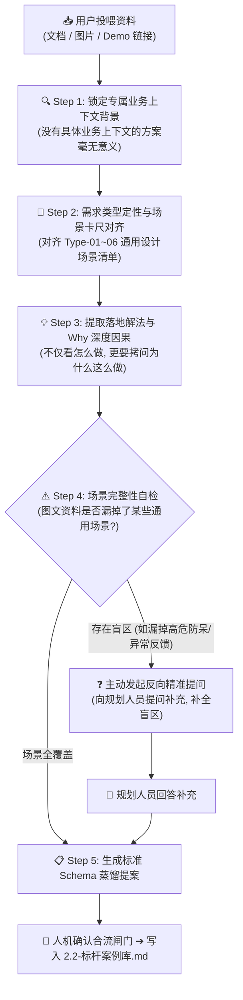

# 标杆方案案例蒸馏指南 (Benchmark Cases Distillation Guide)

> 💡 **中枢定位**：
> 本文档是织雨设计智脑的**高维经验萃取手册**。
> 当规划人员向 `learning-materials/` 投喂优秀的业务方案（文档/截图/Demo）并要求学习时，织雨必须启动本指南定义的作业程序，将具体的页面设计深度萃取为**带有业务背景、对齐通用场景、具备底层因果（Why）且可被 Coding AI 理解复用的结构化资产**，最终沉淀入 [`2.2-标杆案例库.md`](../01-system-solution-design/②设计点思考/2.2-标杆案例库.md)。

---

## 📥 一、多模态物料输入与解析规范 (Input Parsing)

规划人员投喂的材料通常包含以下三种形态之一或其组合，织雨必须按对应规范进行解析：

| 输入物料形态 | 常见格式 / 载体 | 织雨解析重心与提取动作 |
| :--- | :--- | :--- |
| **形态 1：文档资料** | PDF 复盘报告、PRD 需求文档、Markdown 说明、飞书文档 | • 重点提炼**业务演进背景**、新老方案对比（Before ➔ After）、核心考核指标；<br>• 挖掘文档中提及的“为什么这么改”的立项初衷与用户反馈原话。 |
| **形态 2：界面图片** | 页面全景截图、局部细节对比图、系统报错截图、流程草图 | • 重点剖析**信息呈现架构**（单表/双栏/卡片）、控件尺寸比例、视觉色彩信噪比；<br>• 重点识别当前界面的信息层级，并主动标记出“图片未展示的隐性流程”。 |
| **形态 3：可访问 Demo** | 线上系统控制台、本地 HTML 原型 Demo、交互原型链接 | • 重点体验**动态交互反馈**（Hover/Click/Loading 态）、瞬时状态机流转；<br>• 测试长文本截断、横向滚动条、极端数据极限表现。 |

---

## 🧠 二、标杆蒸馏四大核心执行流水线 (4-Step Pipeline)



---

### Step 1: 需求类型定性与专属业务上下文锁定（先明类型，再辨背景）
不同产品线的业务逻辑截然不同（例如：公有云强调租户隔离与配额计费，企业内网 SASE 强调员工终端零信任与秒级阻断，AES 资产强调漏洞证据链与部门权属）。**脱离业务背景的蒸馏就是死搬硬套。**

织雨必须首先从物料中提炼出以下 **6 大关键要素**：
1. **所属需求类型定性（首要判定）**：
   - 对照 [`2.2-标杆案例库.md`](../01-system-solution-design/②设计点思考/2.2-标杆案例库.md) 的 6 大需求类型（Type-01 对象资产管理 / Type-02 配置对接同步 / Type-03 监控驾驶舱 / Type-04 链路拓扑排障 / Type-05 事件研判处置 / Type-06 策略规则编排），**首先明确当前案例属于哪一类需求**；
   - 若为复合方案，清晰指出其“核心主类型”与“次要辅助类型”；
2. **产品与业务赛道定位**：该产品是管什么的？处于什么业务赛道？（如：网络安全、微服务治理、大数据集成）；
3. **核心目标角色与心智压力**：使用者是谁？他用这个模块时最大的心理压力和恐惧是什么？（怕改错背锅？怕排障跳页断流？还是怕客户机房交付延期？）；
4. **管理实体的物理特性**：对象的量级有多大（几十个还是数万个）？变动频次是毫秒级动态变化还是一年不变？网络环境是否稳定？
5. **业务关键操作频次**：是高频日常监控，还是低频重大变更？
6. **本次设计的北极星目标**：这个方案最核心要解决的 1~2 个根本问题是什么？

---

### Step 2: 调取该类型的通用场景清单作为卡尺（对齐度量）
根据 Step 1 判定出的需求类型，织雨立即调取 [`2.2-标杆案例库.md`](../01-system-solution-design/②设计点思考/2.2-标杆案例库.md) 中**该类型对应的【通用设计场景清单】作为基准卡尺**进行度量：

* **若判定为 Type-01 对象与资产管理类**，拿 6 大场景逐项对标：
  - ① 呈现架构 ➔ ② 接入与新增 ➔ ③ 查筛与展示 ➔ ④ 变更与批量管理 ➔ ⑤ 状态感知与异常 ➔ ⑥ 退出与高危下线。
* **若判定为 Type-02 配置对接与数据同步类**，拿 6 大场景逐项对标：
  - ① 凭据鉴权与连通性 ➔ ② 数据源与对象选择 ➔ ③ 字段映射与清洗 ➔ ④ 冲突消解与异常策略 ➔ ⑤ 调度与速率控制 ➔ ⑥ 试运行与下发。
* **若判定为其他类型**，对照该类型在案例库中的通用关注点清单。

---

### Step 3: 提取具体解法与 Why 深度因果推演（资深灵魂）
不仅要记录“它用了什么组件”，**核心必须讲透背后的“因果推演（Why）与权衡（Trade-off）”**：

1. **为什么选择方案 A，而坚决不用业界传统的方案 B？**
   - *示例*：为什么用右侧 800px 抽屉，而不用传统的独立详情页？（因果：排障时运维需要对比多台机器，跳页会导致视线完全断流）；
2. **为什么在某个细节上做出反常识的克制设计？**
   - *示例*：为什么状态用灰度小圆点，不用彩色大胶囊？（因果：万台终端场景下，满屏彩色标签会导致严重的视觉眩晕与信噪比暴跌）；
3. **这个设计牺牲了什么？得到了什么？**
   - *权衡*：牺牲了首屏字段的宽度，换取了纵向 20 行数据的高吞吐量扫视效率。

---

### Step 4: 盲区场景自检与反向主动追问机制（核心铁律）

> 🛑 **蒸馏防偷懒红线**：
> 静态截图、单页 PDF 或静态 PRD 通常**只会呈现理想状态下的主流程（Happy Path）**，极易遗漏以下深水区场景：
> - 异常与网络抖动时界面的反馈（如连通性失败报什么？）；
> - 破坏性删除/注销操作的二次确认与防呆机制；
> - 极限长字段、空状态或零数据的兜底；
> - 批量操作超限时的熔断逻辑。

**执行规则**：
如果在投喂的资料中，上述通用场景中的某些项**完全没有提及且无法合理推导**，织雨**绝对严禁假装没看见或自行脑补**！必须在蒸馏报告的末尾，**主动向规划人员发起结构化反向提问**：

> 🗣️ **反向提问标准话术模板**：
> “在本次投喂的资料中，我已经深度提取了该方案在【呈现架构、接入新增、检索查筛】上的优秀做法。但针对此类需求必考的深水区场景，资料中尚未体现：
> 1. **关于异常态/连通性失败**：当 [某配置项报错/网络不通] 时，系统是弹窗报错还是原地展开提示？有无具体错误码指导自愈？
> 2. **关于高危删除/退出**：当用户执行 [注销/解绑] 时，现场是如何防误删的？有无关联资产影响清单或口令确认？
> 3. **关于批量控制**：当一次性下发超过 [100台/100条] 时，界面有无分批限流或防抖保护？
> 请协助补充这几项的实际设计考虑，以便我将其作为完备的标杆经验合入知识库！”

---

## 📋 三、标杆案例标准沉淀模板 (Schema for 2.2)

当人机交互补齐所有信息后，织雨严格按照以下 Schema 生成可直接贴入 `2.2-标杆案例库.md` 的内容：

```markdown
### ⭐ 标杆案例：[产品/系统名] - [模块/功能名称]

> 📌 **案例一句话画像**：[用一句话高度概括业务特征，如：海量移动弱网终端准入、强调瞬时状态机与秒级阻断排障]

#### 1. 业务上下文与场景背景 (Business Context)
* **所属需求类型**：【属于 Type-0X: xxx 类需求】*(根据 2.2 全景表定性)*
* **产品线与赛道**：[如：SASE 办公网络安全 / 混合云专线接入]
* **管理对象特征**：[数量级：数万台 / 变化频次：高频动态 / 异构程度]
* **目标角色与压力**：[角色：一线网络安全运维 / 核心心智：防背锅、怕断流、怕雪崩]
* **核心发力目标**：[在不中断比对上下文的前提下，3秒内完成单台终端的风险定界与网络阻断]

#### 2. 通用设计场景逐项对齐解法 (Mapped Solutions)
* **① 呈现架构（必须配等宽字符线框图 Text Wireframe）**：
  - **布局模式阐述**：[如：顶部指标概览 + 主体紧凑大表 + 右滑 800px 深度画像抽屉，各区域职责与信息密度]
  - **页面骨架线框图（标清层级、尺寸、间距与组件落位）**：
  ```text
  ┌────────────────────────────────────────────────────────────────────────┐
  │ 页面标题栏（40px，面包屑 + 模块主标题 + 右侧常用操作按钮组）               │
  ├────────────────────────────────────────────────────────────────────────┤
  │ ↓ 间距 8px                                                             │
  │ ┌ 概览卡片区 (高度 64px, bg-[#F7F9FC], 12px 内边距) ─────────────────┐ │
  │ │  指标 A (数值/趋势)   │   指标 B (状态/健康度)   │   指标 C (风险告警)  │ │
  │ └────────────────────────────────────────────────────────────────────┘ │
  │ ↓ 间距 8px                                                             │
  │ ┌ 主体操作与数据呈现区 (白底, 无多余外框) ─────────────┬ 右侧滑出深度抽屉 ─┐ │
  │ │  [ 🔍 32px 紧凑搜索器 ]  [ 筛选 Tag ]   [ 批量操作 ] │ (宽度 800px,      │ │
  │ │ ───────────────────────────────────────────────────│  z-50 遮罩层)    │ │
  │ │  紧凑数据表格 (表头 32px, 行高 40px, 数字列等宽右对齐)│ ┌─ 多维 Tabs ──┐ │ │
  │ │  ┌────┬──────────┬──────────┬──────────┬─────────┐ │ │ 基本/网络/策略  │ │ │
  │ │  │勾选│ 关键名称 │ 核心属性 │ 状态圆点 │ 操作列  │ │ └──────────────┘ │ │
  │ │  └────┴──────────┴──────────┴──────────┴─────────┘ │ 深度画像与就地控制│ │
  │ │  底部分页控制条 (32px, 右对齐)                     │ [关闭]             │ │
  │ └────────────────────────────────────────────────────┴────────────────────┘ │
  └────────────────────────────────────────────────────────────────────────┘
  ```
* **② 接入与新增**：[具体录入向导、自动化分发、静默上报机制]
* **③ 检索与查筛**：[搜索控件选型、筛选项外置/折叠策略、自定义列与排序]
* **④ 变更与批量管控**：[行内快捷操作保留项、批量操作浮动栏机制、分组打标]
* **⑤ 状态感知与异常排障**：[状态色彩信噪比处理、异常证据链展示、就地闭环控制]
* **⑥ 退出下线与高危防呆**：[关联受损资产清单回显、双重验证/口令校验防误删]

#### 3. 💡 深度因果推演与设计权衡 (Why & Trade-offs)
* **为什么选择 [方案A] 而非 [传统方案B]？**
  - *因果阐述*：[深入阐述真实业务理由]
* **为什么在关键细节上采用极度克制/特殊的设计？**
  - *因果阐述*：[深入阐述防视觉疲劳或防误触理由]
* **该设计做出了哪些关键权衡？**
  - *权衡阐述*：[牺牲了什么，换取了什么]

#### 4. 🔀 AI 跨需求复用判定准则 (Reusability Rules)
* **适用本标杆的特征 (Adopt When)**：[列出 2~3 个充分条件，满足则优先借鉴]
* **禁忌本标杆的特征 (Avoid When)**：[列出 2~3 个互斥条件，出现则禁止硬套]
```

---

## 🚪 四、两阶段人机确认与合流规范 (Review & Merge Gate)

织雨提炼标杆经验时，必须遵循两阶段协同流程：

1. **【阶段一：提案与补齐】**
   - 织雨输出《标杆方案案例蒸馏提案报告》；
   - 若存在盲区场景，附带“反向提问清单”，等待规划人员解答或确认；
2. **【阶段二：确认与写入】**
   - 规划人员回复：“确认无误，写入案例库” 或回答补充问题；
   - 织雨自动更新 [`01-system-solution-design/②设计点思考/2.2-标杆案例库.md`](../01-system-solution-design/②设计点思考/2.2-标杆案例库.md)，精准追加对应需求类型的标杆案例，并更新全局索引。
