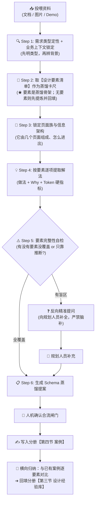

# 标杆方案案例蒸馏指南 (Benchmark Cases Distillation Guide)

> 💡 **中枢定位**：
> 本文档是织雨设计智脑的**高维经验萃取手册**。
> 当规划人员向 `learning-materials/` 投喂优秀的业务方案（文档 / 截图 / Demo）并要求学习时，织雨必须启动本指南定义的作业程序，把具体的页面设计深度萃取为**带有业务背景、以设计要素为轴、具备底层因果（Why）且可被 Coding AI 复用**的结构化资产，按需求类型沉淀入 [`01-system-solution-design/②设计点思考/标杆案例库/`](../01-system-solution-design/②设计点思考/标杆案例库/) 下对应的**类型分册**（门户总览见 [`2.2-标杆案例库.md`](../01-system-solution-design/②设计点思考/2.2-标杆案例库.md)）。
>
> 📦 **两类产出物（缺一不可）**：
> 1. **案例**（证据层）→ 写入分册【第四节】；
> 2. **经验**（沉淀层）→ 横向对比多案例后归纳，写入分册【第三节】。

---

## 🎯 零、第一性要求：蒸馏信息必须"挂靠"在设计要素上

> **铁律**：蒸馏不是写散文，而是**按该需求类型的【设计要素清单】逐项填格**。要素是"格子"，物料是"内容"。

**为什么必须这样**：设计要素是**下游复用的唯一索引**。按 [`execution-sop.md`](../04-workflows-and-cases/execution-sop.md) 的交接契约：

| 下游环节 | 要用蒸馏产出的什么 | 怎么检索 |
| :--- | :--- | :--- |
| Step 2 产出《标杆细节复用清单》 | 颜色 / 尺寸 / 组件 / 页面模板 / 交互态 | **按设计要素逐项抽取**（要素 = 抽取的行索引） |
| Step 4 布局与组件映射 | 同上 | 按要素命中即还原（来源标 `案例X 还原`） |
| 第三节经验归纳 | 同一要素下多案例的做法差异 | **按要素做横向对比**（要素 = 对比的对齐轴） |

> ⚠️ **反过来说**：不挂靠要素的蒸馏内容，**下游既检索不到、也无法跨案例对齐** —— 那样的蒸馏等于白做。

---

## 📥 一、多模态物料输入与解析规范 (Input Parsing)

规划人员投喂的材料通常包含以下三种形态之一或其组合，织雨必须按对应规范解析：

| 输入物料形态 | 常见格式 / 载体 | 织雨解析重心与提取动作 |
| :--- | :--- | :--- |
| **形态 1：文档资料** | PDF 复盘报告、PRD 需求文档、Markdown 说明、飞书文档 | • 提炼**业务演进背景**、新老方案对比（Before ➔ After）、核心考核指标；<br>• 挖掘文档中"为什么这么改"的立项初衷与用户反馈原话。 |
| **形态 2：界面图片** | 页面全景截图、局部细节对比图、系统报错截图、流程草图 | • 剖析**信息呈现架构**（单表 / 双栏 / 卡片）、控件尺寸比例、视觉色彩信噪比；<br>• 识别信息层级，并主动标记"图片未展示的隐性流程"。 |
| **形态 3：可访问 Demo** | 线上系统控制台、本地 HTML 原型、交互原型链接 | • 体验**动态交互反馈**（Hover / Click / Loading 态）、瞬时状态机流转；<br>• 测试长文本截断、横向滚动、极端数据表现。**能取 DOM/样式级真实数值最佳**（可直接落 Token 硬指标）。 |

> 🔌 **遇到"内网系统打不开"怎么办（前置动作）**：
> 若目标系统位于**内网**，内置浏览器直连时常报 `ERR_CERT_AUTHORITY_INVALID`（自建 CA 不被信任，且内嵌 Chromium 不提供"继续前往"入口），此时**不要反复重试、也不要求规划人员逐页截图**。
> 正确做法：先用 [`tools/internal-reverse-proxy.js`](../tools/internal-reverse-proxy.js) 在本地开一条访问通道（用法见 [`tools/README.md`](../tools/README.md)），再以 `http://127.0.0.1:<独占端口>` 访问并取证。
> 若确实无法建立通道（如代理亦不可达），才退回"形态 2：界面图片"，并**在案例来源声明中如实标注该局限**。

---

## 🧠 二、蒸馏执行流水线（6 步）



---

### Step 1: 需求类型定性 + 专属业务上下文锁定（先明类型，再辨背景）

不同产品线的业务逻辑截然不同（如：公有云强调租户隔离与配额计费，企业内网 SASE 强调员工终端零信任与秒级阻断）。**脱离业务背景的蒸馏就是死搬硬套。**

织雨必须首先从物料中提炼出以下 **7 大关键要素**：
1. **需求场景简述（解决什么问题 —— 首要必填）**：
   - 用 **1~3 句大白话**说清：**这个需求当时为业务解决了什么问题、什么痛点？改造动机是什么？**
   - 配套锁定 **Before ➔ After 一句话对比**（改造前用户怎么熬过来的 ➔ 改造后变成什么体验）；
   - ⚠️ 这是案例的 **"需求档案首行"**：读者即使不读全篇，也应能秒懂这个需求为何存在；
2. **所属需求类型定性（首要判定）**：
   - 对照门户 [`2.2-标杆案例库.md`](../01-system-solution-design/②设计点思考/2.2-标杆案例库.md) 的【二、类型识别判据与边界】逐条核对，明确属于 Type-01~07 中的哪一类；
   - 若为复合方案，指出"核心主类型"与"次要辅助类型"；
3. **产品与业务赛道定位**：该产品管什么？处于什么赛道？
4. **核心目标角色与心智压力**：使用者是谁？他最大的心理压力和恐惧是什么？（怕改错背锅？怕排障跳页断流？）；
5. **管理实体的物理特性**：对象的量级（几十还是数万）？变动频次（毫秒级动态还是一年不变）？
6. **业务关键操作频次**：高频日常监控，还是低频重大变更？
7. **本次设计的北极星目标**：这个方案最核心要解决的 1~2 个根本问题是什么？

---

### Step 2: 取【设计要素清单】作为蒸馏卡尺（★ 本指南核心铁律）

根据 Step 1 判定的需求类型，进入该类型分册的【第二节 设计要素清单】，**拿它作为本次蒸馏的基准卡尺**（详见本文【零】节）：

1. **先查**：该类型分册是否已有【设计要素清单】？
2. **已有要素清单** → **直接作为卡尺**，逐要素去物料里"填格"；
3. **尚无要素清单**（该类型首次蒸馏）→ **本步必须先提炼要素**：
   - 按下方【3.1 要素 Schema】提炼，**要素 = 该类型下资深设计师必须思考与考量的维度**（而非"页面类型"）；
   - **先回填分册第二节**，再据此逐项蒸馏；
4. **严禁**：跳过要素自由发挥，或只填自己感兴趣的要素。

**逐要素蒸馏时的三种情况与处理**：

| 物料中的情况 | 处理 |
| :--- | :--- |
| 该要素**有明确做法** | 正常记录（做法 + Why + Token 硬指标） |
| 该要素**未明说但可合理推断** | 记录，并显式标注「**推断**」 |
| 该要素**完全没覆盖** | 标 `⚠️ 未覆盖`，并进入 Step 5 的反向追问清单 —— **严禁虚构填补** |

---

### Step 3: 锁定页面族与信息架构（先于组件级细节产出）

优秀的方案从来不是孤立的一页，而是**以某个枢纽页为中心的页面族**。必须先回答"它由几个页面组成、各自承担什么"：

1. **页面族盘点**：枢纽列表页 / 详情页 / 新建向导页 / 可复用资产库页 …… 各有哪些？（**能给出真实路由最佳**）；
2. **职责与入口契约**：每个页面承担什么职责？返回路径是否统一？（如 `backBtn + 面包屑 backList + backUrl`、子页权限继承父级）；
3. **主键传递规则**：页面之间靠什么主键串联？（如详情页取 `parent_id ?? task_id`，以承载同一任务族的多轮历史）。

> 📌 这份"页面族地图"是后续所有要素落地做法的**骨架底座** —— 先看清全貌，再落到组件。产出物必须是**表格或清单**。

---

### Step 4: 按设计要素逐项提取解法（做法 + Why + Token）

以 Step 2 的要素清单为**行**，逐项填写。每一项必须**三件套齐备**：

1. **做法**：这一步怎么做（控件选型 / 布局排布 / 状态处理 / 交互机制）；
2. **Why 深度因果**（资深灵魂，必答三问）：
   - 为什么选方案 A，而**坚决不用**业界传统的方案 B？
     - *示例*：为什么用整卡卡片流而不用高密度表格？（因果：字段天生不对称，塞进表格会膨胀成 20+ 列）
   - 为什么在某个细节上做出**反常识的克制**设计？
     - *示例*：为什么失败态敢用整卡底色，而不只是一个小标签？（因果：任务量级小才承受得起强编码）
   - 这个设计**牺牲了什么，换到了什么**？
     - *权衡*：牺牲了纵向信息密度，换取了单个任务完整可读 + 状态可扫视。
3. **Token 硬指标（严禁形容词）**：必须给出 **Coding AI 可直接复用的数值** ——
   - **色值**：如 失败字 `#F52727` / 失败底 `#FFEEEE`；正常字 `#20CC94` / 正常底 `#E9FAF4`；
   - **尺寸**：如 主按钮高 `32px`、状态标签高 `20px`、标签内边距 `0 7px`；
   - **字号**：如 指标数值 `24px`、指标标签 `12px`；
   - **圆角与间距**：如 卡片圆角 `2px`、卡片纵向间距 `8px`；
   - **Why 与硬指标必须成对出现**：先讲清因果，紧接给出数值；
   - 若物料中确实拿不到精确数值，须**显式标注"估算值"并说明推断依据**，严禁凭空编造。

> 🛑 **三件套缺一不可（硬性）**：**做法 / Why / Token 硬指标三者缺任一项，该要素即视为"未完成"**，不得标记为已提取。
> ⚠️ **Why 是最容易被漏掉的一项**（尤其在后续精简、重排版时最容易丢）—— 它是"资深灵魂"的载体。只有做法与数值、却没有因果的条目，等于把标杆降级成了一份普通的规范模板。
> 📌 **线框图只画在确有布局意义的要素上**（如"呈现架构"），不要求每个要素都配图。

---

### Step 5: 要素完整性自检与反向主动追问（核心铁律）

> 🛑 **蒸馏防偷懒红线**：静态截图、单页 PDF 或静态 PRD 通常**只呈现理想状态下的主流程（Happy Path）**，极易遗漏深水区：
> - 异常与网络抖动时界面的反馈（连通性失败报什么？）；
> - 破坏性删除 / 注销的二次确认与防呆；
> - 极限长字段、空状态或零数据的兜底；
> - 批量操作超限时的熔断与限流。

**执行规则**：若某些**设计要素**在物料中**完全没有提及且无法合理推导**，织雨**绝对严禁假装没看见或自行脑补**！必须在蒸馏报告末尾**主动发起结构化反向提问**：

> 🗣️ **反向提问标准话术模板**：
> "本次投喂的资料中，我已深度提取了该方案在【E1 呈现架构、E2 编排与新建、E4 结果与证据】上的优秀做法。但针对此类需求必考的设计要素，资料中尚未体现：
> 1. **关于 [E3 调度与执行态 / 并发与资源保护]**：多任务同时执行时如何限速与避免争抢？失败时的错误码与自愈指引是什么？
> 2. **关于 [E6 任务管理维护]**：执行删除 / 下线时，现场如何防误删？有无关联影响清单或口令确认？
> 3. **关于 [极限与空态]**：无数据、超长文本、超量结果时界面如何兜底？
> 4. **关于 [E7 结束通知与触达]**：任务结束（成功 / 失败）时是否会主动通知负责人？走站内消息、邮件还是 IM？还是需要用户自己回来看？
> 请协助补充这几项的实际设计考虑，以便我将其作为完备的标杆经验合入知识库！"

---

### Step 6: 写入分册 + 横向归纳经验（不可省略的收尾）

1. **写入案例**：按【3.2 案例条目 Schema】，追加到该类型分册的【第四节】；
2. **横向归纳（★ 从"案例"变"经验"的关键一步）**：
   - 把本案例与**该分册已有案例**，在同一设计要素上**逐项对比**：
     | 对比结果 | 归纳去向 |
     | :--- | :--- |
     | 做法**一致** | 归纳为经验条目，写入 `3.1 设计经验` |
     | 做法**不一致** | 写入 `3.1 设计经验`，并在「备注」里写明 **什么条件下用哪种** |
     | **冲突且证据不足** | 写入 `3.2 待确认经验`，**留白，不硬编结论** |
   - **来源标记**：织雨归纳的记 `🤖 推理`（需人工复核）；规划人员口述的记 `👤 人工`；
3. **更新分册状态**：在分册头部回填"已蒸馏案例 N 个 / 设计经验 M 条 / 待确认 K 条"。

---

## 📋 三、三套标准 Schema

### 3.1 要素 Schema（写入分册【第二节 设计要素清单】）

```markdown
| 编号 | 设计要素 | 考量什么 | 自检问句 | 可选解法空间 |
| :---: | :--- | :--- | :--- | :--- |
| **E1** | [要素名称] | [这个要素要思考什么] | ① … ② … ③ … | `解法A`（适用条件）／`解法B`（适用条件）／`解法C` |
```

* **要素定义要求**：要素 = **资深设计师在该类型下必须思考与考量的维度**，而非"页面类型"；
* **四件套缺一不可**：编号 / 名称 / 考量什么 / 自检问句 / 可选解法空间（后两者是后续选型的依据）；
* 本表同时是「案例 × 要素」对比的**行基准**，故**编号必须稳定**（E1~En 不轻易改动）。

### 3.2 案例条目 Schema（写入分册【第四节】）

```markdown
### 案例 [字母]：[产品/系统名] - [模块/功能名称]

> 📌 **案例一句话画像**：[用一句话高度概括业务特征，如：以"任务"为主键的漏洞检测编排与追溯中枢]

#### 4.0 案例来源声明
* **物料来源**：[线上系统实访 / 复盘 PDF / 设计稿截图 …]
* **蒸馏日期**：[YYYY-MM-DD]
* **案例独立性**：[单产品 / 跨产品]（⚠️ 单产品时不可等同于行业共性）
* **覆盖局限**：[本次未拍到的深水区场景，与 Step 5 的反向提问清单对应]

#### 4.1 需求场景简述 (Problem Statement)
* **解决什么问题**：[1~3 句大白话，讲清业务缘起、痛点与改造动机]
* **改造前 ➔ 改造后 (Before ➔ After)**：[…… ➔ ……]
* **为什么值得沉淀**：[该需求在同类场景中的典型性与稀缺性]

#### 4.2 业务上下文
* **所属类型**：[Type-0x] ｜ **产品线与赛道**：[……]
* **管理对象特征**：[数量级 / 变化频次 / 异构程度]
* **目标角色与压力**：[角色 / 核心心智]

#### 4.3 页面族与信息架构
* **页面族地图（附真实路由）**：
  | 路由 | 页面 | 定位与职责 |
  | :--- | :--- | :--- |
  | [如 /xxx/list] | [枢纽列表页] | [所有入口的起点与返回点] |
* **导航与返回契约**：[如 统一 backBtn + 面包屑 + backUrl；子页权限继承父级]
* **主键传递规则**：[如 详情页取 parent_id ?? task_id，以承载多轮历史]

#### 4.4 按设计要素逐项做法（★ 必须以第二节要素清单为轴）
* **▸ E1 [要素名]**：
  * **做法**：[控件选型 / 布局排布 / 状态处理 / 交互机制]
  * **Why**：[因果与权衡] ⚠️ **必填**，严禁只写做法与数值
  * **Token 硬指标**：[色值 / 尺寸 / 字号 / 圆角 / 间距]（确有布局意义时附等宽字符线框图）
* **▸ E2 [要素名]**：（同上，三件套齐备）
* **▸ En …**
> ⚠️ **未覆盖的要素显式标 `⚠️ 未覆盖`**；仅靠推断的标「推断」。**严禁虚构填补。**

#### 4.5 本案例的贡献与局限
* **贡献**：[它最值得学的骨架是什么]
* **局限**：[单产品？深水区未覆盖？哪个要素完全缺失？]
```

### 3.3 经验条目 Schema（写入分册【第三节】）

```markdown
### 3.1 设计经验
| 编号 | 设计经验项 | 备注（特殊场景 / 不适用情形） | 来源 | 匹配案例 |
| :---: | :--- | :--- | :---: | :--- |
| **EP-01** | 【Exx 要素名】[经验结论] | [什么条件下适用 / 不适用] | 🤖 推理 / 👤 人工 | 案例 A |

### 3.2 待确认经验（证据不足 / 存疑，尚未正式沉淀）
| 编号 | 候选经验项 | 存疑点 | 来源 | 参考案例 |
| :---: | :--- | :--- | :---: | :--- |
| **EQ-01** | 【Exx】[候选结论] | [为什么还不能沉淀] | 🤖 推理 / 👤 人工 | 案例 A |
```

* **不做经验分类**：踩坑经验同样是经验，直接写成一条；
* **1~N 条即可**，不追求条数齐整；
* 织雨判断合理的经验**可直接沉淀进 3.1**；证据不足的先入 3.2。

### 3.4 分册整体骨架（上下两半，一类型一文件）

```text
# Type-0X：<类型名>
> 状态：已蒸馏案例 N 个 ｜ 设计经验 M 条 ｜ 待确认 K 条
> 可追溯契约 + 锚点目录

═══ 上半部分：经验层（稳定资产 · 最终沉淀物）═══
一、需求类型认知        （是什么 / 解决什么问题 / 产品形态谱系）
                          ⚠️ 类型识别与边界判定统一见门户第二节，分册内不重复
二、设计要素清单        （表格，见 3.1 要素 Schema）
三、设计经验库          （3.1 设计经验 ／ 3.2 待确认经验，见 3.3 经验 Schema）

═══ 下半部分：案例层 + 应用层 ═══
四、案例导入蒸馏        （案例 A / B / …，每个案例见 3.2 案例条目 Schema）
五、本次设计要素选型工作表（空表模板，填好的结果写入项目自己的步骤 2 产出）
```

---

## 🔗 四、可追溯契约与下游衔接

### 4.1 可追溯契约（硬性）

* 每条**经验**必须标注「匹配案例」+「来源」（`🤖 推理` / `👤 人工`）；
* 每个**案例**必须标注「物料来源 + 蒸馏日期 + 案例独立性」；
* **无来源的内容一律不得写入分册。**

### 4.2 与 SOP 交接契约的衔接（决定蒸馏质量）

蒸馏产出必须能**直接支撑** [`execution-sop.md`](../04-workflows-and-cases/execution-sop.md) 中 Step 2 的交付物《**标杆细节复用清单**》：

| 《标杆细节复用清单》要什么 | 从蒸馏产出的哪里取 |
| :--- | :--- |
| 颜色 Token | 案例 `4.4` 各要素的「Token 硬指标」 |
| 尺寸硬指标 | 同上 |
| 组件选型 | 案例 `4.4` 的做法描述 |
| 页面模板 / 框架套头 | 案例 `4.3` 页面族 + `4.4` 呈现架构要素 |
| 关键交互态 | 案例 `4.4`（尤其"调度与执行态""高危防呆"类要素） |

> ⚠️ **若蒸馏时没落出这些，Step 4 就取不到料** —— **蒸馏质量直接决定复用质量**。

---

## 🚪 五、三阶段人机确认与合流规范 (Review & Merge Gate)

织雨提炼标杆经验时，必须遵循三阶段协同流程：

1. **【阶段一：提案与补齐】**
   - 织雨输出《标杆方案案例蒸馏提案报告》；
   - 若存在未覆盖的设计要素，附带"反向提问清单"，等待规划人员解答或确认；
2. **【阶段二：确认与写入】**
   - 规划人员回复"确认无误，写入案例库"或回答补充问题；
   - 织雨按 Schema 写入 [`标杆案例库/`](../01-system-solution-design/②设计点思考/标杆案例库/) 下**对应需求类型的分册**（一类型一文件，精准追加案例到【第四节】）；
   - **同步执行横向归纳**：与已有案例逐要素对比，回填分册【第三节 设计经验库】（见 Step 6）；
   - 若本次判定出**新的需求类型**，需同步在门户 [`2.2-标杆案例库.md`](../01-system-solution-design/②设计点思考/2.2-标杆案例库.md) 的【全景图】新增类型行，并在【分册索引】登记新分册；
3. **【阶段三：结束语反向确认（必做铁律）】**
   - 每次蒸馏合流完成后，织雨**必须**在结束语中主动发起复核邀请，标准话术：
     > 🙋 **请您复核**：本次蒸馏已按标准 Schema 落库。其中若有 **未被如实呈现的设计点或设计意图**，或 **哪一处的理解与您的原意有偏差**，请直接指出，我会立即修正并补齐；
   - **目的**：把规划人员脑中"未被言明的隐性判断"持续回收进案例库，避免 Agent 的理解偏差被静默固化；
   - 同时应主动说明：**本次有哪些设计要素因物料未覆盖而未能蒸馏**（呼应 Step 5 的反向提问清单）。
